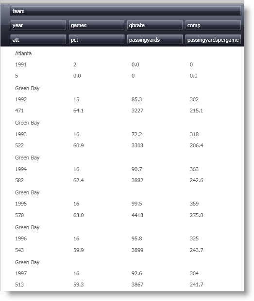

////

|metadata|
{
    "name": "xamdata-arranging-cells-within-the-record",
    "controlName": ["xamDataPresenter"],
    "tags": ["Editing","Templating"],
    "guid": "{1223FF2A-82A7-4CF2-A034-323D15EBC889}",  
    "buildFlags": [],
    "createdOn": "2012-01-30T19:39:52.4898511Z"
}
|metadata|
////

= Arranging Cells within the Record

The xamDataPresenter™ control supports both simple and complex arrangements of cells within a record. The arrangements can be either specified manually (i.e., explicitly) or generated automatically ("AutoArrange"). The AutoArrange feature is enabled by setting the link:{ApiPlatform}datapresenter.v{ProductVersion}~infragistics.windows.datapresenter.datapresenterbase~fieldlayoutsettings.html[FieldLayoutSettings'] link:{ApiPlatform}datapresenter.v{ProductVersion}~infragistics.windows.datapresenter.fieldlayoutsettings~autoarrangecells.html[AutoArrangeCells] property to either LeftToRight or TopToBottom. Setting this property to Never disables the AutoArrange feature.

.Note
[NOTE]
====
The view provides the ultimate default for this property. For example, the Carousel view defaults the AutoArrange property to TopToBottom, while the Grid view varies its default based on the link:{ApiPlatform}datapresenter.v{ProductVersion}~infragistics.windows.datapresenter.gridviewsettings~orientation.html[Orientation] setting. A Vertical orientation defaults AutoArrangeCells to LeftToRight, and a Horizontal orientation defaults AutoArrangeCells to TopToBottom.
====

== AutoArrange Feature

The AutoArrange feature is controlled by properties on link:{ApiPlatform}datapresenter.v{ProductVersion}~infragistics.windows.datapresenter.fieldlayoutsettings.html[FieldLayoutSettings] that begin with the prefix "AutoArrange". The properties are:

* link:{ApiPlatform}datapresenter.v{ProductVersion}~infragistics.windows.datapresenter.fieldlayoutsettings~autoarrangecells.html[AutoArrangeCells] -- Described above.
* link:{ApiPlatform}datapresenter.v{ProductVersion}~infragistics.windows.datapresenter.fieldlayoutsettings~autoarrangemaxcolumns.html[AutoArrangeMaxColumns] -- Determines the maximum number of columns that will be generated for the grid within each link:{ApiPlatform}datapresenter.v{ProductVersion}~infragistics.windows.datapresenter.datarecord.html[DataRecord]'s link:{ApiPlatform}datapresenter.v{ProductVersion}~infragistics.windows.datapresenter.datarecordcellarea.html[DataRecordCellArea]. Each Field is assigned one column slot.
* link:{ApiPlatform}datapresenter.v{ProductVersion}~infragistics.windows.datapresenter.fieldlayoutsettings~autoarrangemaxrows.html[AutoArrangeMaxRows] -- Determines the maximum number of rows that will be generated for the grid within each DataRecord's DataRecordCellArea. Each field is assigned one row slot.
* link:{ApiPlatform}datapresenter.v{ProductVersion}~infragistics.windows.datapresenter.fieldlayoutsettings~autoarrangeprimaryfieldreservation.html[AutoArrangePrimaryFieldReservation] -- Lets you reserve the entire first row or column for the primary field. By default, the primary field is the first field in the link:{ApiPlatform}datapresenter.v{ProductVersion}~infragistics.windows.datapresenter.fieldlayout~fields.html[Fields] collection. However, any field can be made the primary field by settings its link:{ApiPlatform}datapresenter.v{ProductVersion}~infragistics.windows.datapresenter.field~isprimary.html[IsPrimary] property to True.

The example XAML below illustrates how to use the AutoArrange feature:

----
<igDP:XamDataGrid> 
        <igDP:XamDataGrid.FieldLayoutSettings> 
                <igDP:FieldLayoutSettings 
                  AutoArrangeCells="LeftToRight" 
                  AutoArrangeMaxColumns="4" 
                  AutoArrangeMaxRows="3"
                  AutoArrangePrimaryFieldReservation="ReserveFirstRow"/> 
                </igDP:XamDataGrid.FieldLayoutSettings> 
        <igDP:XamDataGrid.FieldLayouts> 
                <igDP:FieldLayout> 
                        <igDP:FieldLayout.Fields> 
                                <igDP:Field Name="team" IsPrimary="True"/> 
                        </igDP:FieldLayout.Fields> 
                </igDP:FieldLayout> 
        </igDP:XamDataGrid.FieldLayouts> 
</igDP:XamDataGrid>
----

After the primary field reservation is taken care of, if AutoArrangeCells resolves to TopToBottom, each field is assigned a row number that is one higher than the previous field (the order is determined by the order of the fields in the Fields collection). When the AutoArrangeMaxRows is reached, the row number is reset and the column number is incremented. This process repeats until AutoArrangeMaxColumns is reached. This effectively lays out the cells in a "snaking" pattern. Of course, if AutoArrangeCells resolves to LeftToRight, the column numbers are incremented before the row numbers, which creates a different snaking pattern.

.Note
[NOTE]
====
The view also provides the ultimate default for both the AutoArrangeMaxColumns and AutoArrangeMaxRows properties. For example, the Carousel view defaults the AutoArrangeMaxColumns property to "1", and the AutoArrangeMaxRows property to "3". The Grid view defaults both of these properties to "0", which means that no maximum is applied.
====

== Manual (or Explicit) Cell Layout

If the FieldLayoutSettings' AutoArrangeCells property is set to Never, the AutoArrange feature is disabled, and each field's cell positions must be specified manually. By default, each Field's cells will occupy the 0/0 row/column slot inside the cell area. When there are multiple fields, having all the cells stacked on top of each other is probably not what is desired. Fortunately, the Field exposes link:{ApiPlatform}datapresenter.v{ProductVersion}~infragistics.windows.datapresenter.fielditem~column.html[Column], link:{ApiPlatform}datapresenter.v{ProductVersion}~infragistics.windows.datapresenter.fielditem~columnspan.html[ColumnSpan], link:{ApiPlatform}datapresenter.v{ProductVersion}~infragistics.windows.datapresenter.fielditem~row.html[Row], and link:{ApiPlatform}datapresenter.v{ProductVersion}~infragistics.windows.datapresenter.fielditem~rowspan.html[RowSpan] properties that let you position the cells any way you like.

.Note
[NOTE]
====
These properties are ignored unless the AutoArrangeCells property is set to Never. For more information, see link:xamdatagrid-changing-the-default-column-and-row-definitions.html[Changing the Default Column and Row Definitions].
====

The following example code defines the cell arrangement illustrated in the image below the code:

----
<igDP:XamDataGrid> 
        <igDP:XamDataGrid.FieldLayoutSettings> 
                <igDP:FieldLayoutSettings 
                  AutoArrangeCells="Never"/> 
        </igDP:XamDataGrid.FieldLayoutSettings> 
        <igDP:XamDataGrid.FieldLayouts> 
                <igDP:FieldLayout> 
                        <igDP:FieldLayout.Fields> 
                                <igDP:Field Name="ProductName" ColumnSpan="2"/> 
                                <igDP:Field Name="CostPerUnit" Row="1"/> 
                                <igDP:Field Name="Quantity" Row="1" Column="1"/> 
                                <igDP:Field Name="ShipAndHandle" Row="2"/> 
                                <igDP:Field Name="Discount" Row="2" Column="1"/> 
                                <igDP:Field Name="Total" Row="3" ColumnSpan="2"/> 
                        </igDP:FieldLayout.Fields> 
                </igDP:FieldLayout> 
        </igDP:XamDataGrid.FieldLayouts> 
</igDP:XamDataGrid>
----

image::images/xamDataGrid_Changing_the_Default_Column_and_Row_Definitions_01.png[field arranging within xamdatagrid when autoarrange feature isn't enabled]

== AutoFit Feature

The DataPresenterBase class exposes a defaultable Boolean link:{ApiPlatform}datapresenter.v{ProductVersion}~infragistics.windows.datapresenter.datapresenterbase~autofit.html[AutoFit] property. If AutoFit is not set, the view supplies an appropriate default value. For example, the Grid view defaults to False, while the Carousel view defaults to True.

The following example code shows how the AutoFit property is set in XAML:

----
<igDP:XamDataGrid AutoFit="True"/>
----

.Note
[NOTE]
====
When the AutoFit property is set to True for views where the item size dictates the size available for each record (e.g., Carousel view), the cells are sized to fit within the record in one or both dimensions based on the View's link:{ApiPlatform}datapresenter.v{ProductVersion}~infragistics.windows.datapresenter.viewbase.html[IsAutoFitHeightSupported] and link:{ApiPlatform}datapresenter.v{ProductVersion}~infragistics.windows.datapresenter.viewbase.html[IsAutoFitWidthSupported] properties.
====

For views such as the Grid view, all the records are constrained in one dimension based on its link:{ApiPlatform}datapresenter.v{ProductVersion}~infragistics.windows.datapresenter.gridviewsettings~orientation.html[Orientation]. For example, when the Orientation property is set to Vertical, all link:{ApiPlatform}datapresenter.v{ProductVersion}~infragistics.windows.datapresenter.recordpresenter.html[RecordPresenters'] widths are set to fit exactly within the control, so there will never be a horizontal scroll bar. Likewise, if the Orientation property is set to Horizontal, the heights are set to fit exactly within the control so there will never be a vertical scroll bar.

== Advanced Cell Layout

For more exotic layouts, the following properties are exposed off the link:{ApiPlatform}datapresenter.v{ProductVersion}~infragistics.windows.datapresenter.fieldlayoutsettings.html[FieldLayoutSettings] class:

* link:{ApiPlatform}datapresenter.v{ProductVersion}~infragistics.windows.datapresenter.fieldlayoutsettings~datarecordcellareagridtemplate.html[DataRecordCellAreaGridTemplate] -- Specifies a template for the grid used inside the DataRecordCellArea. Any properties set on this template grid (including Row and Column definitions, if any) will be used by xamDataPresenter to create the Grid element that is actually used to arrange cells in the cell area. This gives you a lot of control over how cells are arranged. If the grid you supply does not contain enough columns and/or rows to hold all the cells, xamDataPresenter will create as many additional rows and columns as necessary using the link:{ApiPlatform}datapresenter.v{ProductVersion}~infragistics.windows.datapresenter.fieldlayoutsettings~defaultcolumndefinition.html[DefaultColumnDefinition] and link:{ApiPlatform}datapresenter.v{ProductVersion}~infragistics.windows.datapresenter.fieldlayoutsettings~defaultrowdefinition.html[DefaultRowDefinition] property, if specified (for descriptions of these properties, see the following two bullets). If one or both of these defaults are not specified, xamDataPresenter will use internal defaults. If the Grid you supply contains more columns and/or rows than are needed, the extra columns and/or rows are ignored.
* DefaultColumnDefinition -- Settings on this column definition will take precedence over the default settings that would have been used for every column in the grid that is used to arrange cells in the cell area.
* DefaultRowDefinition -- Settings on this row definition will take precedence over the default settings that would have been used for every row in the grid that is used to arrange cells in the cell area.

Below is example XAML, illustrating how to do advanced cell layout:

----
<igDP:XamDataGrid> 
        <igDP:XamDataGrid.FieldLayoutSettings> 
                <igDP:FieldLayoutSettings> 
                        <igDP:FieldLayoutSettings.DefaultColumnDefinition> 
                                <ColumnDefinition Width="200"/> 
                        </igDP:FieldLayoutSettings.DefaultColumnDefinition> 
                </igDP:FieldLayoutSettings> 
        </igDP:XamDataGrid.FieldLayoutSettings> 
</igDP:XamDataGrid>
----