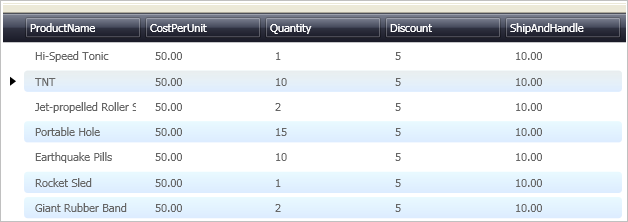

////
|metadata|
{
    "name": "xamdata-changing-field-record-cell-selection-behavior",
    "controlName": ["xamDataPresenter"],
    "tags": ["How Do I"],
    "guid": "{F6623ADF-05F6-4467-BF00-9A5EC8D8F025}",
    "buildFlags": [],
    "createdOn": "2012-01-30T19:39:52.4968525Z"
}
|metadata|
////

= Changing Field, Record, or Cell Selection Behavior

You can modify a DataPresenter control's selection functionality for link:{ApiPlatform}datapresenter{ApiVersion}~infragistics.windows.datapresenter.cell.html[Cell]s, link:{ApiPlatform}datapresenter{ApiVersion}~infragistics.windows.datapresenter.record.html[Record]s, and link:{ApiPlatform}datapresenter{ApiVersion}~infragistics.windows.datapresenter.field.html[Field]s. Use the link:{ApiPlatform}v{ProductVersion}~infragistics.windows.controls.selectiontype.html[SelectionType] enumeration to choose the selection strategy that best fits your application. Control the selection by setting the link:{ApiPlatform}datapresenter{ApiVersion}~infragistics.windows.datapresenter.fieldlayoutsettings~selectiontypecell.html[SelectionTypeCell], link:{ApiPlatform}datapresenter{ApiVersion}~infragistics.windows.datapresenter.fieldlayoutsettings~selectiontyperecord.html[SelectionTypeRecord], or link:{ApiPlatform}datapresenter{ApiVersion}~infragistics.windows.datapresenter.fieldlayoutsettings~selectiontypefield.html[SelectionTypeField] property off the link:{ApiPlatform}datapresenter{ApiVersion}~infragistics.windows.datapresenter.fieldlayoutsettings.html[FieldLayoutSettings] object.

The following procedure assumes you have a data bound xamDataGrid for which you want to change the selection behavior. For more information on data binding xamDataGrid, see link:xamdatagrid-getting-started-with-xamdatagrid.html[Adding xamDataGrid to Your Page]. The settings in this procedure would be similar to those of xamDataCarousel and xamDataPresenter.

*To change the selection type for cells, records, and fields:*

[start=1]
. Set the SelectTypeCell and SelectionTypeRecord properties to Extended off the xamDataGrid instance. These properties allow the end user to select multiple cells or records at the same time. Set the SelectTypeField property to Single if you want the end user to select only one field at a time.
+
.Note
[NOTE]
====
The SelectTypeField setting will work only if you already set the link:{ApiPlatform}datapresenter{ApiVersion}~infragistics.windows.datapresenter.fieldsettings~labelclickaction.html[LabelClickAction] property to SelectField.
====
+
*In XAML:*
+
[source,xaml]
----
<igDP:XamDataGrid ... >
    <igDP:XamDataGrid.FieldLayoutSettings>
        <igDP:FieldLayoutSettings 
            SelectionTypeCell="Extended" 
            SelectionTypeRecord="Extended" 
            SelectionTypeField="Single" />
    </igDP:XamDataGrid.FieldLayoutSettings>
</igDP:XamDataGrid>
----

[start=2]
. Build and run the project. When you select multiple records with either the CTRL or SHIFT keys, the records will be highlighted similar to the image below.
+
