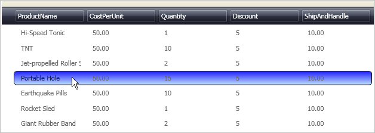

////

|metadata|
{
    "name": "xamdata-changing-the-record-hover-color",
    "controlName": ["xamDataPresenter"],
    "tags": ["How Do I"],
    "guid": "{1FF313CB-042C-4A96-BC31-17A86E17EA0F}",  
    "buildFlags": [],
    "createdOn": "2012-01-30T19:39:52.4998531Z"
}
|metadata|
////

= Changing the Record Hover Color

A styling enhancement commonly made to the DataPresenter controls is the hover color that appears as end users mouse over Records. This enhancement is set off the link:{ApiPlatform}datapresenter{ApiVersion}~infragistics.windows.datapresenter.datarecordcellarea.html[DataRecordCellArea] as it has the link:{ApiPlatform}datapresenter{ApiVersion}~infragistics.windows.datapresenter.datarecordcellarea~backgroundhover.html[BackgroundHover] property that controls the style.

The following XAML shows how to style the DataRecordCellArea object. Notice that the style has no Key assigned to it, so all DataRecordCellArea object's in the same Grid Panel will use this style. Place this style in the Grid Panel's Resources section.

.Note
[NOTE]
====
You can place this style in a higher level Resources section to have it apply to more DataRecordCellArea object's. For example, if you place the style in the application's Resource section, the entire application will use this style.
====

*In XAML:*

----

----

If you place the above XAML into a Grid Panel's Resource section along with the code created from link:xamdatagrid-getting-started-with-xamdatagrid.html[Adding xamDataGrid to Your Page], you'll see xamDataGrid populated with data. When you hover over records, they will be highlighted with a blue gradient similar to the image below.

