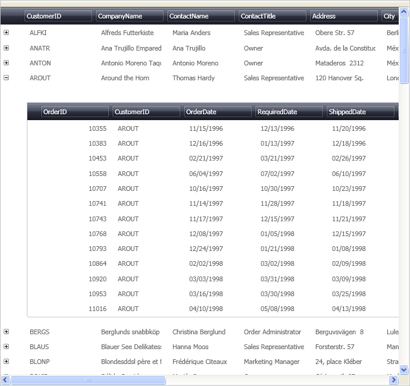

////

|metadata|
{
    "name": "xamdata-displaying-hierarchical-data",
    "controlName": ["xamDataPresenter"],
    "tags": ["How Do I"],
    "guid": "{B58FFDE4-17A4-4817-B230-29DCB2765446}",  
    "buildFlags": [],
    "createdOn": "2012-01-30T19:39:52.5058543Z"
}
|metadata|
////

= Displaying Hierarchical Data

== Topic Overview

=== Purpose

This topic explains hierarchical data and how the link:{ApiPlatform}datapresenter.v{ProductVersion}~infragistics.windows.datapresenter.xamdatagrid.html[ _xamDataGrid_  ]™ control displays it.

=== Required background

The following topics are prerequisites to understanding this topic:

[options="header", cols="a,a"]
|====
|Topic|Purpose

| link:xamdatagrid-understanding-xamdatagrid.html[About _xamDataGrid_ ]
|This topic provides an overview of the _xamDataGrid_ control including a conceptual diagram of its comprising elements.

| link:xamdatapresenter-about-data-items-and-data-records.html[About Data Items and Data Records]
|This topic explains the difference between Data Items and Data Records.

| link:xamdatapresenter-define-a-field-layout.html[Define a Field Layout]
|This topics explains how to manually define the columns shown for each record.

|====

=== In this topic

This topic contains the following sections:

* <<_Ref387411542, What is Hierarchical Data >>
* <<_Ref387411550, Hierarchical Data Recognition Process in the Data Presenter >>
* <<_Ref387411554, Screenshots of Hierarchical Data Rendered in the Data Presenter >>
* <<_Ref387411558, Related Content >>

[[_Ref387411542]]
== What is Hierarchical Data

=== Hierarchical data summary

Hierarchical data organizes information into a tree-like structure of records, consisting of the following parent/child relationships:

* Parent may have zero or more child records (1:many)
* Child records may have only one (direct) parent record (1:1)

[[_Ref387411550]]
== Hierarchical Data Recognition Process in the Data Presenter

=== Process summary

The link:{ApiPlatform}datapresenter.v{ProductVersion}~infragistics.windows.datapresenter.xamdatacarousel.html[ _xamDataCarousel_  ]™, link:{ApiPlatform}datapresenter.v{ProductVersion}~infragistics.windows.datapresenter.xamdatagrid.html[ _xamDataGrid_  ]™, and link:{ApiPlatform}datapresenter.v{ProductVersion}~infragistics.windows.datapresenter.xamdatapresenter.html[ _xamDataPresenter_  ]™ controls can present hierarchical data without making any modifications to the controls. There is no difference between binding the control to a flat or hierarchical data source. The control interpret the data source and display it properly; whether it is flat or hierarchical in nature.

When the control needs to render the data objects it examines their properties’ type and renders depending on their type the properties as described in the table below:

[options="header", cols="a,a"]
|====
|Types|Interpretation by the Data Presenter control

|All public properties of types that do not implement the `IEnumerable` interface as well as the `String` type.
|Renders these properties as a cell on the record row.

|All public properties of types that implement the `IEnumerable` interface with the exception of the `String` type.
|Renders these properties as child records, i.e., hierarchically.

|====

This default behavior can be overridden via the link:{ApiPlatform}datapresenter.v{ProductVersion}~infragistics.windows.datapresenter.field~isexpandable.html[IsExpandable] property exposed off the link:{ApiPlatform}datapresenter.v{ProductVersion}~infragistics.windows.datapresenter.field_members.html[Field] class. The following table explains how to use the `IsExpandable` property:

[options="header", cols="a,a,a"]
|====
|Behavior|Set this property|To the following value

|The data represented by this Field will be rendered as flat (in a cell) or hierarchical (as child records) based on the data type of the Field as explained above.
|`IsExpandable`
|`null` (default)

|Force the data for this Field to be displayed inside a cell instead of as child records regardless of the Field’s data type. 

.Note 

[NOTE] 

==== 

In the case where the type is an `IEnumerable` it is most likely you will want to provide a link:{ApiPlatform}datapresenter.v{ProductVersion}~infragistics.windows.datapresenter.cellvaluepresenter_members.html[CellValuePresenter] style to render the complex type, e.g. using a sparkline or list perhaps. 

====
|`IsExpandable`
|`false`

|Force the data for this Field to be displayed as child records instead of inside a cell regardless of the Field’s data type. 

.Note 

[NOTE] 

==== 

In the case where the type is not an `IEnumerable` the data will be displayed as a single child record. 

====
|`IsExpandable`
|`true`

|====

You can also use the read-only boolean link:{ApiPlatform}datapresenter.v{ProductVersion}~infragistics.windows.datapresenter.field~isexpandableresolved.html[IsExpandableResolved] property to check how a particular Field renders.

.Note
[NOTE]
====
The link:{ApiPlatform}datapresenter.v{ProductVersion}~infragistics.windows.datapresenter.xamdatacards.html[ _xamDataCards_  ]™ control does not display hierarchical data.
====

[[_Ref387411554]]
== Screenshots of Hierarchical Data Rendered in the Data Presenter

=== Screenshots summary

The following screenshots shows the  _xamDataGrid_   control displaying hierarchical data:

[[_Ref387411558]]
== Related Content

=== Topics

The following topics provide additional information related to this topic.

[options="header", cols="a,a"]
|====
|Topic|Purpose

| link:xamdatapresenter-bind-a-datapresenter-control-to-an-xmldataprovider.html[Bind a DataPresenter Control to an XmlDataProvider]
|This topic explains how to bind the Data Presenter to an XmlDataProvider.

| link:xamdatapresenter-bind-a-datapresenter-control-to-a-collection.html[Bind a DataPresenter Control to a Collection]
|This topic explains how to bind the Data Presenter to a Collection.

| link:xamdatapresenter-binding-a-datapresenter-control-to-a-dataset.html[Binding a DataPresenter Control to a DataSet]
|This topic explains how to bind the Data Presenter to a DataSet.

| link:xamdatagrid-cellvaluepesenterstyleselector-reevaluated.html[Conditional Formatting (xamDataGrid)]
|This topic explains how to apply different styles when a cell value changes in a _xamDataGrid_ control.

|====