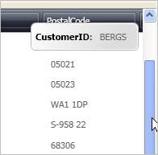

////

|metadata|
{
    "name": "xamdata-displaying-tooltips-while-scrolling-the-grid",
    "controlName": ["xamDataPresenter"],
    "tags": ["How Do I","Tips and Tricks"],
    "guid": "{67D38A37-117D-448C-87DD-DA16928914D7}",  
    "buildFlags": [],
    "createdOn": "2012-01-30T19:39:52.5088549Z"
}
|metadata|
////

= Displaying ToolTips While Scrolling the Grid

By default, the xamDataGrid™ and xamDataPresenter™ Grid View defer the creation of records until they are requested. In addition, while dragging the scroll bar thumb, a ToolTip appears next to the scroll bar showing the value of one field in the record (based on which Field has its link:{ApiPlatform}datapresenter.v{ProductVersion}~infragistics.windows.datapresenter.field~isscrolltipfield.html[IsScrollTipField] property set to True) that would become the top-most record if you released the scroll bar thumb at the current dragged position.

You can remove the ToolTips while maintaining the performance of the deferred scrolling by changing the link:{ApiPlatform}datapresenter.v{ProductVersion}~infragistics.windows.datapresenter.datapresenterbase~scrollingmode.html[ScrollingMode] property to Deferred. If you set the ScrollingMode property to Immediate, the grid will update the display to reflect the new records in view as you drag the scroll bar thumb.

.Note
[NOTE]
====
Setting the ScrollingMode property to Immediate is not recommended due to the impact on performance.
====