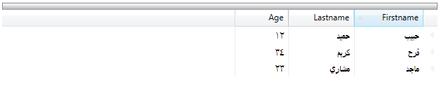
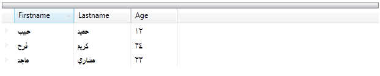

////

|metadata|
{
    "name": "xamdata-enabling-right-to-left-support",
    "controlName": ["xamDataPresenter"],
    "tags": ["Editing","Localization"],
    "guid": "{BB1A0984-F59B-4944-9CC1-A0F717C2CFF2}",  
    "buildFlags": [],
    "createdOn": "2012-01-30T19:39:52.5128557Z"
}
|metadata|
////

= Enabling Right to Left Support

All {ProductName} controls support right-to-left functionality. By setting the link:{ApiPlatform}datapresenter.v{ProductVersion}~infragistics.windows.datapresenter.xamdatagrid.html[FlowDirection] property to RightToLeft, the content will flow from the right side of the control to the left. (i.e., Hebrew and Arabic use RightToLeft). By default, the FlowDirection is set to LeftToRight. The {ProductName} controls inherit this property from System.Windows.FrameworkElement.

This property is also available off some of the sub-controls used by the {ProductName} controls. For example, link:{ApiPlatform}datapresenter.v{ProductVersion}~infragistics.windows.datapresenter.datarecordcellarea.html[DataRecordCellArea] and several more sub-controls expose this property. Setting the FlowDirection at this level allows more control over the flow direction of the main control that uses these sub-controls.

FlowDirection set to "RightToLeft"

FlowDirection set to "LeftToRight"

