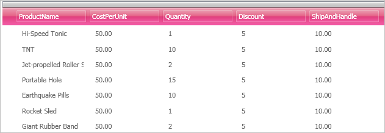

////

|metadata|
{
    "name": "xamdata-referencing-a-themepack-in-xaml",
    "controlName": ["xamDataPresenter"],
    "tags": ["Theming"],
    "guid": "{EA4335AF-AC33-4FFB-A01B-08B3B7AA7C6F}",  
    "buildFlags": [],
    "createdOn": "2012-01-30T19:39:52.5248581Z"
}
|metadata|
////

= Referencing a ThemePack in XAML

Since styling is such an important task in application development, the {ProductName} controls all include built-in themes you can use for styling. In addition, {ProductName} controls also have separate ThemePacks that are included in the installer. ThemePacks are simply compiled assemblies; which removes the complication of referencing one in your project.

Follow these steps to reference a ThemePack in your project.

[start=1]
. For easier access to the ThemePack, add the following namespace declaration inside the opening Page or Window tag.

*In XAML:*

----
xmlns:igThemesLipStick="http://infragistics.com/Themes/Lipstick" 
----

[start=2]
. Create a Resources section for the Page or Window and add a ResourceDictionary. The following XAML adds a ResourceDictionary to the Resources section of a Page.

*In XAML:*

----
<Page.Resources>
        <ResourceDictionary>
      ...
        </ResourceDictionary>
</Page.Resources>
----

[start=3]
. Inside the ResourceDictionary, define a MergedDictionaries section.

*In XAML:*

----
<Page.Resources>
        <ResourceDictionary>
                <ResourceDictionary.MergedDictionaries>
                ...
                </ResourceDictionary.MergedDictionaries>
        </ResourceDictionary>
</Page.Resources>
----

[start=4]
. The follow XAML adds style references for all the {ProductName} controls. This would cause every {ProductName} control on the Page to use the Lipstick ThemePack.

*In XAML:*

----
<Page.Resources>
        <ResourceDictionary>
                <ResourceDictionary.MergedDictionaries>
                        <!--Styles all controls using the LipStick ThemePack-->
                        <igThemesLipStick:DataPresenter />
                        <igThemesLipStick:Primitives  />
                        <igThemesLipStick:Editors  />
                </ResourceDictionary.MergedDictionaries>
        </ResourceDictionary>
</Page.Resources>
----

[start=5]
. Once added to a Page with xamDataGrid™, you will see a pink theme similar to the screen shot below.

