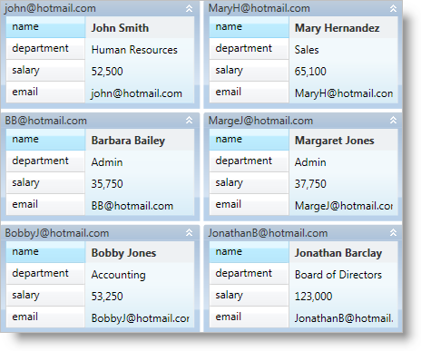

////

|metadata|
{
    "name": "xamdata-terms-presentation-formats-card-view",
    "controlName": ["xamDataPresenter"],
    "tags": ["Data Presentation","Getting Started"],
    "guid": "4adf09ae-44cd-4f42-bc24-debbce778d54",  
    "buildFlags": [],
    "createdOn": "2012-01-30T19:39:52.5848701Z"
}
|metadata|
////

= Card View

The xamDataCards™ control displays flat data using "cards" similar to the Contacts folder in Microsoft® Outlook 2007. Since the xamDataCards control derives from the link:{ApiPlatform}datapresenter{ApiVersion}~infragistics.windows.datapresenter.datapresenterbase.html[DataPresenterBase] class, it inherits the core functionality found in the DataPresenter controls. However, the xamDataCards control does not support the following features:

* Hierarchical Data
* Fixed Records
* Grouping
* Summaries
* Fixed Fields

== Related Topics

link:xamdata-terms-presentation-formats-grid-view-format.html[Grid View]

link:xamdata-terms-presentation-formats-carousel-view.html[Carousel View]