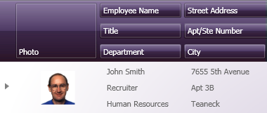
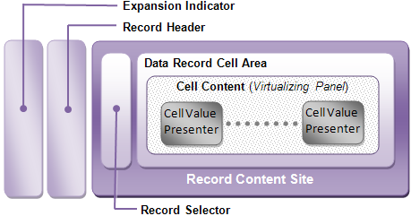

////

|metadata|
{
    "name": "xamdata-terms-records-data-record",
    "controlName": ["xamDataPresenter"],
    "tags": ["Data Binding","Getting Started"],
    "guid": "{EB546165-E987-4196-9D50-7AB06F4AFBDF}",  
    "buildFlags": [],
    "createdOn": "2012-01-30T19:39:52.5638659Z"
}
|metadata|
////

= Data Record

Data Record objects are created for every piece of information bound from your data source when the xamDataCarousel™ control needs to display or use it. These objects serve as peer objects responsible for representing your bound data item, giving you convenient access through the link:{ApiPlatform}datapresenter{ApiVersion}~infragistics.windows.datapresenter.datarecord~dataitem.html[DataItem] property. At the same time, the Data Record class gives you many other properties relating to the presentation of individual items of data.

The following image depicts a typical data record displaying several fields of information (e.g., Photo and Employee Name) in its cells. While it is sometimes convenient to think of records in terms of rows, you can see here that xamDataCarousel enables you to present record data with a very different layout.

Data records can inform you of a number of interactive states relating to the underlying data item (e.g., the active state, the selected state, and the changed state). These may be depicted by an icon placed in the record selector, occupied by the right-facing arrowhead in the image above, or through a style trigger that tests the corresponding Boolean property (such as the link:{ApiPlatform}datapresenter{ApiVersion}~infragistics.windows.datapresenter.record~isselected.html[IsSelected] property).

The following figure examines the make-up of an individual data record as it is presented. Not all data records may have all of the elements shown here, as they are frequently hidden when not needed. But the image above shows you how the Data Record will be carved up when displayed by its corresponding Data Record Presenter. For more information, see link:xamdata-terms-presenters.html[Presenters].

The expansion indicator may be shown if an individual data record has child records (see the link:{ApiPlatform}datapresenter{ApiVersion}~infragistics.windows.datapresenter.record~haschildren.html[HasChildren] property). Its purpose is to expand or collapse any child records that may exist in a child band. For more information, see the link:xamdata-terms-records-expandablefieldrecord.html[ExpandableField Record].

The record header is where icons related to the Data Record's data changed, newly added, or deletion pending states are typically displayed.

The record content site is where the record selector and data record cell area are situated. The cell content will be displayed inside of the data record cell area, in a virtualizing panel. The arrangement for the cells can be either automatically generated, or governed by custom settings made to the link:xamdata-terms-fields-field-layout.html[Field Layout]. Just as the link:{ApiPlatform}datapresenter{ApiVersion}~infragistics.windows.datapresenter.datarecordpresenter.html[DataRecordPresenter] is responsible for displaying the contents of the Data Record, each of its Cell objects are displayed by a link:{ApiPlatform}datapresenter{ApiVersion}~infragistics.windows.datapresenter.cellvaluepresenter.html[CellValuePresenter].