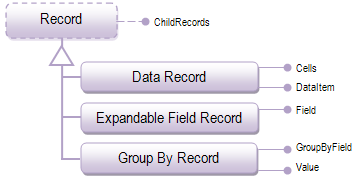

////

|metadata|
{
    "name": "xamdata-terms-records",
    "controlName": ["xamDataPresenter"],
    "tags": ["Data Binding","Getting Started"],
    "guid": "{AF7D310A-38B1-41CF-92B7-14D2EB1BBE09}",  
    "buildFlags": [],
    "createdOn": "2012-01-30T19:39:52.5588649Z"
}
|metadata|
////

= Records

All {ProductName} controls derived from the DataPresenterBase class (this includes xamDataCarousel™, xamDataGrid™,xamDataCards™, and xamDataPresenter™) represent their data in Records.

A record in its simplest sense can be thought of as a set of fields, each having its own value. These values appear in the cells of the record. A common presentation for a record typically shows its cell values appearing side-by-side in a row. However, xamDataCarousel, xamDataGrid, and xamDataPresenter allows you greater flexibility in how you present a record through the use of link:xamdata-terms-presenters.html[Presenters]. It is also common to bind record data against the rows in a relational database; however, you have much more freedom in binding against different kinds of data in the {ProductName} product.

The conceptual class diagram above highlights how controls derived from the DataPresenterBase class are classified, and some of their principle properties that you might use. All classes derived from the abstract Record base class have their own ChildRecords collection property, which allows a Record object to contain other Record objects (special rules may apply for expandable field records and GroupBy records).

The following is a list of the the concrete record types:

* link:xamdata-terms-records-data-record.html[Data Record] - DataRecord objects are created for each data item accessed from the data source in a just-in-time (or “lazy”) fashion.
* link:xamdata-terms-records-expandablefieldrecord.html[ExpandableField Record] *-* ExpandableFieldRecord objects are created to contain the child records collection related to a parent record by a particular Field.
* link:xamdata-terms-records-groupbyrecord.html[GroupBy Record] *-* GroupByRecord objects are created to group the records that have matching Values on their GroupByField.