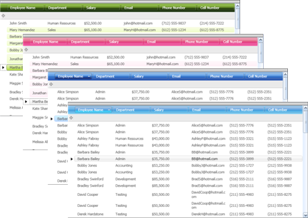

////

|metadata|
{
    "name": "xamdata-terms-themepacks",
    "controlName": ["xamDataPresenter"],
    "tags": ["Getting Started","Theming"],
    "guid": "{8BC64175-21EE-4B99-B629-97E62DE328B6}",  
    "buildFlags": [],
    "createdOn": "2012-01-30T19:39:52.5708673Z"
}
|metadata|
////

= ThemePacks

You can use ThemePacks to better manage and deploy style resources. They are assemblies that package together related style resources intended to give our {ProductName} controls a consistent look and feel. You can use them to manage style resources as a single unit and easily enforce a common look for our controls.

You can reference ThemePacks through XAML, as described in link:xamdata-referencing-a-themepack-in-xaml.html[Referencing a ThemePack in XAML].

We have prepared a number of professionally-designed ThemePacks that will make your Windows® Presentation Foundation applications look good, or fit in with different Theme conventions such as those of Microsoft® Office® 2007. All support for ThemePacks is built into the control infrastructure, and it has been exposed to allow you to design your own ThemePacks. For more information on creating your own ThemePack and using it with the {ProductName} controls, see link:wpf-creating-a-themepack.html[Creating a ThemePack].

The major concepts you need to understand to program with ThemePacks are:

* link:{ApiPlatform}v{ProductVersion}~infragistics.windows.themes.thememanager.html[Theme Manager] -- A singleton object that is responsible for tracking sets of style resources that have been loaded and registered for use by a named theme.
* link:{ApiPlatform}v{ProductVersion}~infragistics.windows.themes.resourcesetlocator~theme.html[Name] -- Every theme needs a name to uniquely identify it, and by which you can register it with the Theme Manager either through code or XAML.
* link:{ApiPlatform}v{ProductVersion}~infragistics.windows.themes.resourcesetlocator~grouping.html[Groupings] -- Style resources belonging to a Theme can be sub-categorized into groups such as "Primitives" or "WPF". These groupings are used to distinguish which elements in the UI will receive those style resources when the Theme is applied.
* link:{ApiPlatform}v{ProductVersion}~infragistics.windows.themes.resourcesetlocator~resourcepath.html[Resource Path] -- This path is used to locate a selection of style resources from within an assembly.

For a more in-depth explanation of how the ThemePack architecture works, see link:themes.html[Themes].