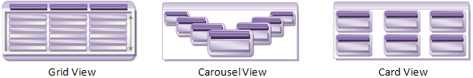

////

|metadata|
{
    "name": "xamdata-terms-views",
    "controlName": ["xamDataPresenter"],
    "tags": ["Data Presentation","Getting Started"],
    "guid": "{0A2D258E-B3A1-4FD4-B900-F119D40035B6}",  
    "buildFlags": [],
    "createdOn": "2012-01-30T19:39:52.5728677Z"
}
|metadata|
////

= Views

Information can be expressed in a variety of forms, sometimes creating entirely different experiences for your users. At first glance, some Views may seem entirely unrelated to each other. Since Views can theoretically have any appearance or behavior imaginable in a user interface, their diversity can rival the Animal Kingdom. Dolphins and deer at first seem completely unrelated, but they share a common Mammalian ancestry. The differences between these two species, like the differences between any two Views, can be attributed to the environment in which they survive and thrive.

Think about which View best expresses to your end users the information that your data represents, and then choose the most appropriate View. This choice will determine your choice of a DataPresenterBase-derived control, as shown in the following table.

[options="header", cols="a,a"]
|====
|View|Control(s)

| link:xamdata-terms-presentation-formats-grid-view-format.html[Grid View] -- Presents regular arrangements of rows and columns in a grid-like structure.
|xamDataGrid™ or xamDataPresenter™

| link:xamdata-terms-presentation-formats-carousel-view.html[Carousel View] -- Presents objects moving along a prescribed path or circuit in a rotisserie manner.
|xamDataCarousel™, xamCarouselPanel™, xamCarouselListbox™, or xamDataPresenter

| link:xamdata-terms-presentation-formats-card-view.html[Card View] -- Presents 'card' objects arranged in rectangular pattern.
|xamDataCards™ or xamDataPresenter

|(Any)
|xamDataPresenter

|====

{ProductName} controls can be specialized to support one format. Both the xamDataCarousel and xamDataGrid controls fall into this specialized category. When you need greater flexibility to change your View in the future, the more general case for which the xamDataPresenter control was designed may be the better choice. Because of its highly extensible link:{ApiPlatform}datapresenter.v{ProductVersion}~infragistics.windows.datapresenter.viewbase.html[ViewBase] class design, it can accommodate any View through its link:{ApiPlatform}datapresenter.v{ProductVersion}~infragistics.windows.datapresenter.xamdatapresenter~view.html[View] property.