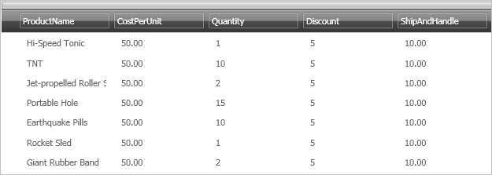

////
|metadata|
{
    "name": "xamdata-using-built-in-themes",
    "controlName": ["xamDataPresenter"],
    "tags": ["Theming"],
    "guid": "{34735165-EC4A-44FA-82A5-DC026FBE4309}",
    "buildFlags": [],
    "createdOn": "2012-01-30T19:39:52.5778687Z"
}
|metadata|
////

= Using Built-In Themes

The xamDataCarousel™, xamDataGrid™, and xamDataPresenter™ controls can be styled with built-in themes stored in the assembly. Setting the control's link:{ApiPlatform}datapresenter.v{ProductVersion}~infragistics.windows.datapresenter.datapresenterbase~theme.html[Theme] property to the name of the desired theme is all that is necessary to use built-in themes. The available built-in themes include:

* Aero
* Generic
* IGTheme
* LunaNormal
* LunaOlive
* LunaSilver
* Metro
* Metro Dark
* Office2010Blue
* Office2013
* Office2k7Black
* Office2k7Blue
* Office2k7Silver
* Onyx
* Print Basic
* Royal Dark
* Royale
* RoyaleStrong

The following procedure assumes you already have a control setup for which you want to set the Theme property. The procedure has been written in the context of xamDataGrid, but works the same way for xamDataCarousel and xamDataPresenter.

*To set the Theme property on the xamDataGrid control:*

[start=1]
. The following XAML shows you where to set the Theme property in relationship to the control. It also sets the Theme property to the Office2k7Black built-in style.

*In XAML:*

----
<igDP:XamDataGrid 
  ...
  Theme="Office2k7Black"/>
----

[start=2]
. When you apply the Office2k7Black theme to xamDataGrid, the control would look similar to the image below.

