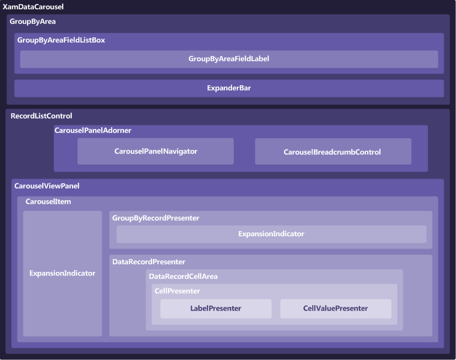

////

|metadata|
{
    "name": "xamdatacarousel-understanding-xamdatacarousel",
    "controlName": ["xamDataPresenter"],
    "tags": ["Getting Started"],
    "guid": "{C9EE9F10-A0E1-41BC-B145-E44F0C4D1D7C}",  
    "buildFlags": [],
    "createdOn": "2012-01-30T19:39:52.6698871Z"
}
|metadata|
////

= About xamDataCarousel

The xamDataCarousel™ control uses the link:xamdata-terms-presentation-formats-carousel-view.html[Carousel View] and arranges data items along a specified link:xamcarousel-path.html[path]. link:xamdata-terms-records.html[Records] are used to represent each data item and link:xamdata-terms-fields.html[Fields] are used to describe the attributes/properties that make up each record. It can automatically detect each type of record in your data source and generate specific FieldLayouts for each type. This allows it to support both conventional data sources like DataSets and DataViews as well as more free form data sources such as XML.

* link:xamcarousel-path-effects.html[Path Effects] – You can use several effects along xamDataCarousel's path that will grant items a certain visual flare that normally wouldn't be possible. These path effects can give the path itself a three dimensional look by scaling items, or perhaps you would like for only one item to stand out at a time with an opacity effect, or maybe a skew effect can give your items the feel of motion.
* Item Templates – Each item in xamDataCarousel is contained within a special container - CarouselItem. By setting a visual style for this one container, each item will display with the same style. Also, by creating a DataTemplate, you can bind the xamDataCarousel control to a data source and show much more information per item.
* link:xamdata-terms-fields-field-layout.html[Field Layouts] – A collection of Fields that helps you define how data should be presented.
* Carousel Breadcrumb – With the Carousel breadcrumb, your end user will never get lost in data again. Displaying automatically along with hierarchical data, the breadcrumb will get the end user apprised of their current location as they drill down in the data.
* link:xamcarousel-terms-carousel-panel-navigator.html[CarouselPanelNavigator] – In the lower-right corner of the xamDataCarousel control is a set of four buttons known collectively as the CarouselPanelNavigator. The two large buttons in the center of the cluster are used to scroll backwards or forwards in the path by one item. The smaller two buttons on either end of the two large buttons will scroll to the first or last items in the path, respectively.

== Composition Diagram

The xamDataCarousel™ control is comprised of various elements. The following illustration depicts the relationship between the elements, so that you can gain a better understanding of the overall composition of xamDataCarousel.

== Related Topics

link:wpf-terms-and-concepts.html[Terms and Concepts]

link:xamdata-theoryofoperation.html[Theory of Operation]