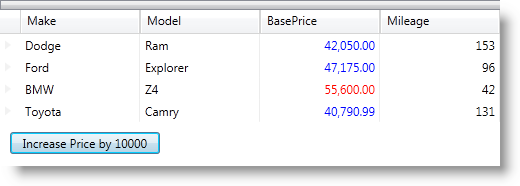

////
|metadata|
{
    "name": "xamdatagrid-cellvaluepesenterstyleselector-reevaluated",
    "controlName": ["xamDataGrid"],
    "tags": ["Events","Grids"],
    "guid": "f4628410-f325-44cf-88b4-4b7933162286",
    "buildFlags": [],
    "createdOn": "2012-01-30T19:39:53.0309593Z"
}
|metadata|
////

= Conditional Formatting (xamDataGrid)

== Topic Overview

=== Purpose

You can apply different styles when a cell value changes in a xamDataGrid control. A link:{ApiPlatform}datapresenter{ApiVersion}~infragistics.windows.datapresenter.fieldsettings~cellvaluepresenterstyleselector.html[CellValuePesenterStyleSelector] can be specified on the link:{ApiPlatform}datapresenter{ApiVersion}~infragistics.windows.datapresenter.fieldsettings.html[FieldSettings] at any level. Available levels include:

* link:{ApiPlatform}datapresenter{ApiVersion}~infragistics.windows.datapresenter.xamdatagrid.html[XamDataGrid]
* link:{ApiPlatform}datapresenter{ApiVersion}~infragistics.windows.datapresenter.fieldlayout.html[FieldLayout]
* link:{ApiPlatform}datapresenter{ApiVersion}~infragistics.windows.datapresenter.field.html[Field]

Specific styles are set using the `SelectStyle` method on the `CellValuePesenterStyleSelector` every time a cell value is changed. This occurs when:

* A link:{ApiPlatform}datapresenter{ApiVersion}~infragistics.windows.datapresenter.cellvaluepresenter.html[CellValuePresenter]'s value changes and the cell is not in edit mode.
* A `CellValuePresenter`{empty}'s value is changed by a user in edit mode and the changes are accepted.

=== Required background

[options="header", cols="a,a"]
|====
|Background type|Content

|Concepts
|You need to be familiar with the following concepts: 

- StyleSelector Class (http://msdn.microsoft.com/en-us/library/ms612988.aspx)

|Topics
|You need to first read the following topics: 

* link:xamdatapresenter-getting-started-with-xamdatapresenter.html[Adding xamDataPresenter to Your Application] 

* link:xamdatapresenter-defining-layouts.html[Defining Field Layouts] 

* link:xamdatagrid-understanding-xamdatagrid.html[About xamDataGrid] 

|====

== Applying different styles when a CellValuePresenter's Value Changes

=== Introduction

The code below demonstrates how the cell’s style is changed according to custom logic using the CellValuePesenterStyleSelector specified on the link:{ApiPlatform}datapresenter{ApiVersion}~infragistics.windows.datapresenter.field~settings.html[Settings] of a particular Field object.

=== Preview

Following image previews the final result where values over 50,000 are red while all other values are blue.

=== Requirements

To complete the procedure, you need the following:

* Include the link:resources-car-business-logic.html[CarsBusinessLogic] class in your project. This class contains the sample data used in this example.

=== Overview

Following is a conceptual overview of the process:

[start=1]
. *<<step1,Creating custom styles and adding them as Window resources>>*
[start=2]
. *<<step2,Adding a xamDataGrid control and a Button to your WPF application>>*
[start=3]
. *<<step3,Creating a subclass of the StyleSelector class and implementing the SelectStyle method>>*
[start=4]
. *<<step4,Setting a CellValuePresenterStyleSelector property for the “BasePrice” Fields’ Settings>>*
[start=5]
. *<<step5,Handle the Button Click event to change the cells values in the “BasePrice” Fields>>*
[start=6]
. *<<step6,Save your application>>*
[start=7]
. _<<step7,(Optional) *Verify the result.* >>_ 

=== Steps

[[step1]]
[start=1]
. *Creating custom styles and adding them as Window resources.*
+
Two custom styles are added as Window resources. They are applied according to a certain rule when a cell value changes. The values that are less than 50,000 get a blue foreground color while values greater than 50,000 get a red foreground color.
+
*In XAML:*
+
[source,xaml]
----
<Window.Resources>
...

...
</Window.Resources>
----

[[step2]]
[start=2]
. *Adding the xamDataGrid control and a Button to increase certain values.*
+
A Button is added and its Click event handler implements functionality to change the cell values in one of the xamDataGrid Fields (“BasePrice”).
+
*In XAML:*
+
[source,xaml]
----
<Grid>
    <Grid.RowDefinitions>
        <RowDefinition Height="Auto" />
        <RowDefinition Height="Auto" />
    </Grid.RowDefinitions>
    <igDP:XamDataGrid x:Name="dataGrid" DataSource="{Binding}"/>
    <Button Content="Increase Price by 10000" Grid.Row="1"
            Width="150" Height="22" Margin="10"
            HorizontalAlignment="Left" VerticalAlignment="Bottom"
            Click="Button_Click" />
</Grid>
----

[[step3]]
[start=3]
. *Creating a subclass of the StyleSelector class and implementing the SelectStyle method.*
+
The SelectStyle returns a different Style when the base price is changed.
+
*In Visual Basic:*
+
[source,vb]
----
Friend Class CVPStyleSelector_Field
  Inherits StyleSelector
  
    Private _redStyle As Style
    Private _blueStyle As Style
    
    Friend Sub New(redStyle As Style, blueStyle As Style)
        Me._redStyle = redStyle
        Me._blueStyle = blueStyle
    End Sub
    
    Public Overrides Function SelectStyle(item As Object container As DependencyObject) As Style
        Dim over50K As Boolean = (50000 < Decimal.Parse(item.ToString()))
        If over50K Then
            Return _redStyle
        Else
            Return _blueStyle
        End If
    End Function
End Class
----
+
*In C#:*
+
[source,csharp]
----
internal class CVPStyleSelector_Field : StyleSelector
{
    private Style _redStyle;
    private Style _blueStyle;
  
    internal CVPStyleSelector_Field(Style redStyle, Style blueStyle)
    {
        this._redStyle = redStyle;
        this._blueStyle = blueStyle;
    }
  
    public override Style SelectStyle(object item, DependencyObject container)
    {
        bool over50K = (50000 < decimal.Parse(item.ToString()));
        if (over50K)
        {
            return _redStyle;
        }
        else
        {
            return _blueStyle;
        }
    }
}
----

[[step4]]
[start=4]
. *Setting the CellValuePresenterStyleSelector property and loading sample data in the xamDataGrid.*
+
*In Visual Basic:*
+
[source,vb]
----
Public Sub New()
    InitializeComponent()
    Me.LoadData()
    AddHandler Loaded, AddressOf Me.MainWindow_Loaded
End Sub

Private Sub LoadData()
    Dim businessData As New CarsBusinessLogic()
    Me.DataContext = TryCast(businessData.GetCars(), ObservableCollection(Of Car))
End Sub

Private Sub MainWindow_Loaded(sender As Object, e As RoutedEventArgs)
    Dim redForegroundStyle As Style _
        = TryCast(Me.Resources("CVP_RedField"), Style)
    Dim blueForegroundStyle As Style _
        = TryCast(Me.Resources("CVP_BlueField"), Style)
    Me.dataGrid.DefaultFieldLayout.Fields("BasePrice").Settings.CellValuePresenterStyleSelector = _
        New CVPStyleSelector_Field(redForegroundStyle, blueForegroundStyle)
End Sub
----
+
*In C#:*
+
[source,csharp]
----
public MainWindow()
{
    InitializeComponent();
    this.LoadData();
    Loaded += new RoutedEventHandler(MainWindow_Loaded);
}
private void LoadData()
{
    CarsBusinessLogic businessData = new CarsBusinessLogic();
    this.DataContext = businessData.GetCars() as ObservableCollection;
}
private void MainWindow_Loaded(object sender, RoutedEventArgs e)
{
    Style redForegroundStyle = this.Resources["CVP_RedField"] as Style;
    Style blueForegroundStyle = this.Resources["CVP_BlueField"] as Style;
    this.dataGrid.DefaultFieldLayout.Fields["BasePrice"].Settings.CellValuePresenterStyleSelector =
        new CVPStyleSelector_Field(redForegroundStyle, blueForegroundStyle);
}
----

[[step5]]
[start=5]
. *Handle the Button Click event to change the cells values in the “BasePrice” Fields.*
+
Clicking the button, the cell values in the BasePrice column increase with 10 000.
+
*In Visual Basic:*
+
[source,vb]
----
Private Sub Button_Click(sender As Object, e As RoutedEventArgs)
    Dim temp As ObservableCollection(Of Car) = TryCast(Me.DataContext, 
    ObservableCollection(Of Car))
    For Each car As Car In temp
        car.BasePrice += 10000
    Next
End Sub
----
+
*In C#:*
+
[source,csharp]
----
private void Button_Click(object sender, RoutedEventArgs e)
{
    ObservableCollection<Car> temp = 
    this.DataContext as ObservableCollection<Car>;
    foreach (Car car in temp)
    {
        car.BasePrice += 10000;
    }
}
----

[[step6]]
[start=6]
. *Save the application.*

[[step7]]
[start=7]
. _(Optional)_  *Verify the result.*
+
Run your application and then click the “Increase…” button. If the code is implemented properly, the “BasePrice” cells values increase and when some of them reach 50,000 their foreground color changes to red.

== Related Topics

Following are some other topics you may find useful.

* link:xamdata-terms-fields-field-settings.html[Field Settings]
* link:xamdata-specifying-settings-for-fields.html[Specifying Settings for Fields]
* link:xamdata-assigning-a-fieldlayout.html[Assigning a FieldLayout]
* link:wpf-working-with-xamdatagrid-xamdatacarousel-and-xamdatapresenter-styling-points.html[Working with xamDataGrid, xamDataCarousel, and xamDataPresenter Styling Points]