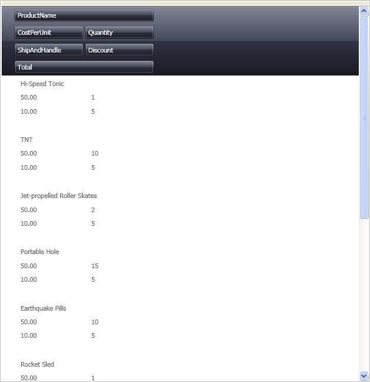

////
|metadata|
{
    "name": "xamdatagrid-changing-the-default-column-and-row-definitions",
    "controlName": ["xamDataGrid"],
    "tags": ["Data Presentation","Editing"],
    "guid": "{F5317934-129E-4372-B14B-CF18E8CB1FCA}",
    "buildFlags": [],
    "createdOn": "2012-01-30T19:39:52.9799491Z"
}
|metadata|
////

= Changing the Default Column and Row Definitions

The xamDataPresenter™ Grid View allows you to change the layout beyond customizing the link:{ApiPlatform}datapresenter{ApiVersion}~infragistics.windows.datapresenter.fieldlayout.html[FieldLayout]s. You can set a link:{ApiPlatform}datapresenter{ApiVersion}~infragistics.windows.datapresenter.fielditem~row.html[Row], link:{ApiPlatform}datapresenter{ApiVersion}~infragistics.windows.datapresenter.fielditem~column.html[Column], link:{ApiPlatform}datapresenter{ApiVersion}~infragistics.windows.datapresenter.fielditem~columnspan.html[ColumnSpan], or link:{ApiPlatform}datapresenter{ApiVersion}~infragistics.windows.datapresenter.fielditem~rowspan.html[RowSpan] on each link:{ApiPlatform}datapresenter{ApiVersion}~infragistics.windows.datapresenter.field.html[Field] to further control the layout of the link:{ApiPlatform}datapresenter{ApiVersion}~infragistics.windows.datapresenter.record.html[Record].

The following procedure assumes you have a data bound xamDataPresenter. For more information, see link:xamdatapresenter-getting-started-with-xamdatapresenter.html[Adding xamDataPresenter to Your Application].

Follow these steps to specify a Row, Column, and ColumnSpan on Fields in the xamDataPresenter.

[start=1]
. The following XAML creates an instance of XamDataPresenter and names it.
+
*In XAML:*
+
[source,xaml]
----
<igDP:XamDataPresenter x:Name="XamDataPresenter1" ... >
    <igDP:XamDataPresenter.View>
        <igDP:GridView />
    </igDP:XamDataPresenter.View>
    ...     
</igDP:XamDataPresenter>
----

[start=2]
. Use the following XAML to specify the link:{ApiPlatform}datapresenter{ApiVersion}~infragistics.windows.datapresenter.fieldlayoutsettings.html[FieldLayoutSettings] of the XamDataPresenter and set the link:{ApiPlatform}datapresenter{ApiVersion}~infragistics.windows.datapresenter.fieldlayoutsettings~autoarrangecells.html[AutoArrangeCells] and link:{ApiPlatform}datapresenter{ApiVersion}~infragistics.windows.datapresenter.fieldlayoutsettings~autogeneratefields.html[AutoGenerateFields] properties.
+
*In XAML:*
+
[source,xaml]
----
...
    <igDP:XamDataPresenter.FieldLayoutSettings>
        <igDP:FieldLayoutSettings AutoArrangeCells="Never" 
            AutoGenerateFields="False" />
    </igDP:XamDataPresenter.FieldLayoutSettings>
...
----

[start=3]
. With the FieldLayoutSettings specified, define the FieldLayouts for the control. The following XAML specifies the FieldLayouts and then defines the Fields from the data source, as well as an additional `UnboundField`. Each field has a Row and Column set to assist xamDataGrid in positioning that particular Field. The first and second Field also have a ColumnSpan set to 2, this causes those Fields to span two columns instead of just one. You can think of it as ColumnSpan="2" specifies both Column="0" and Column="1" for those two columns.
+
*In XAML:*
+
[source,xaml]
----
...
    <igDP:XamDataPresenter.FieldLayouts>
        <igDP:FieldLayout>
            <igDP:FieldLayout.Fields>
                <igDP:Field Name="ProductName" Row="0" Column="0" 
                    ColumnSpan="2" />
                <igDP:Field Name="CostPerUnit" Row="1" Column="0" />
                <igDP:Field Name="Quantity" Row="1" Column="1" />
                <igDP:Field Name="Discount" Row="2" Column="1" />
                <igDP:Field Name="ShipAndHandle" Row="2" Column="0" />
                <igDP:UnboundField Name="Total" Row="3" Column="0"
                    ColumnSpan="2" />
            </igDP:FieldLayout.Fields>
        </igDP:FieldLayout>
    </igDP:XamDataPresenter.FieldLayouts>
...
----

[start=4]
. Build and run the project. You should see xamDataPresenter with its first and last columns spaning the length of the four middle columns similar to the image below.
+
