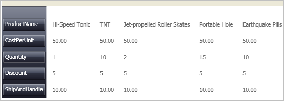

////

|metadata|
{
    "name": "xamdatagrid-changing-the-record-orientation",
    "controlName": ["xamDataGrid"],
    "tags": ["Data Presentation","Editing"],
    "guid": "{8136C48C-735A-4A54-AD4B-9FD46B9DAC9B}",  
    "buildFlags": [],
    "createdOn": "2012-01-30T19:39:52.9829497Z"
}
|metadata|
////

= Changing the Record Orientation

The xamDataPresenter's™ Grid View shows link:{ApiPlatform}datapresenter{ApiVersion}~infragistics.windows.datapresenter.record.html[Record]s in either vertical (default) or horizontal orientation. To show records in horizontal orientation, set the link:{ApiPlatform}datapresenter{ApiVersion}~infragistics.windows.datapresenter.gridviewsettings~orientation.html[Orientation] property off the link:{ApiPlatform}datapresenter{ApiVersion}~infragistics.windows.datapresenter.gridviewsettings.html[GridViewSettings].

The following procedure assumes you have a data bound xamDataPresenter that you want to change the orientation on. For more information, see link:xamdatapresenter-getting-started-with-xamdatapresenter.html[Adding xamDataPresenter to Your Application].

Follow these steps to display Grid View's Records horizontally.

[start=1]
. The following XAML creates an instance of XamDataPresenter's Grid View and names it. The XAML then defines a link:{RootAssembly}{ApiVersion}~infragistics.windows.controls.viewsettingsbase.html[ViewSettings] object off the GridView and a GridViewSettings object (derived from ViewSettings), enabling you to set the Orientation property.

*In XAML:*

----
<igDP:XamDataPresenter x:Name="XamDataPresenter1" 
  ...
  >
        <igDP:XamDataPresenter.View>
                <igDP:GridView>
                        <igDP:GridView.ViewSettings>
                                <igDP:GridViewSettings Orientation="Horizontal" />
                        </igDP:GridView.ViewSettings>
                </igDP:GridView>
        </igDP:XamDataPresenter.View>
</igDP:XamDataPresenter>
----

[start=2]
. Build and run the project. You should see the Grid View displaying in a horizontal orientation similar to the image below.

