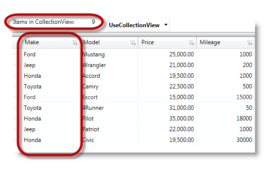
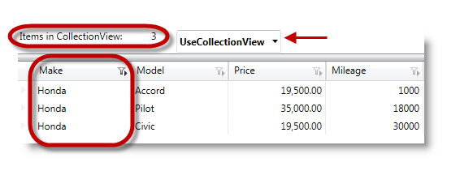
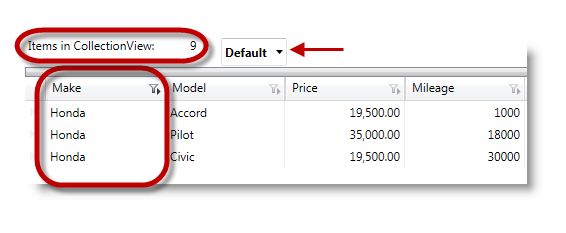

////
|metadata|
{
    "name": "xamdatagrid-external-filtering",
    "controlName": ["xamDataGrid"],
    "tags": ["Filtering","Grids"],
    "guid": "87759144-fef9-4a4b-b274-f7eae5c308cf",
    "buildFlags": [],
    "createdOn": "2012-09-17T19:52:00.43974Z"
}
|metadata|
////

= External Filtering (xamDataGrid)

== Topic Overview

=== Purpose

This topic demonstrates through code example, how to use the _xamDataGrid™_   control to externalize the record filtering process.

=== Required background

The following topics are prerequisites to understanding this topic:

[options="header", cols="a,a"]
|====
|Topic|Purpose

| link:wpf-about-the-data-presenter-family.html[About the Data Presenter Family]
|This topic introduces the `DataPresenter` control's grouping function. 

The `DataPresenter` controls offer a grouping function, which allows end users to group records based on fields that contain the same value.

| link:xamdatagrid-understanding-xamdatagrid.html[About xamDataGrid]
|The _xamDataGrid_ control uses the Grid View and arranges data in columns and rows.

| link:xamdatagrid-using-xamdatagrid.html[Working with xamDataGrid]
|This section is your gateway to important task-based information that will help you to use the various features and functionalities provided by _xamDataGrid_ control more effectively.

|====

=== In this topic

This topic contains the following sections:

* <<_Ref327527325,Introduction>>
* <<_Ref327527435,External Filtering - Code Example>>
* <<_Ref327527447,Related Content>>

[[_Ref327527325]]
== Introduction

=== Introduction to the xamDataGrid external Filtering

The following example demonstrates how to configure the  _xamDataGrid_   control's external filtering process, which runs externally without affecting the user interface. To display a list of available filter operands, click on either the filter label icon or a filter cell's drop-down button, depending on the selected `FilterUIType`. Due to current limitations, some of the  _xamDataGrid's_   data presenter operands, which are normally available, are not available for the  _xamDataGrid's_   data presenter.

Since the `DataPresenter's` resources go unused when carrying out external operations, it consumes considerably less overhead. The link:http://msdn.microsoft.com/en-us/library/system.windows.data.collectionview(v=VS.85).aspx[CollectionView] performs the requested filtering process, and once the filtering finishes the `CollectionView` notifies the `DataPresenter`, which in turn propagates the results in the UI.

=== Preview

The following screenshot illustrates a typical data grid rendering before filtering on the Make column, which indicates the number of items in the `CollectionView`. In this case, there are 9 items in the `CollectionView`.

The next screenshot illustrates how the same data grid would render if the user were to filter on a specific manufacturer, in this case Honda in the Make field. Additionally, enabling the  _UseCollectionView's_   `FilterEvaluationMode`, results in updating the collection view and displaying the number of filtered items in the `CollectionView`. In this case, there are 3 items in the `CollectionView`.

`CollectionView`‘s filter property propagates the result of filtered records to the  _xamDataGrid's_   data presenter. Additionally, the data presenter reflects the changes made in the filter by rendering the result in the  _xamDataGrid's_   view.

The following screenshot illustrates the outlined column filtering scenario, but with the `FilterEvaluationMode` set to  _Default_   this time. Notice that the items in `CollectionView` are unaffected by the filtering process. The  _xamDataGrid's_   data presenter performs the filtering internally.

=== Limitations

When using the  _UseCollectionView's_   `FilterEvaluationMode`, if you have a custom `ICollectionView` implementation where `ICollectionView`.`SourceCollection` does not return a value results in operands requiring aggregated value to evaluate (for example,  _Above Average, Below Average, Percentile etc…_  ) are unsupported.

The reason for not being able to support these operands is that the operation of filtering makes the entire data set unavailable to the data presenter.

Furthermore, you cannot populate the filter drop-down list with unique values.

In order to present unique values in the drop-down or control what gets presented, you first need to handle either the link:{ApiPlatform}datapresenter{ApiVersion}~infragistics.windows.datapresenter.datapresenterbase~recordfilterdropdownpopulating_ev.html[RecordFilterDropDownPopulating] or link:{ApiPlatform}datapresenter{ApiVersion}~infragistics.windows.datapresenter.datapresenterbase~recordfilterdropdownopening_ev.html[RecordFilterDropDownOpening] event, which populates the drop-down with a list of unique values.

Choosing an operand from the filter drop-down notifies the data presenter to apply the condition to the `ICollectionView` data souce, which in turn filters itself and notify the data presenter to display the filtered items.

.Note
[NOTE]
====
Since the `ICollectionView` filters itself and provides a subset of data items to the data presenter, the data presenter discards the filtered out data items' `DataRecord` objects. Therefore, selected or activated records toggle their selected or activated state following the removal of the filtering criteria when the data grid refreshes. You can only perform filtering on bound data fields.
====

When filtering data items (in and out), the  _xamDataGrid_   control recreates the `DataRecord` objects. Thus resulting in the loss of any unbound field values, along with any other state stored by the `DataRecord`.

In order to use External Filtering, you will first need to configure the `FieldLayoutSettings'` `FilterEvaluationMode` with the  _UseCollectionView_   option.

The following is an enumeration of the available `FilterEvaluationModes`:

[options="header", cols="a,a"]
|====
| *Sort condition type* | *Description* 

|_Auto_
|Internal filtering, performed by the data presenter.

|_Default_
|Resolves to Auto.

|_Manual_
|Allows the user to manually implement the filtering logic by removing entries not matching the filtering criteria from the data source.

|_UseCollectionView_
|Uses the `ICollectionView` data source to execute the filtering operations. 

.Note 

[NOTE] 

==== 

If there are any filtering logic set using the `Filter` property of the `ICollectionView` implementing data source, it will be overwritten by the xamDataGrid's filtering criteria which are supplied through this property. 

====

|====

[[_Ref327527435]]
== External Filtering – Code Example

=== Description

This external filtering operation uses callback procedures to pass your filtering criteria to the `ICollectionView` to filter out records.

=== Prerequisites

Create a new WPF Application project and perform the following requirements:

* Add these three Infragistics assemblies to your project

** {ApiPlatform}DataPresenter.{DllVersion}

** {ApiPlatform}Editors.{DllVersion}

** {ApiPlatform}{DllVersion}

* Add the following namespace definitions in the XAML part of the window, where your will place the mark-up for the _xamDataGrid_:
+
[source,xaml]
----
xmlns:igDP=http://infragistics.com/DataPresenter
----

* Ensure that the relevant properties of the object are marked as  _public_  , as those properties will be accessed using link:http://msdn.microsoft.com/en-us/library/f7ykdhsy(v=vs.71).aspx[Reflection] while evaluating filter conditions.

=== Code explanation

Enabling record filtering.

*In XAML:*

[source,xaml]
----
<igDP:XamDataGrid.FieldSettings>
   <igDP:FieldSettings AllowRecordFiltering="True" />
</igDP:XamDataGrid.FieldSettings>
----

Setting up the `FilterEvaluationMode` with  _UseCollectionView_   option.

*In XAML:*

[source,xaml]
----
<igDP:XamDataGrid.FieldLayoutSettings>
   <igDP:FieldLayoutSettings 
      FilterEvaluationMode="UseCollectionView"
      FilterUIType="LabelIcons" />
</igDP:XamDataGrid.FieldLayoutSettings>
----

=== Complete code

Data model definition.

*In C#:*

[source,csharp]
----
 public class DataModel : INotifyPropertyChanged
    {
        private string _make;
        public string Make
        {
            get { return _make; }
            set
            {
                if (_make != value)
                {
                    _make = value;
                    OnPropertyChanged("Make");
                }
            }
        }
        private string _model;
        public string Model
        {
            get { return _model; }
            set
            {
                if (_model != value)
                {
                    _model = value;
                    OnPropertyChanged("Model");
                }
            }
        }
        private double _price;
        public double Price
        {
            get { return _price; }
            set
            {
                if (_price != value)
                {
                    _price = value;
                    OnPropertyChanged("Price");
                }
            }
        }
        private int _mileage;
        public int Mileage
        {
            get { return _mileage; }
            set
            {
                if (_mileage != value)
                {
                    _mileage = value;
                    OnPropertyChanged("Mileage");
                }
            }
        }
        #region INotifyPropertyChanged Members
        protected void OnPropertyChanged(string propertyName)
        {
            if (PropertyChanged != null)
            {
                this.PropertyChanged(this, new PropertyChangedEventArgs(propertyName));
            }
        }
        public event PropertyChangedEventHandler PropertyChanged;
        #endregion
    }
----

*In Visual Basic:*

[source,vb]
----
Public Class DataModel
      Implements INotifyPropertyChanged
      Private _make As String
      Public Property Make() As String
            Get
                  Return _make
            End Get
            Set
                  If _make <> value Then
                        _make = value
                        OnPropertyChanged("Make")
                  End If
            End Set
      End Property
      Private _model As String
      Public Property Model() As String
            Get
                  Return _model
            End Get
            Set
                  If _model <> value Then
                        _model = value
                        OnPropertyChanged("Model")
                  End If
            End Set
      End Property
      Private _price As Double
      Public Property Price() As Double
            Get
                  Return _price
            End Get
            Set
                  If _price <> value Then
                        _price = value
                        OnPropertyChanged("Price")
                  End If
            End Set
      End Property
      Private _mileage As Integer
      Public Property Mileage() As Integer
            Get
                  Return _mileage
            End Get
            Set
                  If _mileage <> value Then
                        _mileage = value
                        OnPropertyChanged("Mileage")
                  End If
            End Set
      End Property
      #Region "INotifyPropertyChanged Members"
      Protected Sub OnPropertyChanged(propertyName As String)
            RaiseEvent PropertyChanged(Me, New PropertyChangedEventArgs(propertyName))
      End Sub
      Public Event PropertyChanged As PropertyChangedEventHandler
      #End Region
End Class
----

*In XAML:*

[source,xaml]
----
<Grid>
<Grid.RowDefinitions>
            <RowDefinition Height="30"/>
            <RowDefinition Height="*"/>
        </Grid.RowDefinitions>
        <StackPanel Grid.Row="0" Orientation="Horizontal">
            <TextBlock x:Name="textBlock1" Text="Items in CollectionView: " 
Width="165" HorizontalAlignment="Stretch" />
            <TextBlock x:Name="textBlock2" 
Width="30" HorizontalAlignment="Stretch" />
            <igEditors:XamComboEditor 
                    FontWeight="Bold"
                    ItemsSource="{DynamicResource FilterEvaluationMode}"
                    Value="{Binding ElementName=xamDataGrid1, Path=FieldLayoutSettings.FilterEvaluationMode}"/>
        </StackPanel>
        <igDP:XamDataGrid x:Name="xamDataGrid1" 
                     Grid.Row="1"
                     DataSource="{DynamicResource DataSource}" 
                     VerticalAlignment="Stretch"
                     RecordFilterChanged="xamDataGrid1_RecordFilterChanged">
            <igDP:XamDataGrid.FieldLayoutSettings>
                <igDP:FieldLayoutSettings 
                      FilterEvaluationMode="UseCollectionView"
                      FilterUIType="LabelIcons" />
            </igDP:XamDataGrid.FieldLayoutSettings>
            <igDP:XamDataGrid.FieldSettings>
                <igDP:FieldSettings AllowRecordFiltering="True" />
            </igDP:XamDataGrid.FieldSettings>
        </igDP:XamDataGrid>
</Grid>
----

*In C#:*

[source,csharp]
----
public partial class MainWindow : Window
    {
        public MainWindow()
        {
            InitializeComponent();
            this.Resources.Add("FilterEvaluationMode", Enum.GetValues(typeof(FilterEvaluationMode)));
            // Create new instance of the data source
            this.CreateDataSource();
        }
        // Create data source
        private void CreateDataSource()
        {
            var data = new ObservableCollection<DataModel>();
            data.Add(new DataModel() { Make = "Ford", Model = "Mustang", Price = 25000, Mileage = 1000 });
            data.Add(new DataModel() { Make = "Jeep", Model = "Wrangler", Price = 21000, Mileage = 200 });
            data.Add(new DataModel() { Make = "Honda", Model = "Accord", Price = 19500, Mileage = 1000 });
            data.Add(new DataModel() { Make = "Toyota", Model = "Camry", Price = 22500, Mileage = 500 });
            data.Add(new DataModel() { Make = "Ford", Model = "Escort", Price = 15000, Mileage = 15000 });
            data.Add(new DataModel() { Make = "Toyota", Model = "4Runner", Price = 31000, Mileage = 50 });
            data.Add(new DataModel() { Make = "Honda", Model = "Pilot", Price = 35000, Mileage = 18000 });
            data.Add(new DataModel() { Make = "Jeep", Model = "Patriot", Price = 22000, Mileage = 1000 });
            data.Add(new DataModel() { Make = "Honda", Model = "Civic", Price = 19500, Mileage = 30000 });
            this.Resources.Add("DataSource", new ListCollectionView(data));
        }
private void xamDataGrid1_RecordFilterChanged(object sender, Infragistics.Windows.DataPresenter.Events.RecordFilterChangedEventArgs e)
        {
            CollectionView cv = this.xamDataGrid1.DataSource as CollectionView;
            this.textBlock2.Text = cv.Count.ToString();
        }
    }
----

*In Visual Basic:*

[source,vb]
----
Public Partial Class MainWindow
      Inherits Window
      Public Sub New()
            InitializeComponent()
            Me.Resources.Add("FilterEvaluationMode", [Enum].GetValues(GetType(FilterEvaluationMode)))
            ' Create new instance of the data source
            Me.CreateDataSource()
      End Sub
      ' Create data source
      Private Sub CreateDataSource()
            ' Populate some data
            Dim data = New ObservableCollection(Of DataModel)()
            data.Add(New DataModel() With { 
                  .Make = "Ford", 
                  .Model = "Mustang", 
                  .Price = 25000, 
                  .Mileage = 1000 
            })
            data.Add(New DataModel() With { 
                  .Make = "Jeep", 
                  .Model = "Wrangler", 
                  .Price = 21000, 
                  .Mileage = 200 
            })
            data.Add(New DataModel() With { 
                  .Make = "Honda", 
                  .Model = "Accord", 
                  .Price = 19500, 
                  .Mileage = 1000 
            })
            data.Add(New DataModel() With { 
                  .Make = "Toyota", 
                  .Model = "Camry", 
                  .Price = 22500, 
                  .Mileage = 500 
            })
            data.Add(New DataModel() With { 
                  .Make = "Ford", 
                  .Model = "Escort", 
                  .Price = 15000, 
                  .Mileage = 15000 
            })
            data.Add(New DataModel() With { 
                  .Make = "Toyota", 
                  .Model = "4Runner", 
                  .Price = 31000, 
                  .Mileage = 50 
            })
            data.Add(New DataModel() With { 
                  .Make = "Honda", 
                  .Model = "Pilot", 
                  .Price = 35000, 
                  .Mileage = 18000 
            })
            data.Add(New DataModel() With { 
                  .Make = "Jeep", 
                  .Model = "Patriot", 
                  .Price = 22000, 
                  .Mileage = 1000 
            })
            data.Add(New DataModel() With { 
                  .Make = "Honda", 
                  .Model = "Civic", 
                  .Price = 19500, 
                  .Mileage = 30000 
            })
            Me.Resources.Add("DataSource", New ListCollectionView(data))
      End Sub
      Private Sub xamDataGrid1_RecordFilterChanged(sender As Object, e As Infragistics.Windows.DataPresenter.Events.RecordFilterChangedEventArgs)
            Dim cv As CollectionView = TryCast(Me.xamDataGrid1.DataSource, CollectionView)
            Me.textBlock2.Text = cv.Count.ToString()
      End Sub
End Class
----

[[_Ref327527447]]
== Related Content

=== Topics

The following topics provide additional information related to this topic.

[options="header", cols="a,a"]
|====
|Topic|Purpose

| link:xamdatagrid-external-grouping.html[External Grouping]
|This topic explains how to use external grouping with _xamDataGrid_ .

| link:xamdatagrid-external-sorting.html[External Sorting]
|This topic uses code example to demonstrate how to perform external sorts using _xamDataGrid_ control.

| link:xamdatagrid-external-summary-calculations.html[External Summary Calculations]
|This topic explains the external summary calculation feature of _xamDataGrid_ . Summaries are calculated via LINQ.

| link:xamdatapresenter-grouping.html[Grouping (xamDataPresenter)]
|This serves as a starting point with links to specific topics about the grouping functionality of the _xamDataGrid_ control.

| link:xamdatapresenter-sorting.html[Record Sorting (xamDataPresenter)]
|This serves as a starting point with links to specific topics about the sort functionality of the _xamDataGrid_ control.

|====