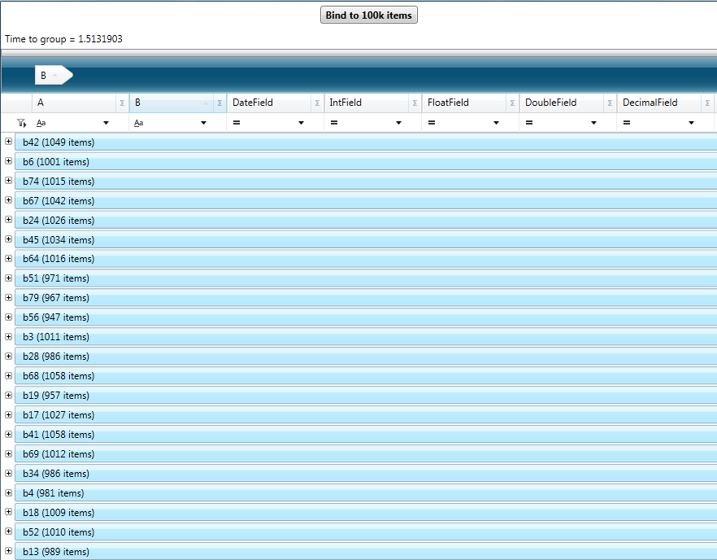

////
|metadata|
{
    "name": "xamdatagrid-external-grouping",
    "controlName": ["xamDataGrid"],
    "tags": ["Data Binding","Formatting","Grids","Grouping","Patterns and Practices"],
    "guid": "287fc05a-e08a-4a41-b72f-eb7f67c5ba69",
    "buildFlags": [],
    "createdOn": "2012-09-12T11:43:11.4786081Z"
}
|metadata|
////

= External Grouping

== Topic Overview

=== Purpose

This topic explains how to use external grouping with the  _XamDataGrid™control_   _._

=== Required background

The following topics are prerequisites to understanding this topic:

[options="header", cols="a,a"]
|====
|Topic|Purpose

| link:xamdatagrid-getting-started-with-xamdatagrid.html[Adding xamDataGrid to Your Page]
|This topic uses code examples to demonstrate how to add a _xamDataGrid_ control to your page.

| link:xamdatapresenter-about-grouping.html[About Grouping]
|This topic introduces the `DataPresenter` control’s grouping function. 

The `DataPresenter` controls offer a grouping function, which allows end users to group records based on fields that contain the same value.

|====

=== In this topic

This topic contains the following sections:

* <<_Introduction, Introduction >>

* <<_External_Grouping_Code_Example,  _xamDataGrid_   External grouping – Code Example >>

* <<_Related_Content, Related Content >>

[[_Introduction]]
== Introduction

=== Introduction to the External Grouping

External Grouping functionality will work similarly to how it works by default (i.e. internally) for `xamDataGrid` from the UI perspective. Users will be able to drag and drop fields to and from the group-by area to group by the fields.

.Note
[NOTE]
====

Limitations are that `GroupByMode` and `GroupByEvaluator` settings of the Data Presenter are not supported since  _ICollectionView_   is the one performing the grouping operations

Furthermore, grouping by unbound fields is not supported either.
====

In order to use External Grouping you should set the link:{ApiPlatform}datapresenter.v{ProductVersion}~infragistics.windows.datapresenter.fieldlayoutsettings~groupbyevaluationmode.html[GroupByEvaluationMode] on link:{ApiPlatform}datapresenter.v{ProductVersion}~infragistics.windows.datapresenter.datapresenterbase~fieldlayoutsettings.html[FieldLayoutSettings] to  _UseCollectionView_  . The `GroupByEvaluationMode` enumeration has the following options:

[options="header", cols="a,a"]
|====
|Sort condition type|Description

| _Default_ 
|Default is resolved to Auto.

| _Auto_ 
|Grouping mode where grouping occurs internally.

| _UseCollectionView_ 
|Use link:https://msdn.microsoft.com/en-us/library/System.ComponentModel.ICollectionView.aspx[ICollectionView]’s grouping function.

|====

[[_External_Grouping_Code_Example]]
== _xamDataGrid_   External grouping – Code Example

=== Description

This code example demonstrates how to use  _xamDataGrid’s_   external grouping feature. This example uses ListViewCollection as the  _xamDataGrid’s_   data source, because it implements the `ICollectionView` interface. This collection is bound to the  _xamDataGrid_   and requires that the `GroupByEvaluationMode` be set to  _UseCollectionView_   in order to use it for external grouping.

=== Prerequisites

Start a new WPF Application project type named  _ExternalOperations_   _,_   which includes the following:

* Infragistics assemblies

** {ApiPlatform}DataPresenter.v{ProductVersion}

** {ApiPlatform}Editors.v{ProductVersion}

** {ApiPlatform}v{ProductVersion}

* Classes

** `Item,` which inherits INotifyPropertyChanged. `Item,` this inherits INotifyPropertyChanged. To see the complete code for this class, please refer to the link:xamdatagrid-item-class-code-example.html[Item class code example] topic.

** `Utils` class, which creates a `ListCollectionView` of random items. This is the data source, to which  _xamDataGrid_   will be bound. Please refer to the link:xamdatagrid-creating-of-sample-listcollectionview-code-example.html[Creating ListCollectionView code example] topic for this class’ complete code.

* Starting window

** Window named `ExternalGrouping.xaml`, set as a starting window for the application.

* Namespace definitions (located in the XAML part of the window, where your will place the mark-up for the __xamDataGrid__):
+
[source,xaml]
----
xmlns:igDP=http://infragistics.com/DataPresenter
----
+
[source,xaml]
----
xmlns:local="clr-namespace:ExternalOperations"
----
+
(this will be the case for projects named _ExternalOperations_. If you have chosen a different name, you should change this definition to reflect the new name).

=== Preview

The following picture illustrates the final rendering of the complied application using external grouping. From the UI perspective, there is no difference whether grouping operations occur externally or internally.

=== Code

*In XAML:*

[source,xaml]
----
<Window x:Class="ExternalOperations.ExternalGrouping"
        xmlns="http://schemas.microsoft.com/winfx/2006/xaml/presentation"
        xmlns:x="http://schemas.microsoft.com/winfx/2006/xaml" 
        xmlns:igDP="http://infragistics.com/DataPresenter" 
        xmlns:local="clr-namespace:ExternalOperations"
        Title="ExternalGrouping" Height="768" Width="1024">
    <DockPanel LastChildFill="True">
        <StackPanel Orientation="Vertical" VerticalAlignment="Stretch" DockPanel.Dock="Top">
            <Button FontWeight="Bold" x:Name="btn100kExternal" Content="Bind to 100k items" Click="btn100kExternal_Click" Width="120" Margin="5"/>
            <Label x:Name="lblExternalTimes" />
        </StackPanel>
        <igDP:XamDataGrid x:Name="xdg100kExternal" VerticalAlignment="Stretch" Grouping="xdg100kExternal_Grouping"
                                      DataSourceResetBehavior="DiscardExistingRecords">
            <igDP:XamDataGrid.FieldLayoutSettings>
                <!-- Here GroupByEvaluationMode is set to UseCollectionView, in order to use the external grouping feature. -->
                <igDP:FieldLayoutSettings GroupByEvaluationMode="UseCollectionView" FilterUIType="FilterRecord"/>
            </igDP:XamDataGrid.FieldLayoutSettings>
            <igDP:XamDataGrid.FieldSettings>
                <igDP:FieldSettings AllowRecordFiltering="True" AllowSummaries="True" SummaryUIType="MultiSelect"
                                                SummaryDisplayArea="BottomFixed" />
            </igDP:XamDataGrid.FieldSettings>
        </igDP:XamDataGrid>
    </DockPanel>
</Window>
----

*In Visual Basic:*

[source,vb]
----
Namespace ExternalOperations
      ''' 

      ''' Interaction logic for ExternalGrouping.xaml
      ''' 

      Public Partial Class ExternalGrouping
            Inherits Window
            Public Sub New()
                  InitializeComponent()
            End Sub
            Private Sub btn100kExternal_Click(sender As Object, e As RoutedEventArgs)
                  xdg100kExternal.DataSource = Utils.CreateDataSource(100000)
            End Sub
            Private Sub xdg100kExternal_Grouping(sender As Object, e As GroupingEventArgs)
                  lblExternalTimes.Content = "Grouping..."
                  Dim start As DateTime = DateTime.Now
                  Dispatcher.BeginInvoke(DispatcherPriority.Background, New Action(Function() 
                  lblExternalTimes.Content = "Time to group = "(DateTime.Now - start).TotalSeconds
End Function))
            End Sub
      End Class
End Namespace
----

*In C#:*

[source,csharp]
----
namespace ExternalOperations
{
    /// 

    /// Interaction logic for ExternalGrouping.xaml
    /// 

    public partial class ExternalGrouping : Window
    {
        public ExternalGrouping()
        {
            InitializeComponent();
        }
        private void btn100kExternal_Click(object sender, RoutedEventArgs e)
        {
            xdg100kExternal.DataSource = Utils.CreateDataSource(100000);
        }
        private void xdg100kExternal_Grouping(object sender, GroupingEventArgs e)
        {
            lblExternalTimes.Content = "Grouping...";
            DateTime start = DateTime.Now;
            Dispatcher.BeginInvoke(DispatcherPriority.Background,
                new Action(
                    () =>
                    {
                        lblExternalTimes.Content = "Time to group = " + (DateTime.Now - start).TotalSeconds;
                    }
                    ));
        }
    }
}
----

[[_Related_Content]]
== Related Content

=== Topics

The following topics provide additional information related to this topic.

[options="header", cols="a,a"]
|====
|Topic|Purpose

| link:xamdatagrid-external-filtering.html[External Filtering]
|This topic explains the external process of filtering the records in _xamDataGrid_ control.

| link:xamdatagrid-external-sorting.html[External Sorting]
|This topic explains the external process of sorting the records in _xamDataGrid_ control.

| link:xamdatagrid-external-summary-calculations.html[External Summary Calculations]
|This topic explains the external summary calculations feature of _xamDataGrid_ .

| link:xamdatagrid-grouping.html[Grouping (xamDataGrid)]
|This is the starting point, where topics written specifically to help you group using the _xamDataGrid_ control are shown.

|====

=== Samples

The following samples provide additional information related to this topic.

[options="header", cols="a,a"]
|====
|Sample|Purpose

|Improved performance in Grouping
|This sample demonstrates performance ability of the _xamDataGrid_ to group large sets of data.

|====