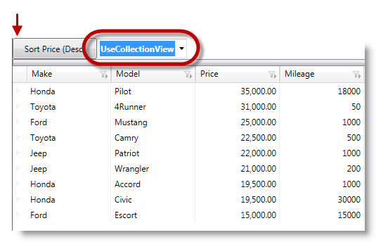
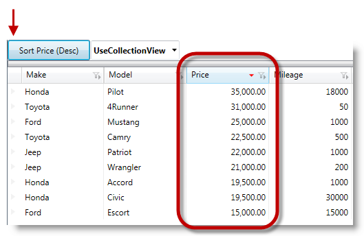

////
|metadata|
{
    "name": "xamdatagrid-external-sorting",
    "controlName": ["xamDataGrid"],
    "tags": ["Grids","Sorting"],
    "guid": "ec9ad245-1de9-487c-ad9a-ef42717274a8",
    "buildFlags": [],
    "createdOn": "2012-09-17T19:53:34.2271178Z"
}
|metadata|
////

= External Sorting (xamDataGrid)

== Topic Overview

=== Purpose

This topic uses code example to demonstrate how to perform external sorts using  _xamDataGrid_™ control.

=== Required background

The following topics are prerequisites to understanding this topic:

[options="header", cols="a,a"]
|====
|Topic|Purpose

| link:wpf-about-the-data-presenter-family.html[About the Data Presenter Family]
|Introduce users to {ProductName} new Data Presenter Family (DPF) of controls, designed to quickly and easily create new and compelling user experiences while taking advantage of a shared foundation and API for data binding and automatic element generation.

| link:xamdatagrid-understanding-xamdatagrid.html[About xamDataGrid]
|The _xamDataGrid_ control uses the link:xamdata-terms-presentation-formats-grid-view-format.html[Grid View] and arranges data in columns and rows. link:xamdata-terms-records.html[Records] are used to represent each data item and link:xamdata-terms-fields.html[Fields] are used to describe the attributes/properties that make up each record.

| link:xamdatagrid-using-xamdatagrid.html[Using xamDataGrid]
|This section is your gateway to important task-based information that will help you to effectively use the various features and functionalities provided by _xamDataGrid™_ control.

| link:xamdatapresenter-sorting.html[Sorting]
|This is a group of topics covering the sorting functionality of the _xamDataGrid_ control.

| link:xamdatapresenter-grouping.html[Grouping]
|This is a group of topics covering the filtering functionality of the _xamDataGrid_ control.

| link:external-sorting-filtering-grouping-summaries-overview-xamdatagrid.html[External Sorting Filtering Grouping Summaries Overview (xamDataGrid)]
|This topic gives an overview of link:{ApiPlatform}datapresenter{ApiVersion}~infragistics.windows.datapresenter.xamdatagrid_members.html[XamDataGrid] feature for External Sorting, Filtering, Grouping and Summaries.

|====

=== In this topic

This topic contains the following sections:

* <<_Ref327527325,Introduction>>
* <<_Ref327527435,External Sorting>>
* <<_Ref327527447,Related Content>>

[[_Ref327527325]]
== Introduction

=== Introduction to the xamDataGrid external sorting

Using the  _xamDataGrid’s_   external sorting of bound fields, whenever a user sorts on a field, is quicker than internal sorting. The link:http://msdn.microsoft.com/en-us/library/system.windows.data.collectionview(v=VS.85).aspx[CollectionView] works by taking over the requested operation (sorting), and after the operation is complete, the `CollectionView` propagates the changes to the data presenter and the data presenter reflects the changes by re-displaying the data in the specified order.

.Note
[NOTE]
====
The  _xamDataGrid_   external sorting process does not support sorting unbound fields. Taken with current limitations, the external sorting process only applies to the root field’s layout and not the child field’s layout. This is because there are multiple collection views for each child field layout.
====

In order to use External Sorting you need to set the link:{ApiPlatform}datapresenter{ApiVersion}~infragistics.windows.datapresenter.fieldlayoutsettings~sortevaluationmodeproperty.html[SortEvaluationMode] of `FieldSettings` to  _UseCollectionView_   option. The available options of enumerations are:

[options="header", cols="a,a"]
|====
| *Sort condition type* | *Description* 

| _Auto_ 
|When set, the data presenter performs its sort operations internally.

| _Default_ 
|By default, the internal sort process performs sort operations.

|
|

| _Manual_ 
|When set, allows the user to manually enter the sort logic.

| _UseCollectionView_ 
|When set, uses `ICollectionView` as sort criteria and uses external sort functionality.

|====

=== Preview

The following screenshot illustrates the  _xamDataGrid_   rendering before sort operation on the Price column outlining that the selected option in `SortEvaluationMode` is `UseCollectionView`.

The next screenshot illustrates after external sort operation of the outlined column (Price) in descending order.

[[_Ref327527435]]
== External Sorting – Code Example

=== Description

This example demonstrates how to configure the external sort process in  _xamDataGrid_  . With this process the data presenter performs the sort operation based on `ICollectionView`’s `SortDescription`, rather than relying on the data presenter to perform the sort process internally using its own collection of routines.

The following code examples will show the sort operation being setup to perform externally. There is less overhead with external sort process, because the data presenter does not use its resources for sorting the records. Instead the `CollectionView` performs the process and after completing the process the `CollectionView` notifies the data presenter so the data presenter is ready to display the final result in the UI.

=== Prerequisites

Create a new WPF Application project and perform the following requirements:

* Add these three Infragistics assemblies to your project

** {ApiPlatform}DataPresenter.{ApiVersion}

** {ApiPlatform}Editors.{ApiVersion}

** {ApiPlatform}{ApiVersion}

* Add the following namespace definitions in the XAML part of the window, where your will place the mark-up for the _xamDataGrid_:
+
[source,xaml]
----
xmlns:igDP=http://infragistics.com/DataPresenter
----

* Ensure that the relevant properties of the object are marked as  _public_  , as those properties will be accessed using link:http://msdn.microsoft.com/en-us/library/f7ykdhsy(v=vs.71).aspx[Reflection] while evaluating filter conditions.

=== Code explanation

Setting the `SortEvaluationMode` with  _UseCollectionView_   option.

*In XAML:*

[source,xaml]
----
<igDP:XamDataGrid.FieldLayoutSettings>
  <igDP:FieldLayoutSettings SortEvaluationMode="UseCollectionView" />
</igDP:XamDataGrid.FieldLayoutSettings>
----

Setting up a resource that represents the `SortEvaluationMode` object.

*In C#:*

[source,csharp]
----
This.Resources.Add(“SortEvaluationMode”, Enum.GetValues(typeof(SortEvaluationMode)));
----

*In Visual Basic:*

[source,vb]
----
This.Resources.Add(SortEvaluationMode, [Enum].GetValues(GetType(SortEvaluationMode)))
----

Setting an external sort for a desired field.

*In C#:*

[source,csharp]
----
IcollectionView iCollectionView = (IcollectionView)this.Resources[“sort_DataSource”];
iCollectionView.SortDescriptions.Clear();
iCollectionView.SortDescriptions.Add(new SortDescription(“Price”, ListSortDirection.Descending));
----

*In Visual Basic:*

[source,vb]
----
Dim iCollectionView As IcollectionView = DirectCast(Me.Resources(sort_DataSource), IcollectionView)
iCollectionView.SortDescriptions.Clear()
iCollectionView.SortDescriptions.Add(New SortDescription(Price, ListSortDirection.Descending))
----

=== Complete code

Data model definition.

*In C#:*

[source,csharp]
----
 public class DataModel : INotifyPropertyChanged
    {
        private string _make;
        public string Make
        {
            get { return _make; }
            set
            {
                if (_make != value)
                {
                    _make = value;
                    OnPropertyChanged("Make");
                }
            }
        }
        private string _model;
        public string Model
        {
            get { return _model; }
            set
            {
                if (_model != value)
                {
                    _model = value;
                    OnPropertyChanged("Model");
                }
            }
        }
        private double _price;
        public double Price
        {
            get { return _price; }
            set
            {
                if (_price != value)
                {
                    _price = value;
                    OnPropertyChanged("Price");
                }
            }
        }
        private int _mileage;
        public int Mileage
        {
            get { return _mileage; }
            set
            {
                if (_mileage != value)
                {
                    _mileage = value;
                    OnPropertyChanged("Mileage");
                }
            }
        }
        #region INotifyPropertyChanged Members
        protected void OnPropertyChanged(string propertyName)
        {
            if (PropertyChanged != null)
            {
                this.PropertyChanged(this, new PropertyChangedEventArgs(propertyName));
            }
        }
        public event PropertyChangedEventHandler PropertyChanged;
        #endregion
    }
----

*In Visual Basic:*

[source,vb]
----
Public Class DataModel
      Implements INotifyPropertyChanged
      Private _make As String
      Public Property Make() As String
            Get
                  Return _make
            End Get
            Set
                  If _make <> value Then
                        _make = value
                        OnPropertyChanged("Make")
                  End If
            End Set
      End Property
      Private _model As String
      Public Property Model() As String
            Get
                  Return _model
            End Get
            Set
                  If _model <> value Then
                        _model = value
                        OnPropertyChanged("Model")
                  End If
            End Set
      End Property
      Private _price As Double
      Public Property Price() As Double
            Get
                  Return _price
            End Get
            Set
                  If _price <> value Then
                        _price = value
                        OnPropertyChanged("Price")
                  End If
            End Set
      End Property
      Private _mileage As Integer
      Public Property Mileage() As Integer
            Get
                  Return _mileage
            End Get
            Set
                  If _mileage <> value Then
                        _mileage = value
                        OnPropertyChanged("Mileage")
                  End If
            End Set
      End Property
      #Region "INotifyPropertyChanged Members"
      Protected Sub OnPropertyChanged(propertyName As String)
            RaiseEvent PropertyChanged(Me, New PropertyChangedEventArgs(propertyName))
      End Sub
      Public Event PropertyChanged As PropertyChangedEventHandler
      #End Region
End Class
----

*In XAML:*

[source,xaml]
----
<Grid>
  <Grid.RowDefinitions>
    <RowDefinition Height="30"/>
    <RowDefinition Height="*"/>
  </Grid.RowDefinitions>
  <StackPanel Grid.Row="0" Orientation="Horizontal">
    <Button x:Name="sortBtn" Content="Sort" Width="100" 
HorizontalAlignment="Stretch" 
       Click="OnSort_click"/>
    <Button x:Name="filterBtn" Content="Filter" Width="100" 
HorizontalAlignment="Stretch" 
              Click="OnFilter_click"/>
  </StackPanel>
  <igDP:XamDataGrid x:Name="_sortGrid" 
                    Grid.Row="1"
                    DataSource="{DynamicResource sort_DataSource}" 
                    VerticalAlignment="Stretch">
    <igDP:XamDataGrid.FieldLayoutSettings>
      <igDP:FieldLayoutSettings SortEvaluationMode="UseCollectionView" />
    </igDP:XamDataGrid.FieldLayoutSettings>
  </igDP:XamDataGrid>
</Grid>
----

*In C#:*

[source,csharp]
----
public partial class MainWindow : Window
    {
        public MainWindow()
        {
            InitializeComponent();
            this.Resources.Add("SortEvaluationMode", Enum.GetValues(typeof(SortEvaluationMode)));
            this.CreateSortDataSource();
        }
        private void OnSort_click(object sender, RoutedEventArgs e)
        {
            ICollectionView iCollectionView = (ICollectionView)this.Resources["sort_DataSource"];
            iCollectionView.SortDescriptions.Clear();
            iCollectionView.SortDescriptions.Add(new SortDescription("Price", ListSortDirection.Descending));
        }
        private void CreateSortDataSource()
        {
            // Populate some data
            var data = new ObservableCollection<DataModel>();
            data.Add(new DataModel() { Make = "Ford", Model = "Mustang", Price = 25000, Mileage = 1000 });
            data.Add(new DataModel() { Make = "Jeep", Model = "Wrangler", Price = 21000, Mileage = 200 });
            data.Add(new DataModel() { Make = "Honda", Model = "Accord", Price = 19500, Mileage = 1000 });
            data.Add(new DataModel() { Make = "Toyota", Model = "Camry", Price = 22500, Mileage = 500 });
            data.Add(new DataModel() { Make = "Ford", Model = "Escort", Price = 15000, Mileage = 15000 });
            data.Add(new DataModel() { Make = "Toyota", Model = "4Runner", Price = 33000, Mileage = 50 });
            data.Add(new DataModel() { Make = "Honda", Model = "Pilot", Price = 35000, Mileage = 18000 });
            data.Add(new DataModel() { Make = "Jeep", Model = "Patriot", Price = 22000, Mileage = 1000 });
            data.Add(new DataModel() { Make = "Honda", Model = "Civic", Price = 19500, Mileage = 30000 });
            // Add the ListCollectionView as a resource 
            this.Resources.Add("sort_DataSource", new ListCollectionView(data));
        }
    }
----

*In Visual Basic:*

[source,vb]
----
Public Partial Class MainWindow
      Inherits Window
      Public Sub New()
            InitializeComponent()
            Me.Resources.Add("SortEvaluationMode", [Enum].GetValues(GetType(SortEvaluationMode)))
            Me.CreateSortDataSource()
      End Sub
      Private Sub OnSort_click(sender As Object, e As RoutedEventArgs)
            Dim iCollectionView As ICollectionView = DirectCast(Me.Resources("sort_DataSource"), ICollectionView)
            iCollectionView.SortDescriptions.Clear()
            iCollectionView.SortDescriptions.Add(New SortDescription("Price", ListSortDirection.Descending))
      End Sub
      Private Sub CreateSortDataSource()
            ' Populate some data
            Dim data = New ObservableCollection(Of DataModel)()
            data.Add(New DataModel() With { 
                  .Make = "Ford", 
                  .Model = "Mustang", 
                  .Price = 25000, 
                  .Mileage = 1000 
            })
            data.Add(New DataModel() With { 
                  .Make = "Jeep", 
                  .Model = "Wrangler", 
                  .Price = 21000, 
                  .Mileage = 200 
            })
            data.Add(New DataModel() With { 
                  .Make = "Honda", 
                  .Model = "Accord",
                  .Price = 19500, 
                  .Mileage = 1000 
            })
            data.Add(New DataModel() With { 
                  .Make = "Toyota", 
                  .Model = "Camry", 
                  .Price = 22500, 
                  .Mileage = 500 
            })
            data.Add(New DataModel() With { 
                  .Make = "Ford", 
                  .Model = "Escort", 
                  .Price = 15000, 
                  .Mileage = 15000 
            })
            data.Add(New DataModel() With { 
                  .Make = "Toyota", 
                  .Model = "4Runner", 
                  .Price = 33000, 
                  .Mileage = 50 
            })
            data.Add(New DataModel() With { 
                  .Make = "Honda", 
                  .Model = "Pilot", 
                  .Price = 35000, 
                  .Mileage = 18000 
            })
            data.Add(New DataModel() With { 
                  .Make = "Jeep", 
                  .Model = "Patriot", 
                  .Price = 22000, 
                  .Mileage = 1000 
            })
            data.Add(New DataModel() With { 
                  .Make = "Honda", 
                  .Model = "Civic", 
                  .Price = 19500, 
                  .Mileage = 30000 
            })
            ' Add the ListCollectionView as a resource 
            Me.Resources.Add("sort_DataSource", New ListCollectionView(data))
      End Sub
End Class
----

[[_Ref327527447]]
== Related Content

=== Topics

The following topics provide additional information related to this topic.

[options="header", cols="a,a"]
|====
|Topic|Purpose

| link:xamdatagrid-external-filtering.html[External Filtering]
|This topic demonstrates through code example, how to use the _xamDataGrid_ control to externalize the record filtering process.

| link:xamdatagrid-external-grouping.html[External Grouping]
|This topic explains how to use external grouping with _xamDataGrid_ . External Grouping functionality will work similarly to how it works by default (for example, internally) for _xamDataGrid_ from the UI perspective.

| link:xamdatagrid-external-summary-calculations.html[External Summary Calculations]
|This topic explains the external summary calculation feature of _xamDataGrid_ . Summaries are calculated via LINQ.

|====