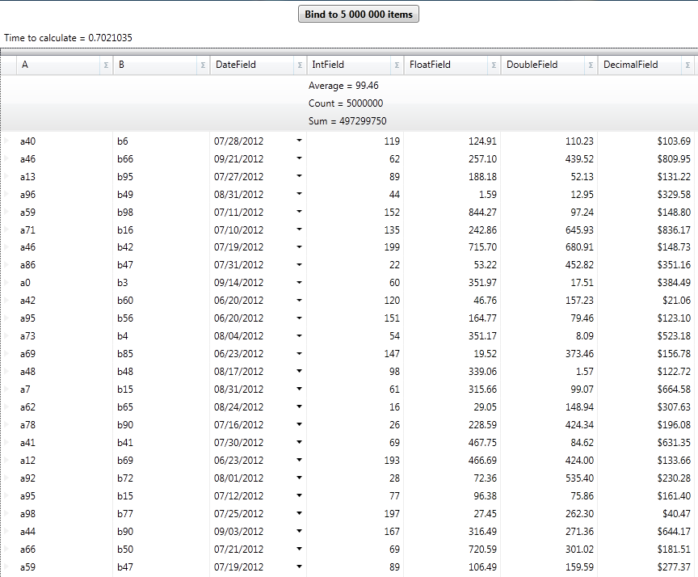

////
|metadata|
{
    "name": "xamdatagrid-external-summary-calculations",
    "controlName": ["xamDataGrid"],
    "tags": ["Calculations","Data Binding","Getting Started","Grids","Grouping"],
    "guid": "a399c3d2-505f-44bc-bab6-b924454c1e65",
    "buildFlags": [],
    "createdOn": "2012-09-12T11:45:59.7026081Z"
}
|metadata|
////

= External Summary Calculations (xamDataGrid)

[[_Ref327800609]]
== Topic Overview

=== Purpose

This topic explains and demonstrates the _xamDataGrid_™ control’s external summary calculation feature.

=== Required background

The following topics are prerequisites to understanding this topic:

[options="header", cols="a,a"]
|====
|Topic|Purpose

| link:xamdatagrid-getting-started-with-xamdatagrid.html[Adding xamDataGrid to Your Page]
|This topic’s intention is to get you up and running as quickly as possible by describing the basic steps required for adding the _xamDataGrid_ control.

| link:xamdatagrid-row-summaries.html[Row Summaries]
|You can give your end users the ability to select the row summaries for a field in _xamDataPresenter_.

|====

=== In this topic

This topic contains the following sections:

* <<_Main_Features_Summary, Main Features Summary >>

** <<_Summary_Evaluation_Mode,Summary Evaluation Mode>>

** <<_Query_Summary_Result,Query Summary Result>>

** <<_Query_Summary_Result_Event_Args,Query Summary Result EventArgs>>

* <<_External_Summary_Calculation_Code_Example,  _xamDataGrid_   External Summaries calculations – Code Example >>

* <<_Related_Content, Related Content >>

[[_Main_Features_Summary]]
== Main Features Summary

=== link:{ApiPlatform}datapresenter{ApiVersion}~infragistics.windows.datapresenter.summaryevaluationmode.html[SummaryEvaluationMode]

The `FieldLayoutSettings` `SummaryEvaluationMode` property has the following enumerations: 

[options="header", cols="a,a"] 

|==== 

| *Settings* | *Description* 

| _Default_ 

|The `SummaryEvaluationMode`’s default setting is Auto. 

| _Auto_ 

|The grouping mode, which employs internal summary calculations. 

| _Manual_ 

|The data presenter will not calculate summary values. You will have to perform the calculations and provide the result via the data presenter’s `QuerySummaryResult` event. 

| _UseLINQ_ 

|Use LINQ for calculating summaries. 

|==== 

=== link:{ApiPlatform}datapresenter{ApiVersion}~infragistics.windows.datapresenter.datapresenterbase~querysummaryresult_ev.html[QuerySummaryResult]

This event is raised whenever the data presenter is about to calculate a summary result.

=== link:{ApiPlatform}datapresenter{ApiVersion}~infragistics.windows.datapresenter.events.querysummaryresulteventargs_members.html[QuerySummaryResultEventArgs]

`QuerySummaryResultEventArgs` class exposes properties and methods, which are useful for calculating summary results using your custom logic.

[[_Summary_Evaluation_Mode]]

=== Summary Evaluation Mode

Set the `SummaryEvaluationMode` on `FieldLayoutSettings` to `UseLINQ` to use external summary calculations.

.Note:
[NOTE]
====
The underlying data items and sources  *must*  support LINQ.
====

[[_Query_Summary_Result]]

=== Query Summary Result

`QuerySummaryResult`, event on `DataPresenterBase`, is raised regardless of what the `SummaryEvaluationMode` is set to.

You can calculate summary value using custom logic and provide the summary result value to the data presenter.

[[_Query_Summary_Result_Event_Args]]

=== Query Summary Result EventArgs

`QuerySummaryResultEventArgs` class exposes the following properties and methods, which is useful for calculating summary values using custom logic.

[options="header", cols="a,a"]
|====
|Property|Description

| link:{ApiPlatform}datapresenter{ApiVersion}~infragistics.windows.datapresenter.events.querysummaryresulteventargs~summary.html[Summary]
|Gets the `SummaryResult` object, once calculated and provides the context for the record collection.

|[options="header", cols="a,a"] 

|==== 

[options="header", cols="a,a"]
|====
|Method|Description

| link:{ApiPlatform}datapresenter{ApiVersion}~infragistics.windows.datapresenter.events.querysummaryresulteventargs~setsummaryvalue.html[SetSummaryValue](Object value) 
|Provides a custom calculated summary result, which in turn causes the data presenter to bypass its own calculation logic and use the value provided for the result instead. 

Calling this method with a non-null argument bypasses the data presenter’s calculation logic. 
|====

[[_External_Summary_Calculation_Code_Example]]
== _xamDataGrid_   External Summaries Calculations – Code Example

=== Description

This example demonstrates the basics of performing the  _xamDataGrid_   control’s external summaries calculations, which uses ICollectionView as its data source and LINQ to calculate the summaries.

=== Prerequisites

Start a new WPF Application project type named  _ExternalOperations_   _,_   which includes the following:

* Infragistics assemblies

** {ApiPlatform}DataPresenter.{ApiVersion}

** {ApiPlatform}Editors.{ApiVersion}

** {ApiPlatform}{ApiVersion}

* Classes

** `Item,` this inherits INotifyPropertyChanged. To see the complete code for this class, please refer to the link:xamdatagrid-item-class-code-example.html[Item class code example].

** `Utils` class, which creates a `ListCollectionView` of random items. This is the data source, to which  _xamDataGrid_   will be bound. Please refer to the link:xamdatagrid-creating-of-sample-listcollectionview-code-example.html[Creating ListCollectionView code example] for this class’ complete code.

* Starting window

** Window named `ExternalSummaries.xaml`, set as a starting window for the application.

* Namespace definitions (located in the XAML part of the window, where your will place the mark-up for the _xamDataGrid_):
+
[source,xaml]
----
xmlns:igDP=http://infragistics.com/DataPresenter
----
+
[source,xaml]
----
xmlns:local="clr-namespace:ExternalOperations"
----

=== Preview

This is the preview of the final application displaying summary calculations.

=== Code

*In XAML:*

[source,xaml]
----
<Window x:Class="ExternalOperations.ExternalSummaries"
        xmlns="http://schemas.microsoft.com/winfx/2006/xaml/presentation"
        xmlns:x="http://schemas.microsoft.com/winfx/2006/xaml"
        xmlns:igDP="http://infragistics.com/DataPresenter" 
        xmlns:local="clr-namespace:ExternalOperations"
        Title="ExternalSummaries" Height="768" Width="1024">
    <DockPanel LastChildFill="True">
        <StackPanel Orientation="Vertical" VerticalAlignment="Stretch" DockPanel.Dock="Top">
            <Button FontWeight="Bold" x:Name="btnManyRecordsExternal" Content="Bind to 5 000 000 items" Click="btnManyRecordsExternal_Click"  Width="150" Margin="5"/>
            <Label x:Name="lblExternalTimes" />
        </StackPanel>
        <igDP:XamDataGrid x:Name="xdg5mlExternal" VerticalAlignment="Stretch" QuerySummaryResult="xdg5mlExternal_QuerySummaryResult"
                          DataSourceResetBehavior="DiscardExistingRecords">
            <igDP:XamDataGrid.FieldLayoutSettings>
                <!-- Here SummaryEvaluationMode is set to UseLinq in order to use external summaries feature.  -->
                <igDP:FieldLayoutSettings SummaryEvaluationMode="UseLinq"/>
            </igDP:XamDataGrid.FieldLayoutSettings>
            <igDP:XamDataGrid.FieldSettings>
                <igDP:FieldSettings AllowSummaries="True" SummaryUIType="MultiSelect" SummaryDisplayArea="Top" />
            </igDP:XamDataGrid.FieldSettings>
        </igDP:XamDataGrid>
    </DockPanel>
</Window>
----

*In Visual Basic:*

[source,vb]
----
Namespace ExternalOperations
      Public Partial Class ExternalSummaries
            Inherits Window
            Public Sub New()
                  InitializeComponent()
            End Sub
            Private Sub btnManyRecordsExternal_Click(sender As Object, e As RoutedEventArgs)
                  xdg5mlExternal.DataSource = Utils.CreateDataSource(5000000)
            End Sub
            Private Sub xdg5mlExternal_QuerySummaryResult(sender As Object, e As Infragistics.Windows.DataPresenter.Events.QuerySummaryResultEventArgs)
                  lblExternalTimes.Content = "Calculating summaries..."
                  Dim start As DateTime = DateTime.Now
                  Dispatcher.BeginInvoke(DispatcherPriority.Background, New Action(Function() 
                  lblExternalTimes.Content = "Time to calculate = " + (DateTime.Now - start).TotalSeconds
End Function))
            End Sub
      End Class
End Namespace
----

*In C#:*

[source,csharp]
----
namespace ExternalOperations
{
    public partial class ExternalSummaries : Window
    {
        public ExternalSummaries()
        {
            InitializeComponent();
        }
        private void btnManyRecordsExternal_Click(object sender, RoutedEventArgs e)
        {
            xdg5mlExternal.DataSource = Utils.CreateDataSource(5000000);
        }
        private void xdg5mlExternal_QuerySummaryResult(object sender, Infragistics.Windows.DataPresenter.Events.QuerySummaryResultEventArgs e)
        {
            lblExternalTimes.Content = "Calculating summaries...";
            DateTime start = DateTime.Now;
            Dispatcher.BeginInvoke(DispatcherPriority.Background,
                new Action(
                    () =>
                    {
                        lblExternalTimes.Content = "Time to calculate = " + (DateTime.Now - start).TotalSeconds;
                    }
                    ));
        }
    }
}
----

[[_Related_Content]]
== Related Content

=== Topics

The following topics provide additional information related to this topic.

[options="header", cols="a,a"]
|====
|Topic|Purpose

| link:xamdatagrid-external-filtering.html[External Filtering]
|This topic explains how to use External Filtering with _xamDataGrid_ .

| link:xamdatagrid-external-grouping.html[External Grouping]
|This topic explains how to use external grouping with _XamDataGrid_ .

| link:xamdatagrid-external-sorting.html[External Sorting]
|This topic explains the external process of sorting the records in _XamDataGrid_ control.

| link:external-sorting-filtering-grouping-summaries-overview-xamdatagrid.html[External Sorting Filtering Grouping Summaries Overview (xamDataGrid)]
|This topic gives an overview of _XamDataGrid_ feature for External Sorting, Filtering, Grouping and Summaries.

|====

=== Samples

The following samples provide additional information related to this topic.

[options="header", cols="a,a"]
|====
|Sample|Purpose

|External Summary Calculations
|This sample demonstrates the ability to perform summary calculations in _xamDataGrid_ externally.

|====