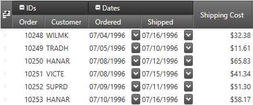

////

|metadata|
{
    "name": "xamdatagrid-field-grouping",
    "tags": ["Grouping","How Do I"],
    "controlName": ["xamDataGrid"],
    "guid": "f5c08f36-e215-4797-bc03-549758c27841",  
    "buildFlags": [],
    "createdOn": "2016-02-18T07:48:54.5045277Z"
}
|metadata|
////

= Field Grouping (xamDataGrid)

== Topic Overview

=== Purpose

This topic explains how to work with the field grouping feature.

=== Required background

The following topics are prerequisites to understanding this topic:

[options="header", cols="a,a"]
|====
|Topic|Purpose

| link:xamdatagrid-understanding-xamdatagrid.html[About xamDataGrid]
|This topic introduces the xamDataGrid control and various elements, on which control is composed.

| link:xamdatapresenter-define-a-field-layout.html[Define a Field Layout]
|This topic describes how to define field layouts to specify which fields to display and to set properties related to those fields in the xamDataPresenter controls.

|====

=== In this topic

This topic contains the following sections:

* <<_Ref443295000, Introduction >>
* <<_Ref443295110, User Interactions and Usability >>
* <<_Ref443064351, Field Group Collapsing Configuration >>
* <<_Ref443295164, Collapsing/Expanding Field Groups Programmatically >>
** <<_Ref443295175, Toggle Field Group Visibility Using Command >>
** <<_Ref443295189, Set Field Group Visibility Using Property >>

* <<_Ref443295205, Handling Field Grouping Events >>
* <<_Ref443295236, Styling Field Groups >>
* <<_Ref443295245, Related Content >>

[[_Ref443295000]]
== Introduction

=== Field grouping summary

The field grouping feature allows you to group several fields under a common field group. You can also nest field groups one under another. The field grouping feature is supported in both horizontal and vertical record orientation.

The following screenshot shows the "Order" and the "Customer" fields rendered under a common field group "IDs" and also the "Ordered" and the "Shipped" fields rendered under a common field group "Dates":

The following code snippet demonstrates the definition of the above field group configuration:

*In XAML:*

[source,xaml]
----
<igDP:XamDataGrid>
  <igDP:XamDataGrid.FieldLayouts>
    <igDP:FieldLayout>
      <igDP:FieldGroup Label="IDs">
        <igDP:Field Name="OrderID" Label="Order" Width="55" />
        <igDP:Field Name="CustomerID" Label="Customer" Width="75" />
      </igDP:FieldGroup>
      <igDP:FieldGroup Label="Dates" AllowCollapsing="True">
        <igDP:Field Name="OrderDate" Label="Ordered" Width="90" />
        <igDP:Field Name="ShippedDate" Label="Shipped" Width="90" />
      </igDP:FieldGroup>
      <igDP:Field Name="Freight" Label="Shipping Cost" Width="100" />
    </igDP:FieldLayout>
  </igDP:XamDataGrid.FieldLayouts>
</igDP:XamDataGrid>
----

The field groups may be collapsed and expanded by the user by clicking the small button located on the left side of the field group label. You can also collapse and expand the field groups programmatically using commands or properties which is discussed later in this topic.

=== Field grouping architecture

The link:{ApiPlatform}datapresenter.v{ProductVersion}~infragistics.windows.datapresenter.fieldlayout_members.html[FieldLayout] exposes:

* a link:{ApiPlatform}datapresenter.v{ProductVersion}~infragistics.windows.datapresenter.fieldlayout~fielditems.html[FieldItems] property - a collection of all root level link:{ApiPlatform}datapresenter.v{ProductVersion}~infragistics.windows.datapresenter.fieldgroup_members.html[FieldGroup]s and root level link:{ApiPlatform}datapresenter.v{ProductVersion}~infragistics.windows.datapresenter.field_members.html[Field]s
* a link:{ApiPlatform}datapresenter.v{ProductVersion}~infragistics.windows.datapresenter.fieldlayout~fields.html[Fields] property - a flattened collection of all `Field`s

The two collections are internally synchronized both ways.

[[_Ref443295110]]
== User Interactions and Usability

=== User interactions summary chart

The following table summarizes the user interaction capabilities of the field grouping feature.

[options="header", cols="a,a,a,a"]
|====
|The user can…|Using…|Details|Configurable?

|[[_Hlk377147553]] 

Expand / Collapse a field group
|Click on the expansion indicator located inside the field group’s label.
|This will toggle the field group expand/collapse state.
|image::images/Yes.png[] 

<<_Ref443064351,Field Group Collapsing Configuration>>

|[[_Hlk377147649]] 

Drag a field to a new position
|Click on the field label and drag it with the mouse.
|Arrow indicators will be rendered to show the position where the field group is about to be moved.
|image::images/Yes.png[] 

link:xamdatagrid-about-field-moving.html[About Field Moving]

|Drag a field group to a new position
|Click on the field group label and drag it with the mouse.
|Arrow indicators will be rendered to show the position where the field group is about to be moved.
|image::images/Yes.png[] 

link:xamdatagrid-about-field-moving.html[About Field Moving]

|Remove a field group from the view
|Click on the field group and drag it outside of the view.
|This will remove the field group with all its nested field groups and fields
|image::images/No.png[]

|Fix a field group (or a field)
|Click on the fixing handle located inside the field group’s label.
|The field group fixing is available on field groups (and fields) only on the root level of the field layout.
|image::images/Yes.png[] 

link:xamdatagrid-about-fixed-non-scrolling-fields.html[About Fixed (Non-Scrolling) Fields]

|====

.Note
[NOTE]
====
A field or a field group can only be moved inside its parent field group.
====

[[_Ref443064351]]
== Field Group Collapsing Configuration

=== Field group collapsing configuration summary chart

The following table explains briefly the configurable aspects of the field grouping feature and maps them to the properties that configure them.

[options="header", cols="a,a,a"]
|====
|Configurable aspect|Property|Details

|[[_Hlk356484826]] 

Enabling globally field group collapsing
| link:{ApiPlatform}datapresenter.v{ProductVersion}~infragistics.windows.datapresenter.fieldlayoutsettings~allowfieldgroupcollapsing.html[AllowFieldGroupCollapsing]
|This property of the link:{ApiPlatform}datapresenter.v{ProductVersion}~infragistics.windows.datapresenter.fieldlayoutsettings.html[FieldLayoutSettings] class will allow you to configure the ability to expand and collapse field groups for the entire control

|Enabling field group collapsing for each individual field group
| link:{ApiPlatform}datapresenter.v{ProductVersion}~infragistics.windows.datapresenter.fieldgroup~allowcollapsing.html[AllowCollapsing]
|This property of the link:{ApiPlatform}datapresenter.v{ProductVersion}~infragistics.windows.datapresenter.fieldgroup.html[FieldGroup] class allows you to configure the ability to expand and collapse field groups for each field group. It also has higher precedence comparing to the `AllowFieldGroupCollapsing` property.

|====

[[_Ref443295164]]
== Collapsing/Expanding Field Groups Programmatically

[[_Hlk368069110]]

=== Overview

The following section demonstrates with code examples how to collapse and expand field groups programmatically.

[[_Ref443295175]]

=== Toggle Field Group Visibility Using Command

The following code snippet demonstrates how to toggle a field group (named "FieldGroup1") expanded/collapsed using command:

*In XAML:*

[source,xaml]
----
<Button Content="Toggle the field group"
    Command="{x:Static igDP:DataPresenterCommands.ToggleFieldGroupIsCollapsed}"
    CommandParameter="{Binding ElementName=FieldGroup1}"
    CommandTarget="{Binding ElementName=xamDataGrid1}" />
----

[[_Ref443295189]]

=== Set Field Group Visibility Using Property

The following code snippets demonstrate how to set a field group (named "FieldGroup1") as expanded or collapsed using the link:{ApiPlatform}datapresenter.v{ProductVersion}~infragistics.windows.datapresenter.fieldgroup~iscollapsed.html[IsCollapsed] property:

*In XAML:*

[source,xaml]
----
…
<igDP:FieldGroup x:Name="FieldGroup1">
…
----

*In C#:*

[source,csharp]
----
this.fieldGroup1.IsCollapsed = true;
----

[[_Ref443295205]]
== Handling Field Grouping Events

=== Overview

This section describes the events associated with the field grouping feature.

=== Events

The following table maps the desired behaviors to the event that manage it.

[options="header", cols="a,a,a"]
|====
|In order to:|Use this event:|Event arguments:

|Get notified when a field group gets collapsed
| link:{ApiPlatform}datapresenter.v{ProductVersion}~infragistics.windows.datapresenter.datapresenterbase~fieldgroupcollapsed_ev.html[FieldGroupCollapsed]
|The collapsed field group

|Get notified when a field group gets expanded
| link:{ApiPlatform}datapresenter.v{ProductVersion}~infragistics.windows.datapresenter.datapresenterbase~fieldgroupexpanded_ev.html[FieldGroupExpanded]
|The expanded field group

|====

[[_Ref443295236]]
== Styling Field Groups

=== Overview

To style the field group label you can:

* Create an implicit style and target the `FieldGroupLabelPresenter` type – this will affect all field groups.
* Provide a style to the `FieldLayoutSettings`’ link:{ApiPlatform}datapresenter.v{ProductVersion}~infragistics.windows.datapresenter.fieldlayoutsettings~fieldgrouplabelpresenterstyle.html[FieldGroupLabelPresenterStyle] property – this will affect all field group in the data presenter control in question.
* Provide a style to the FieldGroup’s link:{ApiPlatform}datapresenter.v{ProductVersion}~infragistics.windows.datapresenter.fieldgroup~labelpresenterstyle.html[LabelPresenterStyle] property – this will the field group in question.

=== Implicit style example

The following code snippet demonstrates how to apply the style on all field groups:

*In XAML:*

[source,xaml]
----
<Page
  …
  xmlns:igDP="http://infragistics.com/DataPresenter"
  …>
…
<Page.Resources>
  <ResourceDictionary>
    
  </ResourceDictionary>
</Page.Resources>
…
<igDP:XamDataGrid>
…
  <igDP:XamDataGrid.FieldLayouts>
    <igDP:FieldLayout>
      <igDP:FieldGroup>
      …
      </igDP:FieldGroup>
      <igDP:FieldGroup>
      …
      </igDP:FieldGroup>
    </igDP:FieldGroup>
  <igDP:XamDataGrid.FieldLayouts>
…
</igDP:XamDataGrid>
…
</Page>
----

=== Explicit style example

The following code snippet demonstrates how to apply the style only on specific field group(s):

*In XAML:*

[source,xaml]
----
<Page
  …
  xmlns:igDP="http://infragistics.com/DataPresenter"
  …>
…
<Page.Resources>
  <ResourceDictionary>
    
  </ResourceDictionary>
</Page.Resources>
…
<igDP:XamDataGrid>
…
  <igDP:XamDataGrid.FieldLayouts>
    <igDP:FieldLayout>
      <igDP:FieldGroup LabelPresenterStyle="{StaticResource ResourceKey=BGRed">
      …
      </igDP:FieldGroup>
      <igDP:FieldGroup>
      …
      </igDP:FieldGroup>
    </igDP:FieldGroup>
  <igDP:XamDataGrid.FieldLayouts>
…
</igDP:XamDataGrid>
…
</Page>
----

In this particular case the style will be applied to the first field group only.

[[_Ref443295245]]
== Related Content

=== Topics

The following topics provide additional information related to this topic.

[options="header", cols="a,a"]
|====
|Topic|Purpose

| link:xamdatagrid-changing-the-record-orientation.html[Changing the Record Orientation]
|This topic explains how to change the record orientation.

| link:xamdatapresenter-field-sizing.html[Field Sizing]
|This topic gives an overview of the field sizing feature.

| link:xamdatagrid-about-fixed-non-scrolling-fields.html[About Fixed (Non-Scrolling) Fields]
|This topic gives an overview of the fixed field feature.

| link:xamdatapresenter-save-field-customizations.html[Save Field Customizations]
|This topic explains how to save user customizations like field position, size, sorting, grouping and more.

| link:xamdatapresenter-load-field-customizations.html[Load Field Customizations]
|This topic explains how to load a saved user customizations like field position, size, sorting, grouping and more.

|====

=== Sample

The following sample provides additional information related to this topic.

[options="header", cols="a,a"]
|====
|Sample|Purpose

| link:{SamplesURL}/data-grid/field-grouping[Field Grouping]
|This sample demonstrates the field grouping ability of the control.

|====