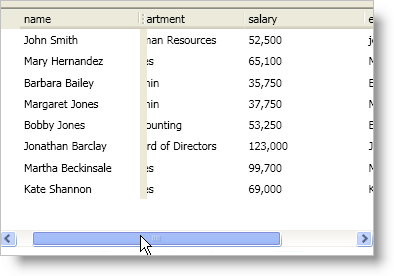

////

|metadata|
{
    "name": "xamdatagrid-fix-fields",
    "controlName": ["xamDataGrid"],
    "tags": ["Editing"],
    "guid": "{685DA58E-4FEA-45E4-B208-E482F6CB1D36}",  
    "buildFlags": [],
    "createdOn": "2012-01-30T19:39:53.0039539Z"
}
|metadata|
////

= Fix Fields

You can fix fields to an edge of the xamDataPresenter™ control or the xamDataGrid™ control by setting a link:{ApiPlatform}datapresenter{ApiVersion}~infragistics.windows.datapresenter.field.html[Field] object's link:{ApiPlatform}datapresenter{ApiVersion}~infragistics.windows.datapresenter.fielditem~fixedlocation.html[FixedLocation] property to a link:{ApiPlatform}datapresenter{ApiVersion}~infragistics.windows.datapresenter.fixedfieldlocation.html[FixedFieldLocation] enum value. You can fix fields programmatically at run time or declaratively at design time regardless of a Field object's link:{ApiPlatform}datapresenter{ApiVersion}~infragistics.windows.datapresenter.fielditem~allowfixingresolved.html[AllowFixingResolved] property value.

The following example code demonstrates how to pin fields.

*In XAML:*

----
<igDP:XamDataPresenter Name="xamDataPresenter1" BindToSampleData="True">
    <igDP:XamDataPresenter.FieldLayouts>
        <igDP:FieldLayout>
            <igDP:FieldLayout.Fields>
                <igDP:Field Name="name" FixedLocation="FixedToNearEdge" />
            </igDP:FieldLayout.Fields>
        </igDP:FieldLayout>
    </igDP:XamDataPresenter.FieldLayouts>
</igDP:XamDataPresenter>
----

*In Visual Basic:*

----
Imports Infragistics.Windows.DataPresenter
...
'This line of code assumes you have a field layout with a field named "name"
Me.xamDataPresenter1.FieldLayouts(0).Fields("name").FixedLocation = FixedFieldLocation.FixedToNearEdge
'Or you can execute a command
'Me.xamDataPresenter1.ExecuteCommand(DataPresenterCommands.FixFieldNear, Me.xamDataPresenter1.FieldLayouts(0).Fields("name"))
----

*In C#:*

----
using Infragistics.Windows.DataPresenter;
...
this.xamDataPresenter1.FieldLayouts[0].Fields["name"].FixedLocation = FixedFieldLocation.FixedToNearEdge;
//Or you can execute a command
//this.xamDataPresenter1.ExecuteCommand(DataPresenterCommands.FixFieldNear, this.xamDataPresenter1.FieldLayouts[0].Fields["name"])
----

== Related Topic

link:xamdatagrid-about-fixed-non-scrolling-fields.html[About Fixed (Non-Scrolling) Fields]

link:xamdatagrid-enable-fixed-fields.html[Enable Fixed Fields]