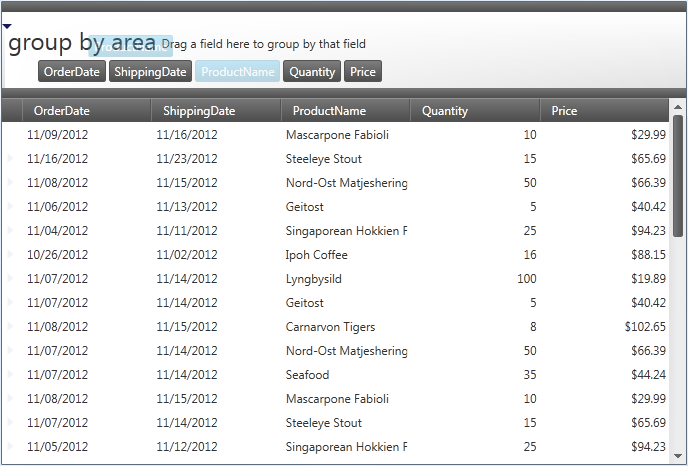

////

|metadata|
{
    "name": "xamdatagrid-grouping-overview",
    "controlName": ["xamDataGrid"],
    "tags": ["Getting Started","Grouping"],
    "guid": "3bd89112-5d4f-465f-a19e-37e7138a7e9c",  
    "buildFlags": [],
    "createdOn": "2013-02-26T13:55:29.4661465Z"
}
|metadata|
////

= Grouping Overview (xamDataGrid)

== Topic Overview

=== Purpose

This topic gives an overview of the link:{ApiPlatform}datapresenter{ApiVersion}~infragistics.windows.datapresenter.xamdatagrid.html[ _xamDataGrid™_  ] control’s grouping functionality allowing users to group data into more readable and navigable arrangements.

=== Required background

The following topic is a prerequisite to understanding this topic:

[options="header", cols="a,a"]
|====
|Topic|Purpose

| link:xamdatagrid-understanding-xamdatagrid.html[About xamDataGrid]
|This topic introduces the _xamDataGrid_ control and various elements, on which control is composed.

|====

=== In this topic

This topic contains the following sections:

* <<_Ref340222659, Grouping Overview >>

* <<_Ref340222669, Main Settings Summary >>

** <<_Ref340222680,Main settings summary chart>>

** <<_Ref340236978,GroupByArea>>

** <<_Ref340236982,GroupByAreaMode>>

** <<_Ref340236985,GroupByAreaMulti>>

** <<_Ref340236987,GroupByAreaLocation>>

** <<_Ref340236991,GroupByComparer>>

** <<_Ref340236994,GroupByEvaluationMode>>

** <<_Ref340236996,GroupByEvaluator>>

** <<_Ref340237000,GroupByMode>>

* <<_Ref335407927, Related Content >>

[[_Ref340222659]]
== Grouping Overview

=== Grouping Overview

Grouping, the ability to present related data together is one of the  _xamDataGrid_   important functionalities that the user can perform using either the UI or code.

Grouping also allows users to drag field headers from multiple field layouts into the group-by area.

image::images/Grouping_Overview_1.png[]

There is a second option, which displays a button for each field in the default layout underneath the group-by area. Users can drag these buttons into the group-by area to group records in the default field layout; however, this option does not allow users to group records using fields in multiple field layouts. This option is backward compatible with previous releases.

[[_Ref340222669]]
== Main Settings Summary

[[_Ref340222680]]

=== Main settings summary chart

The  _xamDataGrid_   is highly user configurable using these settings.

[options="header", cols="a,a"]
|====
|Settings|Description

| link:{ApiPlatform}datapresenter{ApiVersion}~infragistics.windows.datapresenter.fieldsettings~allowgroupby.html[AllowGroupBy]
| link:{ApiPlatform}datapresenter{ApiVersion}~infragistics.windows.datapresenter.fieldsettings.html[FieldSettings] class property determines if users can initiate a group-by operation through the UI for the field. 

This property’s default setting is True.

| link:{ApiPlatform}datapresenter{ApiVersion}~infragistics.windows.datapresenter.fieldsettings~cellvisibilitywhengrouped.html[CellVisibilityWhenGrouped]
|This `FieldSettings` class property determines whether grouped field cells are visible. 

This property’s default value is Visible.

| link:{ApiPlatform}datapresenter{ApiVersion}~infragistics.windows.datapresenter.datapresenterbase~groupbyarea.html[GroupByArea]
|This link:{ApiPlatform}datapresenter{ApiVersion}~infragistics.windows.datapresenter.datapresenterbase.html[DataPresenterBase] class property gets or sets the link:{ApiPlatform}datapresenter{ApiVersion}~infragistics.windows.datapresenter.groupbyarea.html[GroupByArea] control.

| link:{ApiPlatform}datapresenter{ApiVersion}~infragistics.windows.datapresenter.datapresenterbase~groupbyareamode.html[GroupByAreaMode]
|This `DataPresenterBase` class property gets or sets how fields are grouped by users.

| link:{ApiPlatform}datapresenter{ApiVersion}~infragistics.windows.datapresenter.datapresenterbase~groupbyareamulti.html[GroupByAreaMulti]
|This `DataPresenterBase` class property gets or sets the link:{ApiPlatform}datapresenter{ApiVersion}~infragistics.windows.datapresenter.groupbyareamulti.html[GroupByAreaMulti] control, used for creating Outlook style groupings across multiple link:{ApiPlatform}datapresenter{ApiVersion}~infragistics.windows.datapresenter.fieldlayout.html[FieldLayout]s.

| link:{ApiPlatform}datapresenter{ApiVersion}~infragistics.windows.datapresenter.datapresenterbase~groupbyarealocation.html[GroupByAreaLocation]
|This `DataPresenterBase` class property determines the location of the `GroupByArea` display. 

If set to `None`, the `GroupByArea` is not displayed.

| link:{ApiPlatform}datapresenter{ApiVersion}~infragistics.windows.datapresenter.fieldsettings~groupbycomparer.html[GroupByComparer]
|This property of `FieldSettings` class, if specified, sorts the link:{ApiPlatform}datapresenter{ApiVersion}~infragistics.windows.datapresenter.groupbyrecord.html[GroupByRecord]s following their creation. This operation requires a second sort pass on the `GroupByRecord`s.

| link:{ApiPlatform}datapresenter{ApiVersion}~infragistics.windows.datapresenter.fieldlayoutsettings~groupbyevaluationmode.html[GroupByEvaluationMode]
|This property of link:{ApiPlatform}datapresenter{ApiVersion}~infragistics.windows.datapresenter.fieldlayoutsettings.html[FieldLayoutSettings] class specifies how the data presenter will perform grouping operations.

| link:{ApiPlatform}datapresenter{ApiVersion}~infragistics.windows.datapresenter.fieldsettings~groupbyevaluator.html[GroupByEvaluator]
|Use this property of `FieldSettings` class, to specify a custom evaluator for group-by records, which determines the group breaks.

| link:{ApiPlatform}datapresenter{ApiVersion}~infragistics.windows.datapresenter.fieldsettings~groupbymode.html[GroupByMode]
|This property of `FieldSettings` class determines link:{ApiPlatform}datapresenter{ApiVersion}~infragistics.windows.datapresenter.datarecord.html[DataRecord] grouping.

|====

[[_Ref340236978]]

=== GroupByArea

* You can set this `GroupByArea` property to a control of type GroupByArea to attach an external group-by area to the link:{ApiPlatform}datapresenter{ApiVersion}~infragistics.windows.datapresenter.datapresenterbase.html[DataPresenter] or to modify properties of the `GroupByArea` control. This group-by area only allows grouping by fields in the default field layout.

.Note
[NOTE]
====
In order for the Data Presenter to use the `GroupByArea` control the `GroupByAreaMode` property must first be set to `DefaultFiledLayoutOnly`.
====

[[_Ref340236982]]

=== GroupByAreaMode

This property serves three separate purposes.

* Primary purpose is to determine whether users can group records using fields from multiple field layouts. For example, if you have a nested hierarchy of Customer and Order data items, this property determines if users can group the Customer data items and the Order data items.

* Secondary purpose is to determine how much space the group-by area will occupy when you enable multiple field layout grouping. If you use the `MultipleFieldLayoutCompact` setting, the control displays the group-by criteria, in a single line, in the group-by area. However, with the `MultipleFiledLayoutsFull sett``ing`, the  _xamDataGrid_   will display each unique field layout on a separate line in the group-by area.

* Tertiary purpose is to switch between the two different UI options available for grouping records. If you enable grouping only on the default field layout and prefer the older grouping UI, that is to say use the `DefaultFieldLayoutOnly`, the group-by area will display buttons for the fields in the default field layout. Otherwise, users will be able to drag field headers from multiple field layouts into the group-by area.

[[_Ref340236985]]

=== GroupByAreaMulti

You can set this property to a `GroupByAreaMulti` control to attach an external group-by area to the `DataPresenter` or to modify properties of the `GroupByAreaMulti` control.

.Note
[NOTE]
====
For this group-by area to work the `GroupByAreaMode` property must be set to either `MultipleFieldLayoutsCompact` or `MultipleFieldLayoutsFull`.
====

[[_Ref340236987]]

=== GroupByAreaLocation

This property allows you to set the location of the group-by area.

.Note
[NOTE]
====
The control is unaffected by this property when using an external group-by area.
====

[[_Ref340236991]]

=== GroupByComparer

You can provide your own sorting logic for group-by records by setting this property to an object that implements the IComparer interface.

[[_Ref340236994]]

=== GroupByEvaluationMode

The `GroupByEvaluationMode` enumeration has the following members:

[options="header", cols="a,a"]
|====
|Member|Description

|Auto
|The data presenter performs the grouping operations internally.

|Default
|Default resolves to _Auto_ .

|UseCollectionView
|If underlying data source is ICollectionView, the data presenter uses its `GroupDescriptions` property to perform the grouping operation. The control modifies the collection view’s `GroupDescriptions` and `SortedDescriptions` collections. 

Using this mode control strips out any duplicate field entries.

|====

[[_Ref340236996]]

=== GroupByEvaluator

This property can be set to a custom implementation of the link:{ApiPlatform}datapresenter{ApiVersion}~infragistics.windows.datapresenter.igroupbyevaluator.html[IGroupByEvaluator] interface. This interface has a read-only `SortComparer` property of the IComparer type. The `IGroupByEvaluator` interface’s `SortComparer` property should return a comparer that is logically consistent with the implementation of its link:{ApiPlatform}datapresenter{ApiVersion}~infragistics.windows.datapresenter.igroupbyevaluator~doesgroupcontainrecord.html[DoesGroupContainRecord] method.

In other words, the sort order logic is consistent with the grouping logic, and all `DataRecord`s that end up in the same group should return zero from the comparer’s Compare method when being compared with another `DataRecord` from the same group.

[[_Ref340237000]]

=== GroupByMode

The `GroupByMode` property gets or sets a link:{ApiPlatform}datapresenter{ApiVersion}~infragistics.windows.datapresenter.fieldgroupbymode.html[FieldGroupByMode] enumeration. The property allows you to specify which of default `GroupByEvaluators` to use when grouping a field.

.Note
[NOTE]
====
Specifying a `GroupByEvaluator` causes this property to be ignored.
====

Unless set, this property reverts to its default value to one of the following options, based on link:{ApiPlatform}datapresenter{ApiVersion}~infragistics.windows.datapresenter.fieldsettings~editastype.html[EditAsType] property of the `FieldSettings` class.

[options="header", cols="a,a"]
|====
|Value|Description

|Text
|This value is set if `EditAsType` is of type string.

|OutlookDate
|This value is set if `EditAsType` is on type DateTime.

|Value
|This value is set if `EditAsType` is not of type string or DateTime.

|====

[[_Ref335407927]]
== Related Content

[[_Ref335665218]]

=== Topics

The following topics provide additional information related to this topic.

[options="header", cols="a,a"]
|====
|Topic|Purpose

| link:xamdatapresenter-change-the-location-of-the-groupbyarea.html[Change the Location of the GroupByArea]
|This topic describes how you can change the location of group-by area.

| link:xamdatapresenter-create-an-external-group-by-area.html[Create an External Group-By Area]
|This topic describes how you can detach the group-by area from Data Presenter control and create an external group-by area in your window.

| link:xamdatapresenter-disable-groupby.html[Disable GroupBy]
|This topic gives describes how you can prevent the group-by area from displaying.

| link:xamdatapresenter-modify-the-group-by-area.html[Modify the Group-By Area]
|This topic describes how you can modify the layout of the field headers and field layout descriptions in the group-by area.

| link:xamdatapresenter-sorting-and-grouping-fields-programmatically.html[Sorting and Grouping Fields Programmatically]
|This topic explains how you can sort and/or group using XAML or procedural code without users clicking a field label or dragging a field label into the group-by area.

| link:xamdatagrid-sorting-and-grouping-process-overview.html[Sorting and Grouping Process Overview]
|This topic gives describes what actions are perfumed internally by _xamDataGrid_ ’s internal comparer during sorting and grouping process.

| link:xamdatagrid-sorting-overview.html[Sorting Overview]
|This topic gives an overview of sorting functionality of _xamDataGrid_ . _xamDataGrid_ display and handles the sorting for you. Your users can sort columns by clicking the column headers, allowing them to view the grid data in the order they want.

| link:xamdatagrid-user-interaction-sorting-records.html[User Interaction when Sorting and Grouping Records]
|This topic describes user interactions for sorting records when _xamDataGrid_ records are grouped.

|====