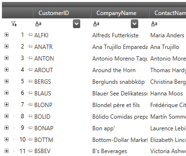

////

|metadata|
{
    "name": "xamdatagrid-record-numbering",
    "tags": ["Formatting","Getting Started","Grids","How Do I"],
    "controlName": ["xamDataGrid"],
    "guid": "78e293f2-ecad-4c24-a51b-8576f7dbc9a3",  
    "buildFlags": [],
    "createdOn": "2014-03-19T13:59:16.329423Z"
}
|metadata|
////

= Record Numbering (xamDataGrid)

== Topic Overview

=== Purpose

This topic explains the Record Numbering feature of the  _xamDataGrid_  .

=== Required background

The following topics are prerequisites to understanding this topic:

[options="header", cols="a,a"]
|====
|Topic|Purpose

| link:xamdatagrid-understanding-xamdatagrid.html[About xamDataGrid]
|This topic introduces the _xamDataGrid_ control and various elements, on which control is composed.

| link:xamdatapresenter-define-a-field-layout.html[Define a Field Layout]
|This topic provides information on how the fields are presented by the _xamDataGrid_ .

|====

=== In this topic

This topic contains the following sections:

* <<_Ref379536599,Introduction>>
* <<_Ref379536605,Record Numbering Configuration Summary>>
* <<_Ref379536555,Configuring Numbering Type>>
* <<_Ref379536576,Configuring Numbering Format>>
* <<_Ref379536583,Configuring Numbering Start>>
* <<_Ref379542969,Configuring Numbering Styling>>
* <<_Ref379536624,Related Content>>

[[_Ref379536599]]
== Introduction

=== Record numbering summary

The Record Numbering feature allows you to display one of several different numbering types in the  _xamDataGrid’s_   record selector column. The numbering is placed in a new control element – link:{ApiPlatform}datapresenter.v{ProductVersion}~infragistics.windows.datapresenter.recordselectornumber_members.html[RecordSelectorNumber].

The following screenshot demonstrates the  _xamDataGrid_   with record numbering enabled:

[[_Ref379536605]]
== Record Numbering Configuration Summary

=== Record numbering configuration summary chart

The following table explains briefly the configurable aspects of the record numbering and maps them to the properties that configure them. Further details are available after the table.

[options="header", cols="a,a,a"]
|====
|Configurable aspect|Details|Properties

|<<_Ref379536555,Configuring Numbering Type>>
|Configure the numbering type to use
| link:{ApiPlatform}datapresenter.v{ProductVersion}~infragistics.windows.datapresenter.fieldlayoutsettings~recordselectornumbertype.html[RecordSelectorNumberType]

|<<_Ref379536576,Configuring Numbering Format>>
|Configure the child records numbering format
| link:{ApiPlatform}datapresenter.v{ProductVersion}~infragistics.windows.datapresenter.fieldlayoutsettings~recordselectornumberformat.html[RecordSelectorNumberFormat]

|<<_Ref379536583,Configuring Numbering Start>>
|Configure the numbering start
| link:{ApiPlatform}datapresenter.v{ProductVersion}~infragistics.windows.datapresenter.fieldlayoutsettings~recordselectornumberstart.html[RecordSelectorNumberStart]

|<<_Ref379542969,Configuring Numbering Styling>>
|Configure the record numbering element
| link:{ApiPlatform}datapresenter.v{ProductVersion}~infragistics.windows.datapresenter.fieldlayoutsettings~recordselectornumberstyle.html[RecordSelectorNumberStyle]

|====

[[_Ref379536555]]
== Configuring Numbering Type

[[_Hlk368069110]]

=== Overview

Use the `RecordSelectorNumberType` property to enable or disable record numbering and specify the numbering type you want.

=== Property settings

The following table maps the desired configuration to the property settings that manage it.

[options="header", cols="a,a,a"]
|====
|In order to:|Use this property:|And set it to:

|Disable record numbering
|`RecordSelectorNumberType`
| link:{ApiPlatform}datapresenter.v{ProductVersion}~infragistics.windows.datapresenter.recordselectornumbertype.html[None]

|Display record numbering based on the underlying data item
|`RecordSelectorNumberType`
| link:{ApiPlatform}datapresenter.v{ProductVersion}~infragistics.windows.datapresenter.recordselectornumbertype.html[DataItemIndex]

|Display record numbering affected by the records’ sort order
|`RecordSelectorNumberType`
| link:{ApiPlatform}datapresenter.v{ProductVersion}~infragistics.windows.datapresenter.recordselectornumbertype.html[RecordIndex]

|Display record numbering for the visible records only 

.Note 

[NOTE] 

==== 

In this mode the record numbering won’t have gaps when records are filtered. 

====
|`RecordSelectorNumberType`
| link:{ApiPlatform}datapresenter.v{ProductVersion}~infragistics.windows.datapresenter.recordselectornumbertype.html[VisibleIndex]

|====

[[_Ref379536576]]
== Configuring Numbering Format

=== Overview

Use the `RecordSelectorNumberFormat` to specify the child nodes’ record numbering with hierarchical data structures.

=== Property settings

The following table maps the desired configuration to the property settings that manage it.

[options="header", cols="a,a,a"]
|====
|In order to:|Use this property:|And set it to:

|Display child’s record numbering index within its parent collection
|`RecordSelectorNumberFormat`
| link:{ApiPlatform}datapresenter.v{ProductVersion}~infragistics.windows.datapresenter.recordselectornumberformat.html[RecordNumberOnly]

|Concatenate the parent’s numbering to the child’s numbering. 

For example: “2.1.5” for the second root record’s first child record’s fifth child record.
|`RecordSelectorNumberFormat`
| link:{ApiPlatform}datapresenter.v{ProductVersion}~infragistics.windows.datapresenter.recordselectornumberformat.html[IncludeParentRecordNumber]

|====

[[_Ref379536583]]
== Configuring Numbering Start

=== Overview

Use the `RecordSelectorNumberStart` property to specify the start number used for the record numbering.

=== Property settings

The following table maps the desired configuration to the property settings that manage it.

[options="header", cols="a,a,a"]
|====
|In order to:|Use this property:|And set it to:

|Set new start value for record numbering
|`RecordSelectorNumberStart`
|To a value of type `int`.

|====

[[_Ref379542969]]
[[_Ref379536624]]
== Configuring Numbering Styling

=== Overview

Use the `RecordSelectorNumberStyle` property to provide styling for the record selector numbering element.

.Note
[NOTE]
====
`RecordSelectorNumber` is a new control element and a style for it can be provided either explicitly by setting the `RecordSelectorNumberStyle` property or implicitly by defining a Style in the Resources collection that is keyed by its type.
====

=== Property settings

The following table maps the desired configuration to the property settings that manage it.

[options="header", cols="a,a,a"]
|====
|In order to:|Use this property:|And set it to:

|Style the record selector numbering element
|`RecordSelectorNumberStyle`
|To a value of type `Style`.

|====

== Related Content

=== Topics

The following topics provide additional information related to this topic.

[options="header", cols="a,a"]
|====
|Topic|Purpose

| link:xamdata-selection-overview.html[Selection Overview]
|This topic provides overview information about the selection of the data presenter’s cells, rows and fields.

|====

=== Samples

The following samples provide additional information related to this topic.

[options="header", cols="a,a"]
|====
|Sample|Purpose

| link:{SamplesURL}/data-grid/record-numbering[Record Numbering]
|This sample demonstrates the record numbering feature and how to configure it.

| link:{SamplesURL}/data-grid/record-numbering-styling[Record Numbering Styling]
|This sample demonstrates how to style the record numbering element.

|====