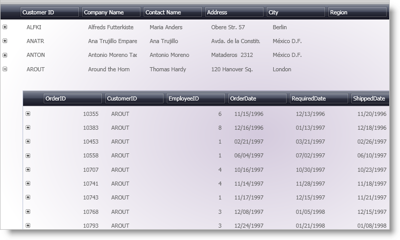
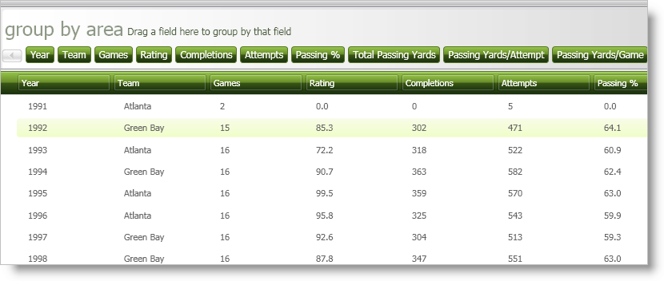
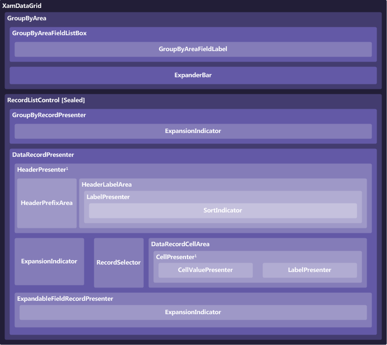

////

|metadata|
{
    "name": "xamdatagrid-understanding-xamdatagrid",
    "controlName": ["xamDataGrid"],
    "tags": ["Getting Started"],
    "guid": "{63391CE1-62BC-4F10-9DA6-6D9B52C5D1CD}",  
    "buildFlags": [],
    "createdOn": "2012-01-30T19:39:53.0239579Z"
}
|metadata|
////

= About xamDataGrid

The xamDataGrid™ control uses the link:xamdata-terms-presentation-formats-grid-view-format.html[Grid View] and arranges data in columns and rows. link:xamdata-terms-records.html[Records] are used to represent each data item and link:xamdata-terms-fields.html[Fields] are used to describe the attributes/properties that make up each record. It can automatically detect each type of record in your data source and generate specific FieldLayouts for each type. This allows it to support both conventional data sources like DataSets and DataViews as well as more free form data sources such as XML.

In addition to the core functionality inherited from the DataPresenterBase class it exposes a link:{ApiPlatform}datapresenter{ApiVersion}~infragistics.windows.datapresenter.xamdatagrid~viewsettings.html[ViewSettings] property which exposes additional options specify to a grid view, e.g. link:{ApiPlatform}datapresenter{ApiVersion}~infragistics.windows.datapresenter.gridviewsettings~orientation.html[GridViewSettings.Orientation].

== Composition Diagram

The xamDataGrid™ control is comprised of various elements. The following illustration depicts the relationship between the elements, so that you can gain a better understanding of the overall composition of xamDataGrid.

*1* If labels are in a separate area (i.e. there is a link:{ApiPlatform}datapresenter{ApiVersion}~infragistics.windows.datapresenter.headerpresenter.html[HeaderPresenter]) then you cannot have a link:{ApiPlatform}datapresenter{ApiVersion}~infragistics.windows.datapresenter.cellpresenter.html[CellPresenter]. Instead, the link:{ApiPlatform}datapresenter{ApiVersion}~infragistics.windows.datapresenter.cellvaluepresenter.html[CellValuePresenter] is placed directly into the link:{ApiPlatform}datapresenter{ApiVersion}~infragistics.windows.datapresenter.datarecordcellarea.html[DataRecordCellArea]. The CellPresenter is used only when labels and cells are together based on the link:{ApiPlatform}datapresenter{ApiVersion}~infragistics.windows.datapresenter.fieldlayoutsettings~labellocation.html[FieldLayoutSettings.LabelLocation] property.

== Related Topics

link:wpf-terms-and-concepts.html[Terms and Concepts]

link:xamdata-theoryofoperation.html[Theory of Operation]