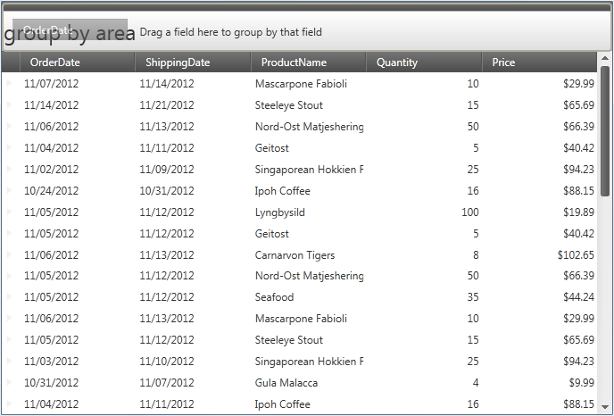
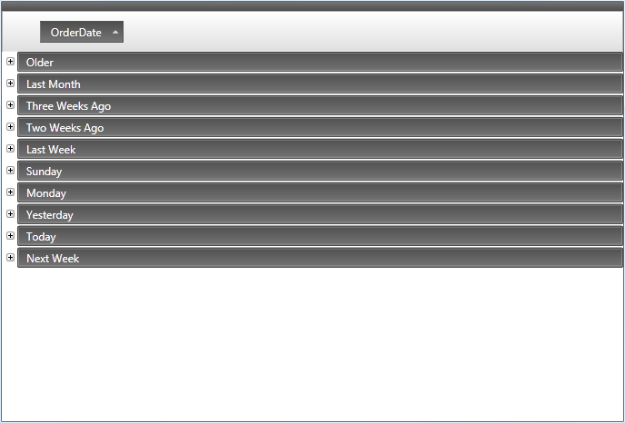
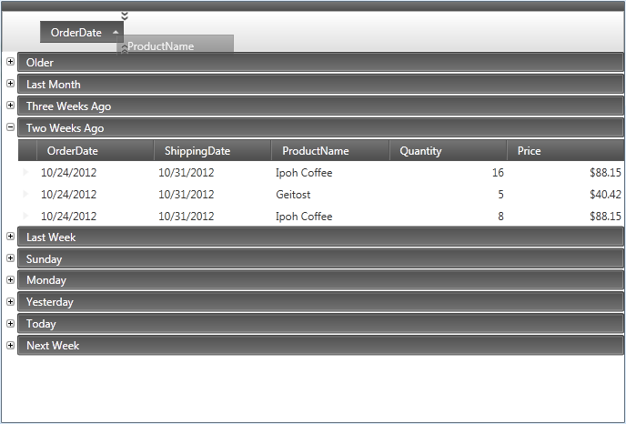

////

|metadata|
{
    "name": "xamdatagrid-user-interaction-grouping-records",
    "tags": ["Application Scenarios","Grouping","How Do I"],
    "controlName": ["xamDataGrid"],
    "guid": "29ef7b97-2295-49d3-bb92-bb75dd986fff",  
    "buildFlags": [],
    "createdOn": "2014-04-01T08:01:54.5328385Z"
}
|metadata|
////

= User Interaction When Grouping Records (xamDataGrid)

== Topic Overview

=== Purpose

This topic describes user interactions when grouping link:{ApiPlatform}datapresenter{ApiVersion}~infragistics.windows.datapresenter.xamdatagrid.html[ _xamDataGrid™_  ] records.

=== Required background

The following topic is a prerequisite to understanding this topic:

[options="header", cols="a,a"]
|====
|Topic|Purpose

| link:xamdatagrid-understanding-xamdatagrid.html[About xamDataGrid]
|This topic introduces the _xamDataGrid_ control and various elements, on which control is composed.

|====

=== In this topic

This topic contains the following sections:

* <<_Ref340063168, User interactions when Sorting Grouped records >>

** <<_Ref335665250,Overview>>

** <<_Ref340063176,Group by field>>

** <<_Ref340063180,Remove grouping>>

** <<_Ref340063201,Group by more than one field>>

* <<_Ref335407927, Related Content >>

[[_Ref340063168]]
== User interactions when sorting and grouping records

=== Overview

The following table summarizes the capabilities of the  _xamDataGrid_   control’s main user interaction related to sorting grouped records.

[options="header", cols="a,a,a,a"]
|====
|The user can…|Using…|Details|Configurable?

|Group by field
|Mouse
|Users can drag field headers from multiple field layouts into group-by area
|image::images/User_Interaction_when_Sorting_Grouped_fields_1.png[] 

link:xamdatapresenter-change-the-location-of-the-groupbyarea.html[Change the Location of the GroupByArea]

|Remove grouping
|Mouse
|Users can drag Label Presenters out of the group-by area to ungroup by field
|image::images/User_Interaction_when_Sorting_Grouped_fields_1.png[] 

link:xamdatapresenter-change-the-location-of-the-groupbyarea.html[Change the Location of the GroupByArea]

|Group by more than one field
|Mouse
|Users can drag more than one field headers into group-by area
|image::images/User_Interaction_when_Sorting_Grouped_fields_1.png[] 

link:xamdatapresenter-change-the-location-of-the-groupbyarea.html[Change the Location of the GroupByArea]

|====

[[_Ref340063176]]

=== Group by field

Users can group on a field simply by clicking on a Label Presenter and dragging it into the group-by area. In the event you cannot see the group by area it will automatically appear.

This is how the  _xamDataGrid_   layout changes after grouping.

==== Related Topics:

link:xamdatapresenter-change-the-location-of-the-groupbyarea.html[Change the Location of the GroupByArea]

[[_Ref340063180]]

=== Remove grouping

Users can remove groupings by dragging the Label Presenter outside of the group-by area.

==== Related Topics:

link:xamdatapresenter-change-the-location-of-the-groupbyarea.html[Change the Location of the GroupByArea]

[[_Ref340063201]]

=== Group by more than one field

Users may group by more than one field by following these steps:

[start=1]
. Create a group by dragging a Label Presenter into the Group by Area, see the <<_Ref340063176,Group by field>> section in this topic for additional information.
[start=2]
. Expand the group by clicking on the group expander in order to expand one or more link:{ApiPlatform}datapresenter{ApiVersion}~infragistics.windows.datapresenter.groupbyrecord.html[GroupByRecord] and show their label presenters
[start=3]
. Drag as many additional label presenter into the group-by area as desired

[[_Ref335407927]]
== Related Content

[[_Ref335665218]]

=== Topics

The following topics provide additional information related to this topic.

[options="header", cols="a,a"]
|====
|Topic|Purpose

| link:xamdatapresenter-about-grouping.html[About Grouping]
|This topic gives an overview of grouping functionality of _xamDataGrid_ . This feature allows your users to group data into more manageable and navigable way. The feature displays a section of the control in which your users can drag columns in order to group their data.

| link:xamdatapresenter-change-the-location-of-the-groupbyarea.html[Change the location of the GroupByArea]
|This topic describes how you can change the location of Group-by Area.

| link:xamdatapresenter-create-an-external-group-by-area.html[Create an External Group-By Area]
|This topic describes how you can detach the group-by area from Data Presenter control and create an external group-by area in your window.

| link:xamdatapresenter-modify-the-group-by-area.html[Modify the GroupByArea]
|This topic describes how you can modify the layout of the field headers and field layout descriptions in the group-by area.

|====