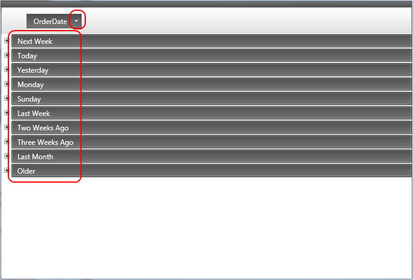
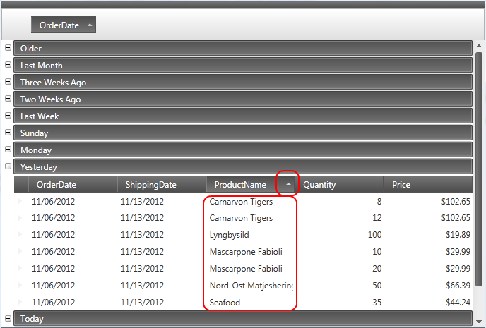
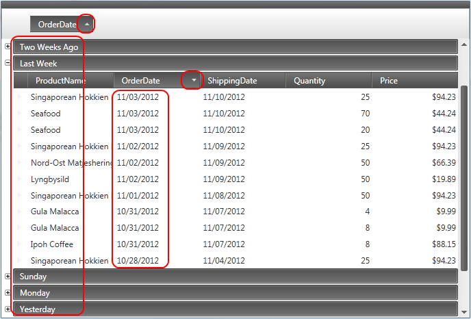
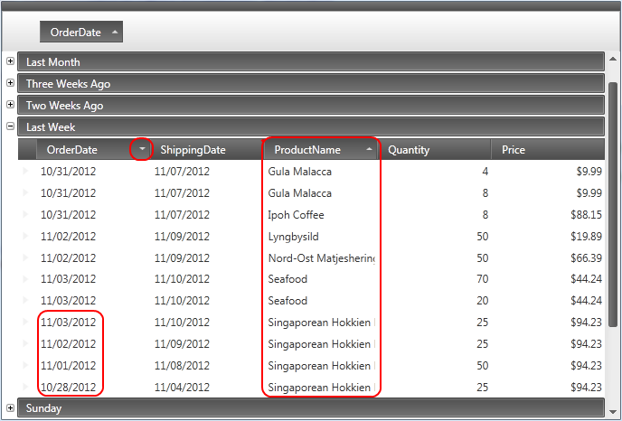

////

|metadata|
{
    "name": "xamdatagrid-user-interaction-sorting-records",
    "controlName": ["xamDataGrid"],
    "tags": ["Application Scenarios","How Do I","Sorting"],
    "guid": "ebc30cb9-9507-4d37-929c-50376c00e73e",  
    "buildFlags": [],
    "createdOn": "2013-02-26T14:04:17.0421465Z"
}
|metadata|
////

= User Interaction When Sorting Records (xamDataGrid)

== Topic Overview

=== Purpose

This topic describes user interactions when sorting grouped link:{ApiPlatform}datapresenter.v{ProductVersion}~infragistics.windows.datapresenter.xamdatagrid.html[ _xamDataGrid™_  ] records.

=== Required background

The following topic is a prerequisite to understanding this topic:

[options="header", cols="a,a"]
|====
|Topic|Purpose

| link:xamdatagrid-understanding-xamdatagrid.html[About xamDataGrid]
|This topic introduces the _xamDataGrid_ control and various elements, on which control is composed.

| link:xamdatagrid-user-interaction-grouping-records.html[User Interaction when Grouping Records]
|This topic describes user interactions when grouping _xamDataGrid_ records.

|====

=== In this topic

This topic contains the following sections:

* <<_Ref340063168, User interactions when Sorting Grouped records >>

** <<_Ref335665250,Overview>>

** <<_Ref340063205,Sort by field inside Group-by area>>

** <<_Ref340063210,Sort by field outside group-by area>>

** <<_Ref340063213,Sort by same field inside and outside group-by area>>

** <<_Ref340063216,Sort by multiple fields outside group-by area>>

* <<_Ref335407927, Related Content >>

[[_Ref340063168]]
== User interactions when sorting and grouping records

=== Overview

The following table summarizes the capabilities of the  _xamDataGrid_   control’s main user interaction related to sorting grouped records.

[options="header", cols="a,a,a,a"]
|====
|The user can…|Using…|Details|Configurable?

|Sort by field inside Group-by area
|Mouse
|Users can click on Label Presenter in the Group-by area
|image::images/User_Interaction_when_Sorting_Grouped_fields_4.png[]

|Sort by field outside group-by area
|Mouse
|Users can click on Label Presenter outside Group-by area
|image::images/User_Interaction_when_Sorting_Grouped_fields_4.png[]

|Sort by same field inside and outside group-by area
|Mouse
|Users can click on Label presenter for a field to sort inside the Group-by area and to click on Label Presenter for the same field outside the Group-by area
|image::images/User_Interaction_when_Sorting_Grouped_fields_4.png[]

|Sort by multiple fields outside group-by area
|Mouse and Keyboard
|Users can press and hold down the CTRL key and select multiple discontinuous Label Presenters
|image::images/User_Interaction_when_Sorting_Grouped_fields_4.png[]

|====

[[_Ref340063205]]

=== Sort by field inside Group-by area

Users can sort `GroupByRecord`s by clicking on the Label Presenter in the Group-by area. By default, dragging a field label presenter into the group-by area causes the records to sort by this field in ascending order.

When clicking on a Label Presenter already contained within the group-by area, users can change the sort order using the UI as show in the following screenshot.

[[_Ref340063210]]

=== Sort by field outside group-by area

Users can sort fields contained in each `GroupByRecord` simply by clicking on the desired field’s Label Presenter; however, you will not see this unless you expand the `GroupByRecord`.

[[_Ref340063213]]

=== Sort by same field inside and outside group-by area

The sorting order selected in the `GroupByRecord` Label Presenter determines whether records sort in ascending or descending order when users group by a field.

It is possible for users to sort by the same field within each group using a different sort order, by clicking on the field within their respective group.

[[_Ref340063216]]

=== Sort by multiple fields outside group-by area

Users can sort by multiple fields contained in each `GroupByRecord` by pressing and holding the CTRL key and clicking on each of the desired fields’ Label Presenter. Sort order criteria are determined by the order in which fields are selected with the first selection determining the first sort criteria, the second selection the second sort criteria and so on.

.Note:
[NOTE]
====
The preceding screenshot illustrates record order after initially grouping on "OrderDate", then selecting "Product Name" and "OrderDate" in that order and applying sort by multiple fields.
====

[[_Ref335407927]]
== Related Content

[[_Ref335665218]]

=== Topics

The following topics provide additional information related to this topic.

[options="header", cols="a,a"]
|====
|Topic|Purpose

| link:xamdatapresenter-about-sorting.html[About Sorting]
|This topic gives an overview of sorting functionality of _xamDataGrid_ . _xamDataGrid_ display and handles the sorting for you. Your users can sort columns by clicking the column headers, allowing them to view the grid data in the order they want.

|====