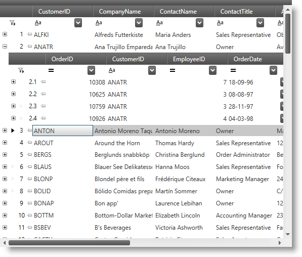

////

|metadata|
{
    "name": "xamdatagrid",
    "controlName": ["xamDataGrid"],
    "tags": [],
    "guid": "{C3963558-1190-4BFE-A7B0-FF924E965A2D}",  
    "buildFlags": [],
    "createdOn": "2012-01-30T19:39:52.9679467Z"
}
|metadata|
////

= xamDataGrid

== In This Group of Topics

=== Introduction

This section contains topics covering the  _xamDataGrid_™ control for WPF.

The  _xamDataGrid_   is a feature-rich Infragistics® Data Presenter family control for visualizing data in tabular form as rows and columns. It is similar in its features and functionalities to the  _xamGrid_™ control. (For a detailed comparison of these two controls, see link:differences-between-xamgrid-and-xamdatagrid.html[Differences Between  _xamGrid_   and  _xamDataGrid_  ].)

=== Topics

[options="header", cols="a,a"]
|====
|Topic|Purpose

| link:xamdatagrid-understanding-xamdatagrid.html[About _xamDataGrid_ ]
|This topic provides an overview of the _xamDataGrid_ control including a conceptual diagram of its comprising elements.

| link:xamdatagrid-getting-started-with-xamdatagrid.html[Adding _xamDataGrid_ to Your Page]
|This topic provides step-by-step instructions on how to add a basic grid to your page.

| link:xamdatagrid-accessing-data.html[Binding _xamDataGrid_ to Data]
|This is a group of topics explaining how to bind the _xamDataGrid_ to different data types.

| link:xamdatagrid-using-xamdatagrid.html[Working with _xamDataGrid_ ]
|This is a group of topics explaining how to use the _xamDataGrid_ control and manage it programmatically.

| link:xamdatagrid-designing-the-look-and-feel.html[Styling _xamDataGrid_ ]
|This is a group of topics explaining how to style the various visual elements of the _xamDataGrid_ control and how to modify the build-in themes to manage the look-and-feel of the grid.

| link:xamdatagrid-optimizing-performance.html[Optimizing Performance ( _xamDataGrid_ )]
|This is a group of topics explaining how to improve the performance of the _xamDataGrid_ in your application.

| link:xamdatagrid-api-overview.html[API Reference ( _xamDataGrid_ )]
|This topic provides reference information about the namespaces and classes related to the _xamDataGrid_ control.

|====