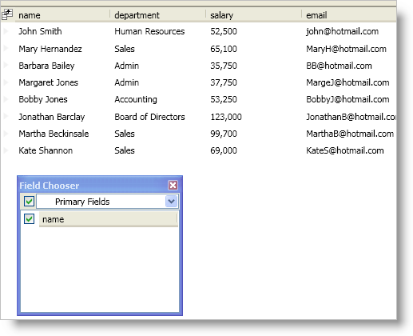

////

|metadata|
{
    "name": "xamdatapresenter-about-field-chooser-settings",
    "controlName": ["xamDataPresenter"],
    "tags": ["Data Presentation","Editing"],
    "guid": "{03C07E43-ABEC-4CBA-9275-AF05AE8D69A9}",  
    "buildFlags": [],
    "createdOn": "2012-01-30T19:39:53.0429617Z"
}
|metadata|
////

= About Field Chooser Settings

The link:{ApiPlatform}datapresenter.v{ProductVersion}~infragistics.windows.datapresenter.fieldchooser.html[FieldChooser] control exposes properties that you can set to modify its behavior and style. However, the way you display the FieldChooser control will dictate how you set its properties.

The simplest case is when you create an external area within your window for the FieldChooser control. Simply set the FieldChooser control's properties just like any other control's properties -- directly on the control or using a style.

In cases where you are displaying the field chooser using the field chooser button or by invoking/executing the link:{ApiPlatform}datapresenter.v{ProductVersion}~infragistics.windows.datapresenter.datapresenterbase~showfieldchooser.html[ShowFieldChooser] method/command, the FieldChooser control will not be part of your window's visual tree. Therefore, any styles you created in your window will not apply to the FieldChooser control. In order to apply styles or set properties exposed by the FieldChooser control, you must handle the DataPresenter control's link:{ApiPlatform}datapresenter.v{ProductVersion}~infragistics.windows.datapresenter.datapresenterbase~fieldchooseropening_ev.html[FieldChooserOpening] event. In the event handler, the link:{ApiPlatform}datapresenter.v{ProductVersion}~infragistics.windows.datapresenter.events.fieldchooseropeningeventargs.html[FieldChooserOpeningEventArgs] object exposes a link:{ApiPlatform}datapresenter.v{ProductVersion}~infragistics.windows.datapresenter.events.fieldchooseropeningeventargs~fieldchooser.html[FieldChooser] property that you can use to set the FieldChooser control's properties.

The following is a list of properties you will you use often when working with the FieldChooser control.

* link:{ApiPlatform}datapresenter.v{ProductVersion}~infragistics.windows.datapresenter.fieldchooser~displayhiddenfieldsonly.html[DisplayHiddenFieldsOnly] - The FieldChooser control will only display the hidden fields of a DataPresenter control. Instead of check boxes, your end users will drag field headers from the DataPresenter control into the FieldChooser control to hide the field and vice-versa to show the field.
* link:{ApiPlatform}datapresenter.v{ProductVersion}~infragistics.windows.datapresenter.fieldchooser~fielddisplayorder.html[FieldDisplayOrder] - You can change the display order of field headers in the FieldChooser control. The FieldDisplayOrderComparer property will override this property setting.
* link:{ApiPlatform}datapresenter.v{ProductVersion}~infragistics.windows.datapresenter.fieldchooser~fielddisplayordercomparer.html[FieldDisplayOrderComparer] - You can change the display order of field headers in the FieldChooser control using your own custom sorting logic.
* link:{ApiPlatform}datapresenter.v{ProductVersion}~infragistics.windows.datapresenter.fieldchooser~fieldfilters.html[FieldFilters] - You can add filters to the drop-down list in the FieldChooser control so your end users can concentrate on a smaller subset of field headers. If a filter does not contain any field headers, the FieldChooser control will not display it in the drop-down list. For example, you can create a filter that only shows DateTime fields; however, if no fields match the filter criterion, the drop-down list will not include the filter.
* link:{ApiPlatform}datapresenter.v{ProductVersion}~infragistics.windows.datapresenter.fieldchooser~fieldgroupselectorvisibility.html[FieldGroupSelectorVisibility] - You can hide the drop-down list in the FieldChooser control.

The following example code demonstrates how to add a filter to the field chooser control by handling the FieldChooserOpening event.

*In XAML:*

----
<igDP:XamDataPresenter 
    Name="xamDataPresenter1" 
    FieldChooserOpening="OnFieldChooserOpening" 
    BindToSampleData="True">
    <igDP:XamDataPresenter.FieldLayoutSettings>
        <igDP:FieldLayoutSettings HeaderPrefixAreaDisplayMode="FieldChooserButton" />
    </igDP:XamDataPresenter.FieldLayoutSettings>
</igDP:XamDataPresenter>
----

*In Visual Basic:*

----
Imports Infragistics.Windows.DataPresenter
Imports Infragistics.Windows.DataPresenter.Events
...
Private Sub OnFieldChooserOpening(ByVal sender As Object, ByVal e As FieldChooserOpeningEventArgs)
    If e.FieldChooser.FieldFilters.Count = 0 Then 
        '1. Create a Predicate object to test a condition
        Dim primaryFieldFilterCondition As Predicate(Of Field) = New Predicate(Of Field)(Function(fieldParam As Field) fieldParam.IsPrimary)
        '2. Create a FieldChooserFilter object that uses the Predicate object
        Dim primaryFieldFilter As New FieldChooserFilter("Primary Fields", primaryFieldFilterCondition, "Show Primary Fields")
        ' 3. Add the FieldChooserFilter object to the FieldChooser control's FieldFilters collection
        e.FieldChooser.FieldFilters.Add(primaryFieldFilter)
    End If
End Sub
...
----

*In C#:*

----
using Infragistics.Windows.DataPresenter;
using Infragistics.Windows.DataPresenter.Events;
...
private void OnFieldChooserOpening(object sender, FieldChooserOpeningEventArgs e)
{
    if(e.FieldChooser.FieldFilters.Count == 0)
    {
        //1. Create a Predicate object to test a condition
        Predicate<Field> primaryFieldFilterCondition = new Predicate<Field>(field => { return field.IsPrimary; });
        //2. Create a FieldChooserFilter object that uses the Predicate object
        FieldChooserFilter primaryFieldFilter = new FieldChooserFilter("Primary Fields", primaryFieldFilterCondition, "Show Primary Fields");
        //3. Add the FieldChooserFilter object to the FieldChooser control's FieldFilters collection
        e.FieldChooser.FieldFilters.Add(primaryFieldFilter);
    }
}
...
----

== Related Topics

link:xamdatapresenter-about-the-field-chooser.html[About the Field Chooser]

link:xamdatapresenter-display-the-field-chooser.html[Display the Field Chooser]

link:xamdatapresenter-prevent-fields-from-being-hidden.html[Prevent Fields from Being Hidden]

link:xamdatapresenter-create-an-external-field-chooser.html[Create an External Field Chooser]

link:xamdatapresenter-change-the-display-order-of-fields-in-the-field-chooser.html[Change the Display Order of Fields in the Field Chooser]