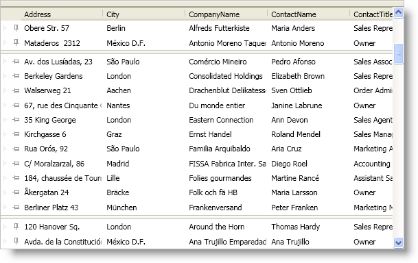

////

|metadata|
{
    "name": "xamdatapresenter-about-fixed-non-scrolling-records",
    "controlName": ["xamDataPresenter"],
    "tags": ["Data Presentation","Editing"],
    "guid": "{19AFFA12-FBE1-44F5-916B-1BBB02B639F0}",  
    "buildFlags": [],
    "createdOn": "2012-01-30T19:39:53.0449621Z"
}
|metadata|
////

= About Fixed (Non-Scrolling) Records

The fixed record feature allows your end users to fix root-level records to the top or bottom of the xamDataPresenter™ or the xamDataGrid™ control's record list. The fixed records will not scroll out of view when your end users scroll new records into view.

The xamDataCarousel™ control does not support fixed records. However, if you programmatically fix a record in a xamDataCarousel control, the record will move to the beginning of the record list and xamDataCarousel will scroll it into view. Unfixing the record will move it back into its original position in the record list and xamDataCarousel will scroll to the beginning of the record list.

If your DataPresenter control contains nested records, i.e., hierarchical data or grouped records, fixed records will exhibit different behaviors.

.Note
[NOTE]
====
Only root-level records can be fixed if you enable nested panels.
====

[start=1]
. If your end users fix multiple records to the top and they expand one of the fixed records, subsequent fixed records (closest to the scrollable area) will become scrollable. If your end users collapse the expanded record, the subsequent fixed records will be fixed again.
[start=2]
. If your end users fix multiple records to the bottom and they expand one of the fixed records, the expanded record and preceding fixed record (closest to the scrollable area) will become scrollable. If your end users collapse the expanded record, the subsequent fixed records will be fixed again.
[start=3]
. Since the DataPresenter controls append fixed records to the bottom of the fixed-records list (records fixed to the top) or the top of the fixed-records list (records fixed to the bottom), any records that your end users fix after expanding a fixed record will be scrollable (see previous rules).
[start=4]
. Your end users can only fix a child record or a data record within a group-by record to the top of its respective record island.
[start=5]
. Fixed child records are only fixed relative to its siblings. For example, if your end users fix a child record that has five siblings, the fixed child record will remain in view as long as your end users do not scroll the last sibling record out of view. Once your end users scroll the last sibling record out of view, the fixed child record will become scrollable. This also means that if your end users fix all child records in a record island, all of them will be scrollable.

== Related Topics

link:xamdatapresenter-about-fixed-records-and-sorting.html[About Fixed Records and Sorting]

link:xamdatapresenter-enable-fixed-records.html[Enable Fixed Records]

link:xamdatapresenter-fix-records.html[Fix Records]

link:xamdatapresenter-limit-the-number-of-fixed-records.html[Limit the Number of Fixed Records]