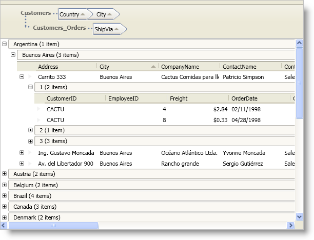

////

|metadata|
{
    "name": "xamdatapresenter-about-grouping",
    "controlName": ["xamDataPresenter"],
    "tags": ["Grouping"],
    "guid": "{0541BFBA-CDF0-486E-90DB-92BA59067B37}",  
    "buildFlags": [],
    "createdOn": "2012-01-30T19:39:53.0519635Z"
}
|metadata|
////

= About Grouping

The DataPresenter controls offer grouping functionality so that your end users can group records based on fields that contain the same value. The DataPresenter controls also offer two different ways for your end users to group records.

* The default behavior allows your end users to drag field headers from multiple field layouts into the group-by area.

* The second option displays a button for each field in the default layout underneath the group-by area. Your end users can drag these buttons into the group-by area to group records in the default field layout. This option does not allow your end users to group records using fields in multiple field layouts. This option is available to support backwards compatibility with previous releases.

Regardless of the control and its group-by settings, you can group records in code or in XAML. Therefore, you can provide your own user interface for grouping records even when you are not displaying field headers in the DataPresenter controls.

All three controls expose the following properties that allow you to modify group-by functionality:

* link:{ApiPlatform}datapresenter.v{ProductVersion}~infragistics.windows.datapresenter.datapresenterbase~groupbyareamode.html[GroupByAreaMode] - This property serves three separate purposes.

** The main purpose is to determine whether your end users can group records using fields from multiple field layouts. For example, if you have a nested hierarchy of Customer and Order data items, this property determines if your end users can group the Customer data items and the Order data items.
** The second purpose is to determine how much space the group-by area will occupy when you enable multiple field layout grouping. If you use the MultipleFieldLayoutsCompact setting, the control will display the group-by criteria in a single line in the group-by area. However, with the MultipleFieldLayoutsFull setting, the DataPresenter control will display each unique field layout on a separate line in the group-by area.
** The third purpose is to switch between the two different user interface options available for grouping records. If you enable grouping only on the default field layout (DefaultFieldLayoutOnly), the group-by area will display buttons for the fields in the default field layout. Otherwise, you end users will be able to drag field headers from multiple field layouts into the group-by area.

* link:{ApiPlatform}datapresenter.v{ProductVersion}~infragistics.windows.datapresenter.datapresenterbase~groupbyarea.html[GroupByArea] - You can set this property to a GroupByArea control to attach an external group-by area to the DataPresenter control or to modify properties of the GroupByArea control. This group-by area only allows grouping by fields in the default field layout. The DataPresenter controls will only use a GroupByArea control when you set the GroupByAreaMode property to DefaultFieldLayoutOnly.
* link:{ApiPlatform}datapresenter.v{ProductVersion}~infragistics.windows.datapresenter.datapresenterbase~groupbyareamulti.html[GroupByAreaMulti] - You can set this property to a GroupByAreaMulti control to attach an external group-by area to the DataPresenter control or to modify properties of the GroupByAreaMulti control. This group-by area only works when you set the GroupByAreaMode property to MultipleFieldLayoutsCompact or MultipleFieldLayoutsFull.
* link:{ApiPlatform}datapresenter.v{ProductVersion}~infragistics.windows.datapresenter.datapresenterbase~groupbyarealocation.html[GroupByAreaLocation] - This property allows you to set the location of the group-by area. If you are using an external group-by area, this property will not affect the control.

In addition to the properties listed above, the link:{ApiPlatform}datapresenter.v{ProductVersion}~infragistics.windows.datapresenter.fieldsettings.html[FieldSettings] object exposes properties that allow you to modify grouping-related behaviors on a specific Field object.

* link:{ApiPlatform}datapresenter.v{ProductVersion}~infragistics.windows.datapresenter.fieldsettings~allowgroupby.html[AllowGroupBy] - This property determines whether your end users can use the field as a group-by criterion.

link:{ApiPlatform}datapresenter.v{ProductVersion}~infragistics.windows.datapresenter.fieldsettings~groupbycomparer.html[GroupByComparer] - You can provide your own sorting logic for group-by records by setting this property to an object that implements the IComparer interface found in the .NET Framework.

link:{ApiPlatform}datapresenter.v{ProductVersion}~infragistics.windows.datapresenter.fieldsettings~groupbyevaluator.html[GroupByEvaluator] - You can provide your own grouping logic by setting this property to an object that implements the IGroupByEvaluator interface.

* link:{ApiPlatform}datapresenter.v{ProductVersion}~infragistics.windows.datapresenter.fieldsettings~groupbymode.html[GroupByMode] - The DataPresenter controls provide a few commonly used group-by evaluators. You can set this property to a built-in group-by evaluator to change the default grouping logic.

== Related Topics

link:xamdatapresenter-about-sorting.html[About Sorting]

link:xamdatapresenter-sorting-and-grouping-fields-programmatically.html[Sorting and Grouping Fields Programmatically]

link:xamdatapresenter-modify-the-group-by-area.html[Modify the Group-By Area]

link:xamdatapresenter-create-an-external-group-by-area.html[Create an External Group-By Area]

link:xamdatapresenter-disable-groupby.html[Disable GroupBy]

link:xamdatapresenter-change-the-location-of-the-groupbyarea.html[Change the Location of the GroupByArea]