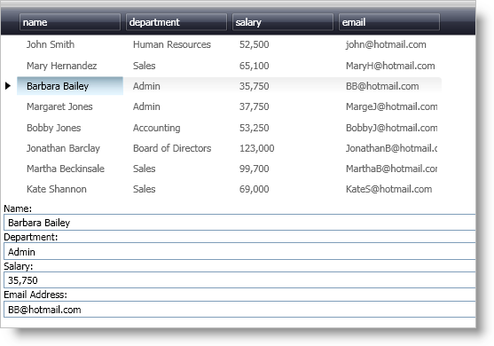

////
|metadata|
{
    "name": "xamdatapresenter-accessing-cell-values-in-the-active-record",
    "controlName": ["xamDataPresenter"],
    "tags": [],
    "guid": "{8BACE740-55E8-4FF9-9B16-3074CBFFA3C0}","buildFlags": [],
    "createdOn": "2012-01-30T19:39:53.0699671Z"
}
|metadata|
////

= Accessing Cell Values in the Active Record

== Before You Begin

You can access link:{ApiPlatform}datapresenter.v{ProductVersion}~infragistics.windows.datapresenter.cell.html[Cell] values in xamDataPresenter's™ active link:{ApiPlatform}datapresenter.v{ProductVersion}~infragistics.windows.datapresenter.record.html[Record] using Extensible Application Markup Language (XAML). This will allow you to bind the value of a Cell in the active Record to the Text property of a TextBox control. You can use this functionality to create a section in your Window for data entry or for data navigation and display purposes.

== What You Will Accomplish

You will create a section in your Window for data entry tasks using XAML.

== Follow these Steps

[start=1]
. Create RowDefinitions for the default Grid layout panel in your Window.
+
*In XAML:*
+
[source,xaml]
----
<Grid>
    <Grid.RowDefinitions>
        <RowDefinition Height="3*" />
        <RowDefinition Height="2*" />
    </Grid.RowDefinitions>
    <!--TODO: Add controls here-->
</Grid>
----

[start=2]
. Add a xamDataPresenter control to your Window.
+
--
.. Name the xamDataPresenter control so you can reference it later.
.. Set the link:{ApiPlatform}datapresenter.v{ProductVersion}~infragistics.windows.datapresenter.datapresenterbase~bindtosampledata.html[BindToSampleData] property to True. This topic will use the sample data in order to concentrate on the topic at hand.
.. Set the attached Grid.Row property to 0.
--
+
*In XAML:*
+
[source,xaml]
----
...
<igDP:XamDataPresenter Name="xamDataPresenter1" BindToSampleData="True" Grid.Row="0">
</igDP:XamDataPresenter>
...
----

[start=3]
. Disable editing of the xamDataPresenter control since you will use the TextBox controls to modify the Cell values.
+
--
.. Declare tags for the FieldSettings property within the tags of xamDataPresenter.
.. Add a link:{ApiPlatform}datapresenter.v{ProductVersion}~infragistics.windows.datapresenter.fieldsettings.html[FieldSettings] object within the tags for the FieldSettings property.
.. Set the link:{ApiPlatform}datapresenter.v{ProductVersion}~infragistics.windows.datapresenter.fieldsettings~allowedit.html[AllowEdit] property of the FieldSettings object to False.
--
+
*In XAML:*
+
[source,xaml]
----
...
<igDP:XamDataPresenter.FieldSettings>
    <igDP:FieldSettings AllowEdit="False" />
</igDP:XamDataPresenter.FieldSettings>
...
----

[start=4]
. Add a StackPanel layout container to your Window.
+
--
.. Set the attached Grid.Row property to 1.
.. Use a binding expression to set the DataContext property of the StackPanel container to the link:{ApiPlatform}datapresenter.v{ProductVersion}~infragistics.windows.datapresenter.datapresenterbase~activerecord.html[ActiveRecord] property of the xamDataPresenter1 control. By setting the DataContext of the parent container, you can use simpler binding expressions to set properties on its children.
--
+
*In XAML:*
+
[source,xaml]
----
...
<StackPanel
    Grid.Row="1"
    DataContext="{Binding ElementName=xamDataPresenter1, Path=ActiveRecord}">
    <!--TODO: Add data entry controls here-->
</StackPanel>
...
----

[start=5]
. Add a TextBlock control to the StackPanel layout container and set the TextBlock's Text property.
+
*In XAML:*
+
[source,xaml]
----
...
<TextBlock Text="Name:" />
...
----

[start=6]
. Add a TextBox control to the StackPanel layout container and use a binding expression to bind the Text property to the link:{ApiPlatform}datapresenter.v{ProductVersion}~infragistics.windows.datapresenter.cell~value.html[Value] property of a Cell in the link:{ApiPlatform}datapresenter.v{ProductVersion}~infragistics.windows.datapresenter.cellcollection.html[Cells collection].
+
Since you set the parent layout container's DataContext to the xamDataPresenter1 control's ActiveRecord property, you can simply use a property path to get the values from a Cell.
+
*In XAML:*
+
[source,xaml]
----
...
<TextBox Text="{Binding Path=Cells[name].Value}" />
...
----

[start=7]
. Repeat steps six and seven for each Field you want to display and/or edit.
+
*In XAML:*
+
[source,xaml]
----
...
<TextBlock Text="Department:" />
<TextBox Text="{Binding Path=Cells[department].Value}" />
<TextBlock Text="Salary:" />
<TextBox Text="{Binding Path=Cells[salary].Value}" />
<TextBlock Text="Email Address:" />
<TextBox Text="{Binding Path=Cells[email].Value}" />
...
----

[start=8]
. Run the project and click a Record to activate it. The values in the Cells of the Record you just clicked on should be displayed in the TextBox controls. If you modify a value in a TextBox and the TextBox loses focus, the value in the corresponding Cell will also update.
+

== Related Topics

link:xamdatapresenter-accessing-cell-values-in-the-recordactivated-event.html[Accessing Cell Values in the RecordActivated Event]

link:xamdata-changing-field-record-cell-selection-behavior.html[Changing Field, Record, or Cell Selection Behavior]

link:xamdata-default-editor-types-for-different-data-types.html[Default Editor Types for Different Data Types]

link:xamdatapresenter-validating-edited-cell-data-in-xamdatapresenter.html[Validating Edited Cell Data in xamDataPresenter]