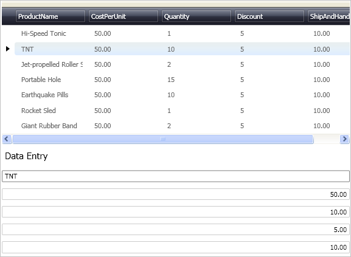

////
|metadata|
{
    "name": "xamdatapresenter-accessing-cell-values-in-the-recordactivated-event",
    "controlName": ["xamDataPresenter"],
    "tags": [],
    "guid": "{6C6A75F4-AAF6-456F-84ED-402B1FAB692C}","buildFlags": [],
    "createdOn": "2012-01-30T19:39:53.0719675Z"
}
|metadata|
////

= Accessing Cell Values in the RecordActivated Event

You can access cell values in the active Record through xamDataPresenter's™ link:{ApiPlatform}datapresenter{ApiVersion}~infragistics.windows.datapresenter.datapresenterbase~recordactivated_ev.html[RecordActivated] event. For example, if you were making a data entry area on your Page/Window, you could use this event to populate the fields in your entry area based on the active link:{ApiPlatform}datapresenter{ApiVersion}~infragistics.windows.datapresenter.record.html[Record] selected by the end user.

.Note
[NOTE]
====
The xamNumericEditor mentioned in this topic is only available in the {ProductName} Full product version. The concepts shown here though can be applied to the editors available in the Express version.
====

The following procedure assumes you have a data bound xamDataPresenter and you want to handle the RecordActivated event for the control, to populate editors on the Page/Window based on the end users active Record. For more information, see link:xamdatapresenter-getting-started-with-xamdatapresenter.html[Adding xamDataPresenter to Your Application].

[start=1]
. Create an instance of XamDataPresenter and name it. Set the RecordActivated event to an event handler method to use when the event fires. Define a Label, xamTextEditor, and four xamNumericEditors. Each of the editors will be named after the Field that they will display. Set a margin on each of the controls to spread them out for easier readability.
+
*In XAML:*
+
[source,xaml]
----
<igDP:XamDataPresenter x:Name="XamDataPresenter1" 
  ...
  RecordActivated="XamDataPresenter1_RecordActivated">
    <igDP:XamDataPresenter.View>
        <igDP:GridView />
    </igDP:XamDataPresenter.View>
</igDP:XamDataPresenter>

<Label x:Name="Label1" Content="Data Entry" Margin="0,5,0,0" FontSize="15.0"/>

<igEditors:XamTextEditor x:Name="ProductName" Margin="0,5,0,0"/>
<igEditors:XamNumericEditor x:Name="CostPerUnit" Margin="0,5,0,0"/>
<igEditors:XamNumericEditor x:Name="Quantity" Margin="0,5,0,0"/>
<igEditors:XamNumericEditor x:Name="Discount" Margin="0,5,0,0"/>
<igEditors:XamNumericEditor x:Name="ShipandHandle" Margin="0,5,0,0"/>
----

[start=2]
. Before you start writing any code, you should place using/Imports directives in your code-behind so you don't need to always type out a member's fully qualified name.
+
*In Visual Basic:*
+
[source,vb]
----
Imports Infragistics.Windows.DataPresenter.Events
Imports Infragistics.Windows.DataPresenter
----
+
*In C#:*
+
[source,csharp]
----
using Infragistics.Windows.DataPresenter.Events;
using Infragistics.Windows.DataPresenter;
----

[start=3]
. Create the event handler method defined for the RecordActivated event in step 4. The method checks each Record to see if they are of type DataRecord. If the Record is of type DataRecord, an instance of the Record is created. Using the new instance of the DataRecord, the method assigns the values from the DataRecord's cells to the appropriate editor.
+
*In Visual Basic:*
+
[source,vb]
----
Sub XamDataPresenter1_RecordActivated(ByVal sender As Object, _
    ByVal e As RecordActivatedEventArgs)
    ' Check to make sure the selected Record is a DataRecord
    If TypeOf e.Record Is DataRecord Then
        ' Cast the record passed in as a DataRecord
        Dim myRecord As DataRecord = CType(e.Record, DataRecord)
        ' Display the selected Records values in the appropriate 
        ' editor
        Me.ProductName.Text = myRecord.Cells(0).Value.ToString()
        Me.CostPerUnit.Value = myRecord.Cells(1).Value
        Me.Quantity.Text = myRecord.Cells(2).Value.ToString()
        Me.Discount.Text = myRecord.Cells(3).Value.ToString()
        Me.ShipandHandle.Value = myRecord.Cells(4).Value
    End If
End Sub
----
+
*In C#:*
+
[source,csharp]
----
void XamDataPresenter1_RecordActivated(object sender, RecordActivatedEventArgs e)
{
    // Check to make sure the selected Record is a DataRecord
    if (e.Record is DataRecord)
    {
        // Cast the record passed in as a DataRecord
        DataRecord myRecord = (DataRecord)e.Record;
        // Display the selected Records values in the appropriate 
        // editor
        this.ProductName.Text = myRecord.Cells[0].Value.ToString();
        this.CostPerUnit.Value = myRecord.Cells[1].Value;
        this.Quantity.Text = myRecord.Cells[2].Value.ToString();
        this.Discount.Text = myRecord.Cells[3].Value.ToString();
        this.ShipandHandle.Value = myRecord.Cells[4].Value;
    }
}
----

[start=4]
. Build and run the project. You should see xamDataPresenter with five editors underneath it. When you select a record in the xamDataPresenter the editors are populated with the data from the selected record.
+

== Related Topics

link:xamdatapresenter-accessing-cell-values-in-the-active-record.html[Accessing Cell Values in the Active Record]

link:xamdata-changing-field-record-cell-selection-behavior.html[Changing Field, Record, or Cell Selection Behavior]

link:xamdata-default-editor-types-for-different-data-types.html[Default Editor Types for Different Data Types]

link:xamdatapresenter-validating-edited-cell-data-in-xamdatapresenter.html[Validating Edited Cell Data in xamDataPresenter]