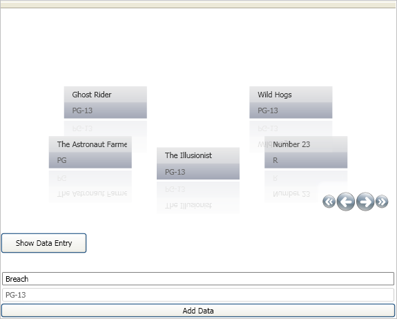

////

|metadata|
{
    "name": "xamdatapresenter-acessing-data-carousel-view",
    "controlName": ["xamDataPresenter"],
    "tags": ["Data Binding","How Do I"],
    "guid": "{FC664D85-9727-4364-8E48-7B5CF2DB83AB}",  
    "buildFlags": [],
    "createdOn": "2012-01-30T19:39:53.0809693Z"
}
|metadata|
////

= Carousel View

The xamDataCarousel™ control updates and deletes data just as xamDataGrid™ because they expose the same events. You can use these events to determine when the end user has deleted or updated a record. The available events include:

* link:{ApiPlatform}datapresenter.v{ProductVersion}~infragistics.windows.datapresenter.datapresenterbase~recordsdeleting_ev.html[RecordsDeleting]
* link:{ApiPlatform}datapresenter.v{ProductVersion}~infragistics.windows.datapresenter.datapresenterbase~recordsdeleted_ev.html[RecordsDeleted]
* link:{ApiPlatform}datapresenter.v{ProductVersion}~infragistics.windows.datapresenter.datapresenterbase~recordupdated_ev.html[RecordUpdated]
* link:{ApiPlatform}datapresenter.v{ProductVersion}~infragistics.windows.datapresenter.datapresenterbase~recordupdating_ev.html[RecordUpdating]
* link:{ApiPlatform}datapresenter.v{ProductVersion}~infragistics.windows.datapresenter.datapresenterbase~recordupdatecanceled_ev.html[RecordUpdateCanceled]
* link:{ApiPlatform}datapresenter.v{ProductVersion}~infragistics.windows.datapresenter.datapresenterbase~recordupdatecanceling_ev.html[RecordUpdateCanceling]

The major difference between xamDataCarousel and xamDataGrid is that xamDataCarousel has no built-in user interface for data input. However, you can write your own user interface that enables your end users to add Records to the data source which will update xamDataCarousel.

Follow these steps to implement an Add Row UI to xamDataCarousel which will allow your end user to add new Records to xamDataCarousel. You will also set the link:{ApiPlatform}datapresenter.v{ProductVersion}~infragistics.windows.datapresenter.fieldsettings~cellclickaction.html[CellClickAction] property to EnterEditModeIfAllowed which will allow end users to edit Records.

[start=1]
. Place the following namespaces in your Page's open tag and set the Loaded event to the Samp_Loaded method.

*In XAML:*

----
...
xmlns:igDP="http://infragistics.com/DataPresenter"
xmlns:igEditors="http://infragistics.com/Editors"
Loaded="Samp_Loaded"
...
----

[start=2]
. Create one column and three rows in the Grid Panel. Place the following XAML in the Page's Grid Panel.

*In XAML:*

----
<Grid>
        <Grid.ColumnDefinitions>
                <ColumnDefinition Width="*" />
        </Grid.ColumnDefinitions>
        <Grid.RowDefinitions>
                <RowDefinition Height="Auto" />
                <RowDefinition Height="Auto" />
                <RowDefinition Height="Auto" />
        </Grid.RowDefinitions>
...
----

[start=3]
. Add the xamDataCarousel control to the page. Specify the CellClickAction off the link:{ApiPlatform}datapresenter.v{ProductVersion}~infragistics.windows.datapresenter.fieldsettings.html[FieldSettings] to allow end users to edit cell data in existing records. The following example XAML shows the syntax for this.

*In XAML:*

----
...
        <igDP:XamDataCarousel x:Name="XamDataCarousel1" Grid.Row="0">
                <igDP:XamDataCarousel.FieldSettings>
                        <igDP:FieldSettings 
                          CellClickAction="EnterEditModeIfAllowed" />
                </igDP:XamDataCarousel.FieldSettings>
        </igDP:XamDataCarousel>
...
----

[start=4]
. Start building the Add Row user interface by creating a Button and assigning its Click event to the Button1_Click method. You will use this button to hide and display the panel that contains the Add Row user interface. The following XAML defines the button's syntax.

*In XAML:*

----
...
        <Button x:Name="Button1"  Content="Show Data Entry" Width="125" 
          Height="30" HorizontalAlignment="Left" Grid.Row="1" 
          Margin="0,25,0,25" Click="Button1_Click"/>
...
----

[start=5]
. An invisible StackPanel contains the Add Row user interface. The StackPanel contains two xamTextEditors and a Button. Assign the Button's Click event to Button2_Click. The following XAML the StackPanel.

*In XAML:*

----
...
        <StackPanel x:Name="DataEntryPanel" Visibility="Hidden" Grid.Row="2">
                <igEditors:XamTextEditor x:Name="Title" Text="Enter Movie Title"/>
                <igEditors:XamTextEditor x:Name="MPAARating" Text="Enter MPAA Rating"/>
                <Button x:Name="Button2" Click="Button2_Click">Add Data</Button>
        </StackPanel>
</Grid>
----

[start=6]
. Compile the project. There will be a few exceptions as the events haven't been created yet. This step is necessary to access XAML elements in the code-behind.
[start=7]
. Before you start writing any procedural code, you should place using/Imports directives in your code-behind so you don't need to always type out a member's fully qualified name.

*In Visual Basic:*

----
Imports System.Data
----

*In C#:*

----
using System.Data;
----

[start=8]
. Define the methods that you assigned to events, starting with the Loaded event. The Loaded event generates sample data and assigns the DataSource property of xamDataCarousel to the new data.

*In Visual Basic:*

----
Private ds As DataSet
Sub Samp_Loaded(ByVal o As Object, ByVal e As RoutedEventArgs)
        ' These two lines would be replaced with the logic 
        ' for getting your data
        ds = New DataSet()
        GenerateData()
        ' Set xamDataCarousel's DataSource property to the default view of 
        ' the dataset
        Me.XamDataCarousel1.DataSource = ds.Tables(0).DefaultView
End Sub
----

*In C#:*

----
private DataSet ds;
void Samp_Loaded(object o, RoutedEventArgs e)
{
        /* These two lines would be replaced with the logic 
        * for getting your data* /
        ds = new DataSet();
        GenerateData();
        // Set xamDataCarousel's DataSource property to the default view of 
        // the dataset
        this.XamDataCarousel1.DataSource = ds.Tables[0].DefaultView;
}
----

[start=9]
. Create the GenerateData method used in the previous step.

*In Visual Basic:*

----
Sub GenerateData()
        Dim dt As DataTable = ds.Tables.Add("TopMovies")
        dt.Columns.Add("Title", GetType([String]))
        dt.Columns.Add("MPAA Rating", GetType(String))
        dt.Rows.Add(New Object() {"Ghost Rider", "PG-13"})
        dt.Rows.Add(New Object() {"The Astronaut Farmer", "PG"})
        dt.Rows.Add(New Object() {"The Illusionist", "PG-13"})
        dt.Rows.Add(New Object() {"Number 23", "R"})
        dt.Rows.Add(New Object() {"Wild Hogs", "PG-13"})
        dt.Rows.Add(New Object() {"Norbit", "PG-13"})
End Sub
----

*In C#:*

----
void GenerateData()
{
        DataTable dt = ds.Tables.Add("TopMovies");
        dt.Columns.Add("Title", typeof(String));
        dt.Columns.Add("MPAA Rating", typeof(string));
        dt.Rows.Add(new object[] { "Ghost Rider", "PG-13" });
        dt.Rows.Add(new object[] { "The Astronaut Farmer", "PG"});
        dt.Rows.Add(new object[] { "The Illusionist", "PG-13" });
        dt.Rows.Add(new object[] { "Number 23", "R" });
        dt.Rows.Add(new object[] { "Wild Hogs", "PG-13" });
        dt.Rows.Add(new object[] { "Norbit", "PG-13" });
}
----

[start=10]
. In the Button1_Click event, set the StackPanel's Visibility property to Visible. To access the StackPanel, use the name you assigned it in XAML.

*In Visual Basic:*

----
Sub Button1_Click(ByVal sender As Object, _
  ByVal e As RoutedEventArgs)
        Me.DataEntryPanel.Visibility = Visibility.Visible
End Sub
----

*In C#:*

----
void Button1_Click(object sender, RoutedEventArgs e)
{
        this.DataEntryPanel.Visibility = Visibility.Visible;
}
----

[start=11]
. In the Button2_Click event, assign the data in the xamTextEditors to a new DataRow and add it to the DataSet.

*In Visual Basic:*

----
Sub Button2_Click(ByVal sender As Object, _
  ByVal e As RoutedEventArgs)
        ' Create a new DataRow
        Dim myRow As DataRow = ds.Tables(0).NewRow()
        ' Assign values from xamTextEditors to DataRow
        myRow(0) = Me.Title.Text.ToString()
        myRow(1) = Me.MPAARating.Text.ToString()
        ' Add new DataRow to Table's Rows Collection
        ds.Tables("TopMovies").Rows.Add(myRow)
        ' Clear the text from xamTextEditors
        Me.Title.Text = ""
        Me.MPAARating.Text = ""
End Sub
----

*In C#:*

----
void Button2_Click(object sender, RoutedEventArgs e)
{
        // Create a new DataRow
        DataRow myRow = ds.Tables[0].NewRow();
        // Assign values from xamTextEditors to DataRow
        myRow[0] = this.Title.Text.ToString();
        myRow[1] = this.MPAARating.Text.ToString();
        // Add new DataRow to Table's Rows Collection
        ds.Tables["TopMovies"].Rows.Add(myRow);
        // Clear the text from xamTextEditors
        this.Title.Text = "";
        this.MPAARating.Text = "";
}
----

[start=12]
. Build and run the project. Click the Show Data Entry button. The Add Row user interface becomes visible. Enter some data into the xamTextEditors and click the Add Data button. A new record is added to the DataSet and the modification is reflected in xamDataCarousel.

