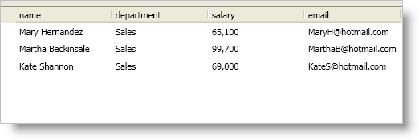

////

|metadata|
{
    "name": "xamdatapresenter-add-filter-conditions",
    "controlName": ["xamDataPresenter"],
    "tags": ["Filtering","How Do I"],
    "guid": "{C54EDBEB-97DF-4C05-AF34-E82E2D9D1FBB}",  
    "buildFlags": [],
    "createdOn": "2012-01-30T19:39:53.0829697Z"
}
|metadata|
////

= Add Filter Conditions

To allow the user to filter records you must set the link:{ApiPlatform}datapresenter{ApiVersion}~infragistics.windows.datapresenter.fieldsettings~allowrecordfiltering.html[AllowRecordFiltering] property of the link:{ApiPlatform}datapresenter{ApiVersion}~infragistics.windows.datapresenter.fieldsettings.html[FieldSettings] object. Even if you did not allowed the user to perform filtering operations you can still programmatically filter records by adding link:{ApiPlatform}datapresenter{ApiVersion}~infragistics.windows.datapresenter.recordfilter.html[RecordFilter] objects to a link:{ApiPlatform}datapresenter{ApiVersion}~infragistics.windows.datapresenter.fieldlayout.html[FieldLayout] object's link:{ApiPlatform}datapresenter{ApiVersion}~infragistics.windows.datapresenter.fieldlayout~recordfilters.html[RecordFilters] collection or to a link:{ApiPlatform}datapresenter{ApiVersion}~infragistics.windows.datapresenter.recordmanager.html[RecordManager] object's link:{ApiPlatform}datapresenter{ApiVersion}~infragistics.windows.datapresenter.recordmanager~recordfilters.html[RecordFilters] collection. You can even programmatically filter records on the xamDataCarousel™ control even though the control does not expose a way for the user to provide record filters.

When you declaratively set the `FieldSettings` object's `AllowRecordFiltering` property to `true` the control will auto-generate `RecordFilter` object for each field in the field layout. These `RecordFilter` objects will not be removed from the `FieldLayout.RecordFilters` even after invoking the `RecordFilters`'s link:{ApiPlatform}datapresenter{ApiVersion}~infragistics.windows.datapresenter.recordfiltercollection~clear.html[Clear] method. However, you can clear their filtering link:{ApiPlatform}datapresenter{ApiVersion}~infragistics.windows.datapresenter.recordfilter~conditions.html[Conditions].

Also as an alternative to adding your own `RecordFilter`(s) when programmatically creating record filters, you may use the auto-generated `RecordFilter`(s) and modify their filtering `Conditions` accordingly.

The `RecordFilter` object represents a collection of conditions for the cell values in a field. You can define conditions by adding objects that implement the `ICondition` interface to the `RecordFilter` object's `Conditions` collection. The Infragistics.Windows.Controls namespace in the {ApiPlatform}{DllVersion} assembly offers the following condition objects:

* link:{RootAssembly}{ApiVersion}~infragistics.windows.controls.comparisoncondition.html[ComparisonCondition] - A simple condition that compares values using a comparison operator.
* link:{RootAssembly}{ApiVersion}~infragistics.windows.controls.complementcondition.html[ComplementCondition] - A condition that negates an existing condition.
* link:{RootAssembly}{ApiVersion}~infragistics.windows.controls.conditiongroup.html[ConditionGroup] - A combination of conditions using a logic operator such as 'And' or 'Or'.

Finally, in order for the record filters to affect your records, you must add the `RecordFilter` objects to the appropriate `RecordFilters` collection. For root-level records, you must add `RecordFilter` objects to the `FieldLayout` object's `RecordFilters` collection regardless of the link:{ApiPlatform}datapresenter{ApiVersion}~infragistics.windows.datapresenter.fieldlayoutsettings~recordfilterscope.html[RecordFilterScope] property value. For child records, you must add the `RecordFilter` objects to the appropriate `RecordFilters` collection based on the `RecordFilterScope` property value of the link:{ApiPlatform}datapresenter{ApiVersion}~infragistics.windows.datapresenter.fieldlayoutsettings.html[FieldLayoutSettings] object.

For example, if you are binding xamDataPresenter to a hierarchical collection of customers/orders and you are filtering the customer items, you must add `RecordFilter` objects to the `RecordFilters` collection of the `FieldLayout` object that represents the customer class (first `FieldLayout` object in the `FieldLayouts` collection). If you are filtering the order items and you are using the default `RecordFilterScope` property value (SiblingDataRecords), you must add `RecordFilter` objects to a child `RecordManager` object's `RecordFilters` collection. You can access a child record manager using an link:{ApiPlatform}datapresenter{ApiVersion}~infragistics.windows.datapresenter.expandablefieldrecord.html[ExpandableFieldRecord] object's link:{ApiPlatform}datapresenter{ApiVersion}~infragistics.windows.datapresenter.expandablefieldrecord~childrecordmanager.html[ChildRecordManager] property. On the other hand, if you set the `RecordFilterScope` property to `AllRecords`, you must add `RecordFilter` objects to the `RecordFilters` collection of the `FieldLayout` object that represents the order items (second `FieldLayout` object in the `FieldLayouts` collection).

The following example code demonstrates how to add filter conditions.

*In XAML:*

----
<!--
You will need the following XML namespace definition to reference the ComparisonCondition object in the {ApiPlatform}Windows.Controls namespace:
xmlns:igWindows="http://infragistics.com/Windows"
-->
<igDP:XamDataPresenter Name="xamDataPresenter1" BindToSampleData="True">
    <igDP:XamDataPresenter.FieldLayouts>
        <igDP:FieldLayout>
            <igDP:FieldLayout.RecordFilters>
                <igDP:RecordFilter FieldName="department">
                    <igDP:RecordFilter.Conditions>
                        <igWindows:ComparisonCondition Operator="Contains" Value="Sales" />
                    </igDP:RecordFilter.Conditions>
                </igDP:RecordFilter>
            </igDP:FieldLayout.RecordFilters>
        </igDP:FieldLayout>
    </igDP:XamDataPresenter.FieldLayouts>
</igDP:XamDataPresenter>
----

*In Visual Basic:*

----
Imports Infragistics.Windows.DataPresenter
Imports Infragistics.Windows.Controls
...
Dim deptRecordFilter As New RecordFilter With {.FieldName = "department"}
Dim salesDeptCondition As New ComparisonCondition(ComparisonOperator.Contains, "Sales")
deptRecordFilter.Conditions.Add(salesDeptCondition)
Me.xamDataPresenter1.FieldLayouts(0).RecordFilters.Add(deptRecordFilter)
----

*In C#:*

----
using Infragistics.Windows.DataPresenter;
using Infragistics.Windows.Controls;
...
RecordFilter deptRecordFilter = new RecordFilter { FieldName = "department" };
ComparisonCondition salesDeptCondition = new ComparisonCondition(ComparisonOperator.Contains, "Sales");
deptRecordFilter.Conditions.Add(salesDeptCondition);
this.xamDataPresenter1.FieldLayouts[0].RecordFilters.Add(deptRecordFilter);
----

== Related Topic

link:xamdatapresenter-about-record-filtering.html[About Record Filtering]

link:xamdatapresenter-enable-record-filtering.html[Enable Record Filtering]

link:xamdatapresenter-modify-the-list-of-operators.html[Modify the List of Operators]

link:xamdatapresenter-modify-the-look-of-filtered-records.html[Modify the Look of Filtered Records]