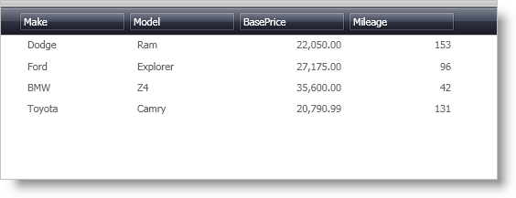

////

|metadata|
{
    "name": "xamdatapresenter-add-items-manually-to-a-datapresenter-control",
    "controlName": ["xamDataPresenter"],
    "tags": ["How Do I"],
    "guid": "{7BE754AE-F231-4325-93CC-BC5242F75772}",  
    "buildFlags": [],
    "createdOn": "2012-01-30T19:39:53.0849701Z"
}
|metadata|
////

= Add Items Manually to a DataPresenter Control

You can add items manually to the DataPresenter controls, i.e., xamDataPresenter™, xamDataGrid, xamDataCarousel, or xamDataCards, without binding the control to data. You can accomplish this by adding your data items directly to the DataPresenter control's link:{ApiPlatform}datapresenter.v{ProductVersion}~infragistics.windows.datapresenter.datapresenterbase~dataitems.html[DataItems] collection. The DataPresenter control will create a link:{ApiPlatform}datapresenter.v{ProductVersion}~infragistics.windows.datapresenter.datarecord.html[DataRecord] for each object you add to the DataItems collection.

.Note
[NOTE]
====
Just like any data bound control in Microsoft® Windows® Presentation Foundation, you must choose between binding a DataPresenter control to a data source and adding items directly to the DataItems collection; you cannot do both.
====

The following example code demonstrates how to add Records manually to a DataPresenter control. The example code in this topic uses the link:resources-car-business-logic.html[CarsBusinessLogic] class, which is available for you in C# and VB.NET to download and use in your project.

*In XAML:*

----
...
<!--
If you are using Visual Basic, replace the XML namespace mapping for the CarsBusinessLogic class with the root namespace of your project.
-->
<igDP:XamDataPresenter Name="xamDataPresenter1" xmlns:Cars="clr-namespace:IGDocumentation">
        <igDP:XamDataPresenter.DataItems>
                <Cars:Car Make="Dodge" Model="Ram" BasePrice="22050.00" Mileage="153" />
                <Cars:Car Make="Ford" Model="Explorer" BasePrice="27175.00" Mileage="96" />
                <Cars:Car Make="BMW" Model="Z4" BasePrice="35600.00" Mileage="42" />
                <Cars:Car Make="Toyota" Model="Camry" BasePrice="20790.99" Mileage="131" />
        </igDP:XamDataPresenter.DataItems>
</igDP:XamDataPresenter>
...
----

*In Visual Basic:*

----
...
'You can place this code in an event handler, such as the Window's Loaded event handler.
Me.xamDataPresenter1.DataItems.Add(New Car("Dodge", "Ram", 22050.00, 153))
Me.xamDataPresenter1.DataItems.Add(New Car("Ford", "Explorer", 27175.00, 96))
Me.xamDataPresenter1.DataItems.Add(New Car("BMW", "Z4", 35600.00, 42))
Me.xamDataPresenter1.DataItems.Add(New Car("Toyota", "Camry", 20790.99, 131))
...
----

*In C#:*

----
using IGDocumentation
...
//You can place this code in an event handler, such as the Window's Loaded event handler.
this.xamDataPresenter1.DataItems.Add(new Car("Dodge", "Ram", 22050.00, 153));
this.xamDataPresenter1.DataItems.Add(new Car("Ford", "Explorer", 27175.00, 96));
this.xamDataPresenter1.DataItems.Add(new Car("BMW", "Z4", 35600.00, 42));
this.xamDataPresenter1.DataItems.Add(new Car("Toyota", "Camry", 20790.99, 131));
...
----

== Related Topics

link:xamdatapresenter-about-data-items-and-data-records.html[About Data Items and Data Records]

link:xamdatapresenter-iterate-through-the-records-collection.html[Iterate through the Records Collection]