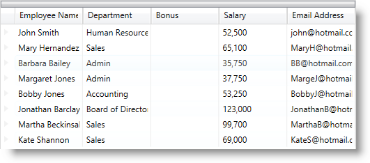
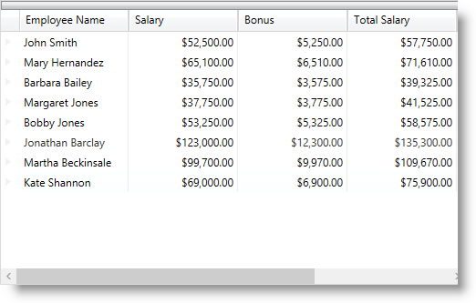
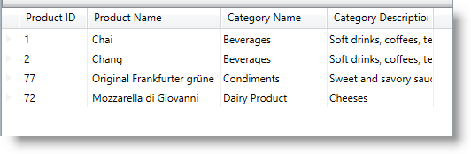

////

|metadata|
{
    "name": "xamdatapresenter-add-unbound-fields-to-a-datapresenter-control",
    "controlName": ["xamDataPresenter"],
    "tags": ["How Do I"],
    "guid": "{19E0C15D-34AF-436C-B315-0D64B2938E5D}",  
    "buildFlags": [],
    "createdOn": "2012-01-30T19:39:53.0879707Z"
}
|metadata|
////

= Configuring Unbound Field

== Topic Overview

=== Purpose

This topic describes how to create an unbound field in the  _xamDataPresenter_™ controls. The unbound fields are used for a variety of purposes such as displaying a calculated value or binding to a complex property.

=== Required background

The following topics are prerequisites to understanding this topic:

[options="header", cols="a,a"]
|====
|Topic|Purpose

| link:xamdatagrid-getting-started-with-xamdatagrid.html[Adding xamDataGrid to Your Page]
|This topic describes how to add a _xamDataGrid_ control to your page.

| link:xamdatagrid-accessing-data.html[Binding xamDataGrid to Data]
|This section lists the topics written specifically to help you access data using _xamDataGrid_ control.

|====

=== In this topic

This topic contains the following sections:

* <<_Ref391715233, Unbound Field Configuration Summary >>
* <<_Ref391653270, Configuring an UnboundField >>
* <<_Ref391653361, Configuring a Field to be Unbound >>
* <<_Ref406692653, Configuring a Field Binding Using AlternateBinding >>
* <<_Ref391715252, Related Content >>

** <<_Ref391715256,Topics>>
** <<_Ref391715260,Samples>>

[[_Ref391715233]]
== Unbound Field Configuration Summary

=== Unbound field configuration summary chart

The following table explains briefly the configurable aspects of the unbound fields and maps them to the properties that configure them. Further details are available after the table.

[options="header", cols="a,a,a"]
|====
|Configurable aspect|Details|Classes and Properties

|<<_Ref391653270,Configuring an UnboundField>>
|Use an `UnboundField` to represent calculated data or a complex property.
|`UnboundField`

|<<_Ref391653361,Configuring a Field to be Unbound>>
|Use a `Field` object `BindingType` property and set it to `Unbound` or `AlternateBinding` property to create an unbound field.
|
* link:{ApiPlatform}datapresenter{ApiVersion}~infragistics.windows.datapresenter.field~bindingtype.html[BindingType] 

* link:{ApiPlatform}datapresenter{ApiVersion}~infragistics.windows.datapresenter.field~alternatebinding.html[AlternateBinding] 

|====

[[_Ref391653270]]
== Configuring an UnboundField

[[_Hlk368069110]]

=== Overview

Use an `UnboundField` to represent calculated data or a complex property in the  _xamDataPresenter_   controls.

For more information about the base link:{ApiPlatform}datapresenter{ApiVersion}~infragistics.windows.datapresenter.field_members.html[Field] properties, read the link:xamdata-terms-fields.html[Fields] topic.

.Note
[NOTE]
====
The `UnboundField` is deprecated and marked as obsolete in 2014 Volume 2 Release. From the 2014 Volume 2 Release, any `Field` can be used as an unbound field if the `Field` `BindingType` is set to `Unbound` or `AlternateBinding` property is used.
====

.Note
[NOTE]
====
For more information, read the <<_Ref391653361,Configuring Field to be Unbound Field>> section.
====

[[_Hlk337817761]]

=== Example

The screenshot below demonstrates the `Bonus` `UnboundField` added in the  _xamDataPresenter_   control.

Following is the code that implements this example.

*In XAML:*

[source,xaml]
----
<igDP:XamDataPresenter Name="DataPresenter" 
                       BindToSampleData="True"
                       AutoFit="True">
    <igDP:XamDataPresenter.FieldLayouts>
        <igDP:FieldLayout>
            <igDP:FieldLayout.Fields>
                <igDP:Field Name="name" Label="Employee Name"/>
                <igDP:Field Name="department" Label="Department" />
                <!--Add unbound fields where you want them to appear in relation to the other fields-->
                <igDP:UnboundField Name="bonus" Label="Bonus" />
                <igDP:Field Name="salary" Label="Salary" />
                <igDP:Field Name="email" Label="Email Address" />
            </igDP:FieldLayout.Fields>
        </igDP:FieldLayout>
    </igDP:XamDataPresenter.FieldLayouts>
</igDP:XamDataPresenter>
----

*In Visual Basic:*

[source,vb]
----
'You can place the following four lines of code in any event handler where you need to add an unbound field to the Fields collection.
Dim bonusField as New UnboundField()
bonusField.Name = "bonus"
bonusField.Label = "Bonus"
'You can replace the hard-coded index if you have more than one FieldLayout in the FieldLayouts collection
Me.DataPresenter.FieldLayouts(0).Fields.Add(bonusField)
----

*In C#:*

[source,csharp]
----
//You can place the following four lines of code in any event handler where you need to add an unbound field to the Fields collection.
var bonusField = new UnboundField();
bonusField.Name = "bonus";
bonusField.Label = "Bonus";
//You can replace the hard-coded index if you have more than one FieldLayout in the FieldLayouts collection
this.DataPresenter.FieldLayouts[0].Fields.Add(bonusField);
----

[[_Ref391653361]]
== Configuring a Field to be Unbound

=== Overview

Use the link:{ApiPlatform}datapresenter{ApiVersion}~infragistics.windows.datapresenter.field_members.html[Field] `BindingType` property and set it to `Unbound` to display a calculated value in the  _xamDataPresenter_   controls.

=== Property settings

The following table maps the desired configuration to the property settings that manage it.

[options="header", cols="a,a,a"]
|====
|In order to:|Use this property:|And set it to:

|Get/set a binding that will be used to bind each link:{ApiPlatform}datapresenter{ApiVersion}~infragistics.windows.datapresenter.cell_members.html[Cell] link:{ApiPlatform}datapresenter{ApiVersion}~infragistics.windows.datapresenter.cell~value.html[Value] property
| link:{ApiPlatform}datapresenter{ApiVersion}~infragistics.windows.datapresenter.field~alternatebinding.html[AlternateBinding]
|`BindingBase` 

.Note 

[NOTE] 

==== 

`AlternateBinding` leads to additional memory and performance overhead than the default name binding. 

====

|Specify if the `Field` should auto-release binding objects in case `AlternateBinding` is used
| link:{ApiPlatform}datapresenter{ApiVersion}~infragistics.windows.datapresenter.field~alternatebindingretentionmode.html[AlternateBindingRetentionMode]
| link:{ApiPlatform}datapresenter{ApiVersion}~infragistics.windows.datapresenter.bindingretentionmode.html[AutoRelease] 

This is the default value. 

A `Field` with an `AlternateBinding` creates a binding object for every cell whose value is accessed and then discards it after the cell is scrolled out of view and its value isn’t required for summary calculations. This minimizes memory usage.

|Specify the `Field` should retain binding objects after they are created in case `AlternateBinding` is used
| link:{ApiPlatform}datapresenter{ApiVersion}~infragistics.windows.datapresenter.field~alternatebindingretentionmode.html[AlternateBindingRetentionMode]
| link:{ApiPlatform}datapresenter{ApiVersion}~infragistics.windows.datapresenter.bindingretentionmode.html[Retain] 

Set this property to `Retain` when sort, group-by or any other operations that require accessing values of all the unbound cells is performed in order to prevent performance impact.

|Determine how cell values are obtained
| link:{ApiPlatform}datapresenter{ApiVersion}~infragistics.windows.datapresenter.field~bindingtype.html[BindingType]
| link:{ApiPlatform}datapresenter{ApiVersion}~infragistics.windows.datapresenter.bindingtype.html[UseNameBinding] 

This is the default value. 

The binding mechanism looks for a data item property name that matches the `Field` `Name` property exactly. This approach provides better performance than using alternate bindings.

|Determine how cell values are obtained
| link:{ApiPlatform}datapresenter{ApiVersion}~infragistics.windows.datapresenter.field~bindingtype.html[BindingType]
| link:{ApiPlatform}datapresenter{ApiVersion}~infragistics.windows.datapresenter.bindingtype.html[UseAlternateBinding] 

This binding type is set when an `AlternateBinding` is used.

|Set a `Field` to be unbound
| link:{ApiPlatform}datapresenter{ApiVersion}~infragistics.windows.datapresenter.field~bindingtype.html[BindingType]
| link:{ApiPlatform}datapresenter{ApiVersion}~infragistics.windows.datapresenter.bindingtype.html[Unbound] 

This binding type is set when the cell value is set through a mechanism other than binding, e.g. through code or as the target of a formula.

|====

=== Example

The screenshot below demonstrates how `Bonus` and `Total Salary` `CurrencyField` are set to be unbound in the  _xamDataGrid_   control.

Following is the code that implements this example.

*In XAML:*

[source,xaml]
----
<igDP:XamDataGrid x:Name="DataGrid" BindToSampleData="True"
                  InitializeRecord="DataGrid_OnInitializeRecord">
    <igDP:XamDataGrid.FieldLayouts>
        <igDP:FieldLayout>
            <igDP:FieldLayout.Fields>
                <igDP:Field Name="name" Label="Employee Name"/>                      
                <igDP:CurrencyField Name="salary" Label="Salary" />
                <!-- Unbound Currency Fields displaying calculated values -->
                <igDP:CurrencyField Name="bonus" Label="Bonus" BindingType="Unbound" />
                <igDP:CurrencyField Name="totalSalary" Label="Total Salary" BindingType="Unbound" />
            </igDP:FieldLayout.Fields>
        </igDP:FieldLayout>
    </igDP:XamDataGrid.FieldLayouts>
</igDP:XamDataGrid>
----

*In C#:*

[source,csharp]
----
private void DataGrid_OnInitializeRecord(object sender, 
            Infragistics.Windows.DataPresenter.Events.InitializeRecordEventArgs e)
{
    if (e.Record is DataRecord)
    {
        //get the current records data, perform the appropriate
        //calculations and assign the values to the unbound currency fields
        var dr = (DataRecord)e.Record;
        double salary = double.Parse(dr.Cells["salary"].Value.ToString());
        double bonus = (salary * 10)/100;
        double totalSalary = salary + bonus;
        dr.Cells["bonus"].Value = bonus;
        dr.Cells["totalSalary"].Value = totalSalary;
    }
}
----

*In Visual Basic:*

[source,vb]
----
Private Sub DataGrid_OnInitializeRecord(sender As Object, e As Infragistics.Windows.DataPresenter.Events.InitializeRecordEventArgs)
    If TypeOf e.Record Is DataRecord Then
      'get the current records data, perform the appropriate
      'calculations and assign the values to the unbound currency fields
      Dim dr = DirectCast(e.Record, DataRecord)
      Dim salary As Double = Double.Parse(dr.Cells("salary").Value.ToString())
      Dim bonus As Double = (salary * 10) / 100
      Dim totalSalary As Double = salary + bonus
      dr.Cells("bonus").Value = bonus
      dr.Cells("totalSalary").Value = totalSalary
      End If
End Sub
----

[[_Ref406692653]]
== Configuring a Field Binding Using AlternateBinding

=== Overview

The following properties replace the deprecated `UnboundField` binding properties:

* The link:{ApiPlatform}datapresenter{ApiVersion}~infragistics.windows.datapresenter.field~alternatebinding.html[AlternateBinding] property along with the link:{ApiPlatform}datapresenter{ApiVersion}~infragistics.windows.datapresenter.field~bindingtype.html[BindingType] property set to link:{ApiPlatform}datapresenter{ApiVersion}~infragistics.windows.datapresenter.bindingtype.html[UseAlternateBinding] replace the `Binding`/`BindingPath` properties.
* The link:{ApiPlatform}datapresenter{ApiVersion}~infragistics.windows.datapresenter.field~alternatebindingretentionmode.html[AlternateBindingRetentionMode] property replaces `BindingRetentionMode` property.

=== Example

The screenshot below demonstrates the `AlternateBinding` property example with the  _xamDataGrid_   control:

Following is the code that implements the example that demonstrates the usage of the `AlternateBinding` property to create and bind fields to data.

The Models and ViewModel code is available here: link:resources-productdata.html[ProductData.cs]

The link:{ApiPlatform}datapresenter{ApiVersion}~infragistics.windows.datapresenter.field_members.html[Field] `AlternateBinding` property can be set in XAML or in code-behind. *Setting the AlternateBinding in XAML:* 

*In XAML:*

[source,xaml]
----
<Grid>
    <Grid.DataContext>
        <data:ProductData />
    </Grid.DataContext>
    <igDP:XamDataGrid x:Name="DataGrid" 
                      DataSource="{Binding Path=Products}"
                      FieldLayoutInitialized="DataGrid_OnFieldLayoutInitialized">
        <igDP:XamDataGrid.FieldLayoutSettings>
            <igDP:FieldLayoutSettings AutoGenerateFields="/>
        </igDP:XamDataGrid.FieldLayoutSettings>
        <igDP:XamDataGrid.FieldLayouts>
            <igDP:FieldLayout>
                <igDP:FieldLayout.Fields>
                    <igDP:TextField Name="ProductID" Label="Product ID"/>
                    <igDP:TextField Name="ProductName" Label="Product Name" />
                    <igDP:Field Label="Category Name" 
                          AlternateBinding="{Binding Path=Category.CategoryName}"/>
                </igDP:FieldLayout.Fields>
            </igDP:FieldLayout>
        </igDP:XamDataGrid.FieldLayouts>
    </igDP:XamDataGrid>
</Grid>
----

*Setting the AlternateBinding in code-behind:*

Adding of the newly created field is done in the link:{ApiPlatform}datapresenter{ApiVersion}~infragistics.windows.datapresenter.datapresenterbase~fieldlayoutinitialized_ev.html[FieldLayoutInitialized] event handler.

*In C#:*

[source,csharp]
----
private void DataGrid_OnFieldLayoutInitialized(object sender, FieldLayoutInitializedEventArgs e)
{
    var fieldDesc = new Field
    {
        Label = "Category Description",
        AlternateBinding = new Binding("Category.Description"),
     };
     e.FieldLayout.Fields.Add(fieldDesc);
}
----

*In Visual Basic:*

[source,vb]
----
Private Sub DataGrid_OnFieldLayoutInitialized(sender As Object, e As FieldLayoutInitializedEventArgs)
    Dim fieldDesc = New Field() With { 
            .Label = "Category Description", 
            .AlternateBinding = New Binding("Category.Description") 
    }
    e.FieldLayout.Fields.Add(fieldDesc)
End Sub
----

[[_Ref391715252]]
== Related Content

[[_Ref391715256]]

=== Topics

The following topics provide additional information related to this topic.

[options="header", cols="a,a"]
|====
|Topic|Purpose

| link:xamdatapresenter-define-a-field-layout.html[Define a Field Layout]
|This topic describes how to define field layouts to specify which fields to display and to set properties related to those fields in the _xamDataPresenter_ controls.

| link:xamdatagrid-configuring-specific-editor-fields.html[Configuring Specific Editor Fields]
|This topic describes an easy and straightforward way of configuring specific editor fields for different data types in the _xamDataPresenter_ controls.

| link:xamdatapresenter-configuring-template-field.html[Configuring Template Field]
|This topic describes how to create a field with a custom display and edit template using a TemplateField in the _xamDataPresenter_ controls.

| link:xamdata-generating-fields-manually-versus-automatically.html[Generating Fields Manually Versus Automatically]
|This topic describes the difference between automatic and manual Fields generation in the _xamDataPresenter_ controls.

| link:xamdatapresenter-manually-assigning-a-field-layout-to-xamdatapresenter.html[Manually Assigning a Field Layout to xamDataPresenter]
|This topic describes how you can create multiple FieldLayouts for the _xamDataPresenter_ controls.

| link:xam-data-grid-displaying-an-image-in-a-field.html[Displaying an Image in a Field]
|This topic describes how to add a Field to display an image overriding the CellValuePresenter's template in the _xamDataPresenter_ controls.

| link:xamdatapresenter-load-field-customizations.html[Load Field Customizations]
|This topic describes how to load field customizations for the _xamDataPresenter_ controls.

| link:xamdatapresenter-save-field-customizations.html[Save Field Customizations]
|This topic describes how to save field customizations for the _xamDataPresenter_ controls.

| link:xamdatagrid-changing-the-default-column-and-row-definitions.html[Changing the Default Column and Row Definitions]
|This topic describes how to change the layout customizing the Row, Column, ColumnSpan, or RowSpan on each Field to further control the layout of the Record.

| link:xamdatagrid-changing-the-record-orientation.html[Changing the Record Orientation]
|This topic describes how to change the Record orientation.

| link:xamdata-enabling-right-to-left-support.html[Enabling Right to Left Support]
|This topic describes how to change the content flow direction.

| link:xamdatagrid-fields-editors-configuration-.html[Field’s Editors Configuration]
|This topic explains how to configure the controls on the data presenter field editor.

|====

[[_Ref391715260]]

=== Samples

The following samples provide additional information related to this topic.

[options="header", cols="a,a"]
|====
|Sample|Purpose

| link:{SamplesURL}/data-grid/unbound-binding-type[Unbound Binding Type]
|This sample demonstrates how to transform any _xamDataGrid_ field to an unbound field to display calculated values by setting the Field BindingType property to Unbound.

| link:{SamplesURL}/data-grid/unbound-fields[Unbound Fields]
|This sample demonstrates how to use Unbound Fields to display calculated values. Note that the Unbound Field is deprecated from 2014 Volume 2 Release.

| link:{SamplesURL}/data-grid/checkbox-in-unbound-field[CheckBox in Unbound Field]
|This sample demonstrates how to add CheckBox controls to the cells in an Unbound Field. Note that the Unbound Field is deprecated from 2014 Volume 2 Release.

| link:{SamplesURL}/data-grid/icons-in-unbound-field[Icons in Unbound Field]
|This sample demonstrates how to use the FieldSettings object CellValuePresenterStyle property of to apply a custom Control Template to the cells in an Unbound Field. Note that the Unbound Field is deprecated from 2014 Volume 2 Release.

|====