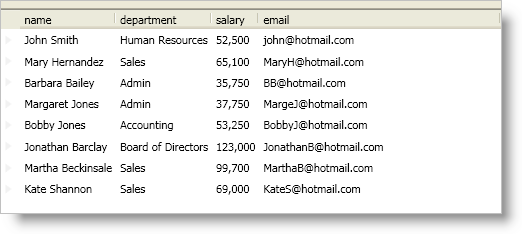

////

|metadata|
{
    "name": "xamdatapresenter-automatically-fit-fields",
    "controlName": ["xamDataPresenter"],
    "tags": ["Data Presentation","Layouts"],
    "guid": "{A78F071A-94ED-4601-B205-EE0693C3A8F3}",  
    "buildFlags": [],
    "createdOn": "2012-01-30T19:39:53.0969725Z"
}
|metadata|
////

= Automatically Fit Fields

A DataPresenter control can automatically resize its fields so they all fit within the control's boundary. The DataPresenter controls offer several "auto-fit" modes that you can use by setting a link:{ApiPlatform}datapresenter.v{ProductVersion}~infragistics.windows.datapresenter.fieldlayoutsettings.html[FieldLayoutSettings] object’s link:{ApiPlatform}datapresenter.v{ProductVersion}~infragistics.windows.datapresenter.fieldlayoutsettings~autofitmode.html[AutoFitMode] property to one of the following link:{ApiPlatform}datapresenter.v{ProductVersion}~infragistics.windows.datapresenter.autofitmode.html[AutoFitMode] enum values:

* Always - The DataPresenter control will adjust the size of all fields to fit within its boundaries while retaining the proportions of fields using star sizing.
* Default - The DataPresenter control determines the default setting based on its AutoFit property value. The following list shows the DataPresenter control's AutoFit property value along with the FieldLayoutSettings object's AutoFitMode property value:

** AutoFit property set to NULL using a grid view - OnlyWithVisibleStarFields
** AutoFit property set to NULL using a carousel view - Always
** AutoFit property set to False - Never
** AutoFit property set to True - Always

* ExtendLastField - The DataPresenter control extends the last field to fill any remaining space. This setting is applicable only when the total width of fields is less than the total width of the DataPresenter control.
* Never - The DataPresenter control will not adjust the size of the fields.
* OnlyWithVisibleStarFields - The DataPresenter control will adjust the size of the fields only if a field with star sizing (percentage sizing) is visible. When you or your end users hide all fields that use star sizing in a field layout, the DataPresenter control will not auto-fit the remaining fields.

The following example code demonstrates how to automatically fit fields.

*In XAML:*

----
<igDP:XamDataPresenter Name="xamDataPresenter1" BindToSampleData="True">
    <igDP:XamDataPresenter.FieldLayoutSettings>
        <igDP:FieldLayoutSettings AutoFitMode="ExtendLastField" />
    </igDP:XamDataPresenter.FieldLayoutSettings>
</igDP:XamDataPresenter>
----

*In Visual Basic:*

----
Imports Infragistics.Windows.DataPresenter
...
Me.xamDataPresenter1.FieldLayoutSettings.AutoFitMode = AutoFitMode.ExtendLastField
...
----

*In C#:*

----
using Infragistics.Windows.DataPresenter;
...
this.xamDataPresenter1.FieldLayoutSettings.AutoFitMode = AutoFitMode.ExtendLastField;
...
----

== Related Topics

link:xamdatapresenter-set-a-fields-width.html[Set a Field's Width]

link:xamdatapresenter-modify-field-sizing-behaviors.html[Modify Field-Sizing Behaviors]

link:xamdatapresenter-perform-an-auto-sizing-operation.html[Perform an Auto-Sizing Operation]