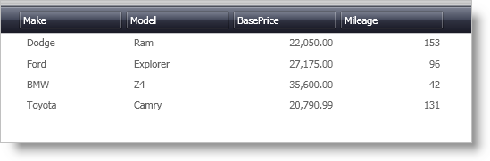

////

|metadata|
{
    "name": "xamdatapresenter-bind-a-datapresenter-control-to-a-collection",
    "controlName": ["xamDataPresenter"],
    "tags": ["Data Binding","How Do I"],
    "guid": "{E92D1E72-4597-4EE0-B315-1CBF483D5916}",  
    "buildFlags": [],
    "createdOn": "2012-01-30T19:39:53.0989729Z"
}
|metadata|
////

= Bind a DataPresenter Control to a Collection

You can data bind the DataPresenter controls to several different data sources, including a collection that implements the IEnumerable interface. You can use an ObjectDataProvider to expose your collection to the presentation layer of your application. If you have not created an ObjectDataProvider yet, please read and follow the steps in link:creating-an-objectdataprovider.html[Creating an ObjectDataProvider] before proceeding with the example code.

The following example code demonstrates how to bind a DataPresenter control to a collection.

*In XAML:*

----
<igDP:XamDataPresenter 
    Name="xamDataPresenter1" 
    DataSource="{Binding Source={StaticResource CarData}}">
</igDP:XamDataPresenter>
----

== Related Topics

link:xamdatapresenter-bind-a-datapresenter-control-to-an-xmldataprovider.html[Bind a DataPresenter Control to an XmlDataProvider]

link:xamdatapresenter-binding-a-datapresenter-control-to-a-dataset.html[Binding a DataPresenter Control to a DataSet]

link:xamdata-displaying-hierarchical-data.html[Displaying Hierarchical Data]