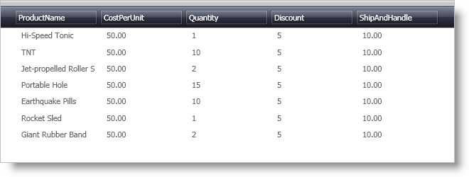

////

|metadata|
{
    "name": "xamdatapresenter-bind-a-datapresenter-control-to-an-xmldataprovider",
    "controlName": ["xamDataPresenter"],
    "tags": ["Data Binding","How Do I"],
    "guid": "{44AABBD1-E40E-44A1-ABD3-B2905DCA32BF}",  
    "buildFlags": [],
    "createdOn": "2012-01-30T19:39:53.1019735Z"
}
|metadata|
////

= Bind a DataPresenter Control to an XmlDataProvider

You can bind the DataPresenter controls to several different data sources, including an XML file. You can use an XmlDataProvider to expose your XML file to the presentation layer of your application. If you have not created an XmlDataProvider yet, you will have to read and follow the steps in link:creating-an-xmldataprovider.html[Creating an XmlDataProvider] before proceeding with the example code in this topic.

The following example code demonstrates how to bind a DataPresenter control to an XmlDataProvider.

*In XAML:*

----
<igDP:XamDataPresenter 
    Name="xamDataPresenter1" 
    DataSource="{Binding Source={StaticResource OrderData}, XPath=/Orders/Order}"></igDP:XamDataPresenter>
----

== Related Topics

link:xamdatapresenter-bind-a-datapresenter-control-to-a-collection.html[Bind a DataPresenter Control to a Collection]

link:xamdatapresenter-binding-a-datapresenter-control-to-a-dataset.html[Binding a DataPresenter Control to a DataSet]

link:xamdata-displaying-hierarchical-data.html[Displaying Hierarchical Data]