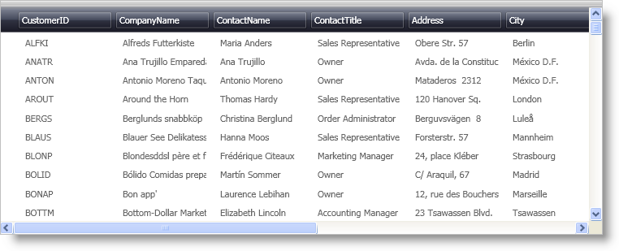

////
|metadata|
{
    "name": "xamdatapresenter-binding-a-datapresenter-control-to-a-dataset",
    "controlName": ["xamDataPresenter"],
    "tags": ["Data Binding","How Do I"],
    "guid": "{0462D8C3-977B-44E3-A05E-B513C9C70F63}",
    "buildFlags": [],
    "createdOn": "2012-01-30T19:39:53.1039739Z"
}
|metadata|
////

= Binding a DataPresenter Control to a DataSet

== Before You Begin

You can bind the DataPresenter controls to several different data sources, including a DataSet. If you want to bind a DataPresenter control to a DataSet using XAML, you can create an ObjectDataProvider that returns a DataSet instead of a collection of business objects. The XAML declaration required to implement this logic would be very similar to the XAML declaration for link:xamdatapresenter-bind-a-datapresenter-control-to-a-collection.html[binding xamDataPresenter to a collection]. However, the steps below will use procedural code to bind xamDataPresenter to a DataSet.

A simple data access class named link:resources-sampledatautil.html[SampleDataUtil] is available for you in C# and VB.NET to download and use while working through this topic. The SampleDataUtil class assumes that you have the Northwind database installed on Microsoft® SQL Server. The code in the SampleDataUtil class will not be covered as it is beyond the scope of this topic.

== What You Will Accomplish

You will create a xamDataPresenter control using XAML. You will then write procedural code to bind xamDataPresenter to a DataSet.

== Follow these Steps

[start=1]
. Add a xamDataPresenter control to your Window and name it.
+
*In XAML:*
+
[source,xaml]
----
...
<igDP:XamDataPresenter Name="xamDataPresenter1">
</igDP:XamDataPresenter>
...
----

[start=2]
. Attach an event handler to the Loaded event of your Window.
+
*In XAML:*
+
[source,xaml]
----
<Window ... Loaded="Window_Loaded" ... >
----

[start=3]
. In the code-behind, find the event handler for the Window's Loaded event.
+
*In Visual Basic:*
+
[source,vb]
----
Private Sub Window_Loaded(ByVal sender As Object, ByVal e As RoutedEventArgs)
    'TODO: Retrieve data and Set the data source of your controls here
End Sub
----
+
*In C#:*
+
[source,csharp]
----
private void Window_Loaded(object sender, RoutedEventArgs e)
{
    //TODO: Retrieve data and Set the data source of your controls here
}
----

[start=4]
. Retrieve data from the Customers Table in the Northwind database.
+
You can use the GetCustomers(string serverAddress) method from the SampleDataUtil class . Make sure you pass in the server address where the Northwind database resides.
+
*In Visual Basic:*
+
[source,vb]
----
Dim customerDS As System.Data.DataSet = SampleDataUtil.GetCustomers(".\SQLExpress")
----
+
*In C#:*
+
[source,csharp]
----
System.Data.DataSet customerDS = IGDocumentation.SampleDataUtil.GetCustomers(".\\SQLExpress");
----

[start=5]
. Set the DataSource property of the xamDataPresenter control to the DefaultView property of the Customers DataTable in the DataSet.
+
*In Visual Basic:*
+
[source,vb]
----
If customerDS.Tables("Customers") IsNot Nothing Then 
    Me.xamDataPresenter1.DataSource = customerDS.Tables("Customers").DefaultView 
End If
----
+
*In C#:*
+
[source,csharp]
----
if (customerDS.Tables["Customers"] != null)
    this.xamDataPresenter1.DataSource = customerDS.Tables["Customers"].DefaultView;
----

[start=6]
. Run the project to display customer information from the Northwind database.
+

== Related Topics

link:xamdatapresenter-bind-a-datapresenter-control-to-an-xmldataprovider.html[Bind a DataPresenter Control to an XmlDataProvider]

link:xamdatapresenter-bind-a-datapresenter-control-to-a-collection.html[Bind a DataPresenter Control to a Collection]

link:xamdata-displaying-hierarchical-data.html[Displaying Hierarchical Data]