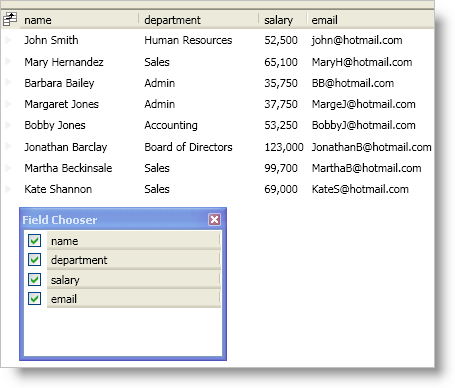

////

|metadata|
{
    "name": "xamdatapresenter-change-the-display-order-of-fields-in-the-field-chooser",
    "controlName": ["xamDataPresenter"],
    "tags": ["Editing","Layouts","Tips and Tricks"],
    "guid": "{A17372FC-ADA0-4052-9BBF-D47CD815AE07}",  
    "buildFlags": [],
    "createdOn": "2012-01-30T19:39:53.1059743Z"
}
|metadata|
////

= Change the Display Order of Fields in the Field Chooser

The link:{ApiPlatform}datapresenter.v{ProductVersion}~infragistics.windows.datapresenter.fieldchooser.html[FieldChooser] control organizes field headers alphabetically; however, you can change the order of the field headers by setting the FieldChooser control's link:{ApiPlatform}datapresenter.v{ProductVersion}~infragistics.windows.datapresenter.fieldchooser~fielddisplayorder.html[FieldDisplayOrder] property or by setting its link:{ApiPlatform}datapresenter.v{ProductVersion}~infragistics.windows.datapresenter.fieldchooser~fielddisplayordercomparer.html[FieldDisplayOrderComparer] property. The FieldDisplayOrder property allows you to organize the field headers using two common settings, alphabetical or based on the field order in the DataPresenter control. On the other hand, the FieldDisplayOrderComparer property gives you full control over the organization of field headers within the FieldChooser control. In order to supply your own sorting logic for the field headers in the FieldChooser control, you must create a class that implements the IComparer interface found in the .NET Framework.

For more information on modifying settings exposed by the FieldChooser control, read the topic on link:xamdatapresenter-about-field-chooser-settings.html[working with field chooser settings].

The following example code demonstrates how to change the display order of fields in the FieldChooser control.

*In XAML:*

----
<igDP:XamDataPresenter 
    Name="xamDataPresenter1" 
    BindToSampleData="True" 
    FieldChooserOpening="OnFieldChooserOpening">
    <igDP:XamDataPresenter.FieldLayoutSettings>
        <igDP:FieldLayoutSettings HeaderPrefixAreaDisplayMode="FieldChooserButton" />
    </igDP:XamDataPresenter.FieldLayoutSettings>
</igDP:XamDataPresenter>
----

*In Visual Basic:*

----
Imports Infragistics.Windows.DataPresenter
Imports Infragistics.Windows.DataPresenter.Events
...
Private Sub OnFieldChooserOpening(ByVal sender As Object, ByVal e As FieldChooserOpeningEventArgs) 
    e.FieldChooser.FieldDisplayOrder = FieldChooserDisplayOrder.SameAsDataPresenter 
End Sub
----

*In C#:*

----
using Infragistics.Windows.DataPresenter;
using Infragistics.Windows.DataPresenter.Events;
...
private void OnFieldChooserOpening(object sender, FieldChooserOpeningEventArgs e)
{
    e.FieldChooser.FieldDisplayOrder = FieldChooserDisplayOrder.SameAsDataPresenter;
}
----

== Related Topics

link:xamdatapresenter-about-the-field-chooser.html[About the Field Chooser]

link:xamdatapresenter-display-the-field-chooser.html[Display the Field Chooser]

link:xamdatapresenter-about-field-chooser-settings.html[About Field Chooser Settings]

link:xamdatapresenter-prevent-fields-from-being-hidden.html[Prevent Fields from Being Hidden]

link:xamdatapresenter-create-an-external-field-chooser.html[Create an External Field Chooser]