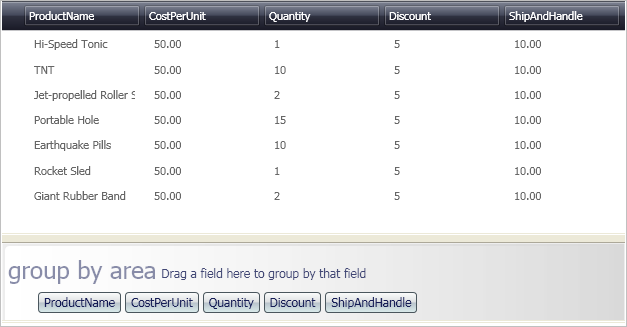

////

|metadata|
{
    "name": "xamdatapresenter-change-the-location-of-the-groupbyarea",
    "controlName": ["xamDataPresenter"],
    "tags": ["Grouping","How Do I","Layouts"],
    "guid": "{C8099EAD-2D12-456F-BC3E-8EF364113A42}",  
    "buildFlags": [],
    "createdOn": "2012-01-30T19:39:53.1079747Z"
}
|metadata|
////

= Change the Location of the GroupByArea

The xamDataPresenter™ control displays the link:{ApiPlatform}datapresenter{ApiVersion}~infragistics.windows.datapresenter.groupbyarea.html[GroupByArea] above the data by default. You can change the location of the GroupByArea by setting the link:{ApiPlatform}datapresenter{ApiVersion}~infragistics.windows.datapresenter.datapresenterbase~groupbyarealocation.html[GroupByAreaLocation] property.

The following procedure assumes you have a data bound xamDataPresenter, and you want to relocate the GroupByArea. For more information, see link:xamdatapresenter-getting-started-with-xamdatapresenter.html[Adding xamDataPresenter to Your Application].

[start=1]
. The following XAML creates an instance of XamDataPresenter and names it. The XAML then sets the GroupByAreaLocation property to BelowDataArea.

*In XAML:*

----
<igDP:XamDataPresenter x:Name="XamDataPresenter1" 
  ...
  GroupByAreaLocation="BelowDataArea"/>
----

[start=2]
. Build and run the project. You'll notice the group-by area bar at the bottom, and if you expand it you will see something similar to the image below.

== Related Topics

link:xamdatapresenter-about-sorting.html[About Sorting]

link:xamdatapresenter-about-grouping.html[About Grouping]

link:xamdatapresenter-sorting-and-grouping-fields-programmatically.html[Sorting and Grouping Fields Programmatically]

link:xamdatapresenter-modify-the-group-by-area.html[Modify the Group-By Area]

link:xamdatapresenter-create-an-external-group-by-area.html[Create an External Group-By Area]

link:xamdatapresenter-disable-groupby.html[Disable GroupBy]