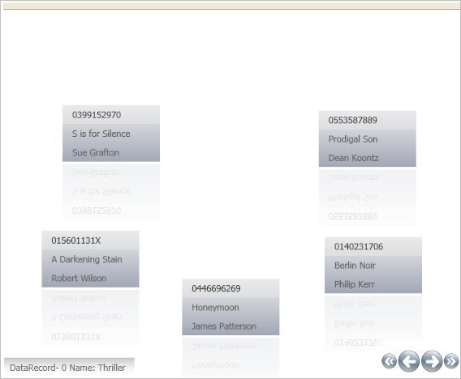

////
|metadata|
{
    "name": "xamdatapresenter-changing-the-location-of-the-carouselbreadcrumb",
    "controlName": ["xamDataPresenter"],
    "tags": ["Data Presentation","How Do I","Layouts"],
    "guid": "{EE3967CC-EC0B-42BB-A198-5FF0C9B56277}",
    "buildFlags": [],
    "createdOn": "2012-01-30T19:39:53.1129757Z"
}
|metadata|
////

= Changing the Location of the CarouselBreadcrumb

When xamDataPresenter's™ Carousel View displays hierarchical data, you will see a breadcrumb item in the upper-left corner when you begin drilling down into your data. You can change the breadcrumb's location by modifying the link:{ApiPlatform}datapresenter.v{ProductVersion}~infragistics.windows.datapresenter.carouselbreadcrumbcontrol.html[CarouselBreadcrumbControl]'s style.

Follow these steps to move the Carousel View's CarouselBreadcrumbControl from the upper-left corner to the lower-left corner.

[start=1]
. Create a Microsoft® Windows® Presentation Foundation Window or Page project.

[start=2]
. For easier access to xamDataPresenter, place the following namespace declaration inside the opening Page or Window tag. Add a second namespace declaration so you can reference the LibraryBusinessLogic class that you will add to your project in the next step.
+
*In XAML:*
+
[source,xaml]
----
xmlns:igDP="http://infragistics.com/DataPresenter"
xmlns:local="clr-namespace:WPF_HelpSampleBrowser"
----

[start=3]
. Create a resource section defining an ObjectDataProvider. The ObjectDataProvider references the link:resources-library-business-logic.html[LibraryBusinessLogic] class. Place the following XAML inside the Grid Panel.
+
*In XAML:*
+
[source,xaml]
----
<Grid.Resources>
    <ObjectDataProvider x:Key="odpObjectDataProvider1" 
        Objecttype="{x:Type local:LibraryBusinessLogic}"  
        Methodname="GetLibrary">
    </ObjectDataProvider>
    ...
</Grid.Resources>
----

[start=4]
. Define a style for the CarouselBreadcrumbControl object inside the Grid Panel's resource section.
+
.Note
[NOTE]
====
This style does not set a Key, therefore all CarouselBreadcrumbControls on the page/window will be affected by this style.
====
+
The following XAML sets the VerticalAlignment property to Bottom.
+
*In XAML:*
+
[source,xaml]
----
...
       
...
----

[start=5]
. Create an instance of XamDataPresenter, name it, set the DataSource property to the ObjectDataProvider created in step 3, and set the View to CarouselView.
+
*In XAML:*
+
[source,xaml]
----
<igDP:XamDataPresenter x:Name="XamDataPresenter1" 
    DataSource="{Binding Source={StaticResource odpObjectDataProvider1}}">
    <igDP:XamDataPresenter.View>
        <igDP:CarouselView />
    </igDP:XamDataPresenter.View>
</igDP:XamDataPresenter>
----

[start=6]
. Build and run the project. Select a link:{ApiPlatform}datapresenter.v{ProductVersion}~infragistics.windows.datapresenter.record.html[Record]'s expansion indicator to expand that Record and show its child Records. At this point, you should see something similar to the following screen shot.
+
