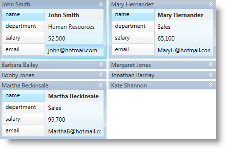

////

|metadata|
{
    "name": "xamdatapresenter-collapse-a-card",
    "controlName": ["xamDataPresenter"],
    "tags": ["Editing","How Do I","Tips and Tricks"],
    "guid": "{9933EA9D-E043-4EF7-8A47-182830E3D32C}",  
    "buildFlags": [],
    "createdOn": "2012-01-30T19:39:53.3670265Z"
}
|metadata|
////

= Collapse a Card

The xamDataCards™ control allows your end users to collapse (hide) a card so only its header is visible. You can collapse a card using one of the following techniques:

* You can set the link:{ApiPlatform}datapresenter{ApiVersion}~infragistics.windows.datapresenter.cardviewsettings.html[CardViewSettings] object's link:{ApiPlatform}datapresenter{ApiVersion}~infragistics.windows.datapresenter.cardviewsettings~shouldcollapsecards.html[ShouldCollapseCards] property to True to collapse all the cards.
* You can set a link:{ApiPlatform}datapresenter{ApiVersion}~infragistics.windows.datapresenter.record.html[Record] object's link:{ApiPlatform}datapresenter{ApiVersion}~infragistics.windows.datapresenter.record~iscontainingcardcollapsed.html[IsContainingCardCollapsed] property to True to collapse individual cards.
* You can execute the link:{ApiPlatform}datapresenter{ApiVersion}~infragistics.windows.datapresenter.datapresentercommands~togglecardcollapsedstate.html[ToggleCardCollapsedState] command exposed by the link:{ApiPlatform}datapresenter{ApiVersion}~infragistics.windows.datapresenter.datapresentercommands.html[DataPresenterCommands] class. The command requires a Record object as a parameter. This will toggle the collapsed state of a specific card.
* You can set the CardViewSettings object's link:{ApiPlatform}datapresenter{ApiVersion}~infragistics.windows.datapresenter.cardviewsettings~collapsecardbuttonvisibility.html[CollapseCardButtonVisibility] property to Visible to display a collapse button in the header of each card. Your end users can click the click the button to toggle the collapsed state of a specific card.

If you set the cards' orientation to horizontal (i.e., CardViewSettings.Orientation is set to Orientation.Horizontal), the xamDataCards control will not rearrange cards to occupy the empty space underneath a collapsed card until your end users collapse all the cards in the row. However, if you set the cards' orientation to vertical, the xamDataCards control will rearrange the cards to fill the space made available by the newly collapsed card, if the space is large enough to hold the next card.

The following example code demonstrates how to collapse a card. The Button control's CommandParameter property is bound to the xamDataCards control's link:{ApiPlatform}datapresenter{ApiVersion}~infragistics.windows.datapresenter.datapresenterbase~activerecord.html[ActiveRecord] property.

*In XAML:*

----
<Button 
    Content="Collapse or Expand the Active Card" 
    Command="{x:Static igDP:DataPresenterCommands.ToggleCardCollapsedState}" 
    CommandParameter="{Binding ElementName=xamDataCards1, Path=ActiveRecord}" 
    CommandTarget="{Binding ElementName=xamDataCards1}" />
<igDP:XamDataCards Name="xamDataCards1" BindToSampleData="True"> 
    <igDP:XamDataCards.ViewSettings>
        <igDP:CardViewSettings CollapseCardButtonVisibility="Visible" ShouldCollapseCards="True" />
    </igDP:XamDataCards.ViewSettings>
</igDP:XamDataCards>
----

*In Visual Basic:*

----
Me.xamDataCards1.ViewSettings.CollapseCardButtonVisibility = Visibility.Visible
Me.xamDataCards1.ViewSettings.ShouldCollapseCards = True
----

*In C#:*

----
this.xamDataCards1.ViewSettings.CollapseCardButtonVisibility = Visibility.Visible;
this.xamDataCards1.ViewSettings.ShouldCollapseCards = true;
----

== Related Topics

link:xamdatapresenter-about-card-settings.html[About Card Settings]

link:xamdatapresenter-about-card-sizing.html[About Card Sizing]

link:xamdatapresenter-about-repositioning-animations.html[About Repositioning Animations]

link:xamdatapresenter-collapse-an-empty-cell.html[Collapse an Empty Cell]

link:xamdatapresenter-set-the-maximum-number-of-viewable-cards.html[Set the Maximum Number of Viewable Cards]

link:xamdatapresenter-set-the-space-between-cards.html[Set the Space Between Cards]

link:xamdatapresenter-working-with-card-headers.html[Working with Card Headers]