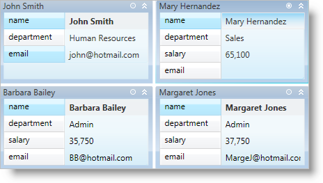

////

|metadata|
{
    "name": "xamdatapresenter-collapse-an-empty-cell",
    "controlName": ["xamDataPresenter"],
    "tags": ["Editing","How Do I","Tips and Tricks"],
    "guid": "{3DEA2677-AC6B-4D0D-8930-4FC6E04A8F5B}",  
    "buildFlags": [],
    "createdOn": "2012-01-30T19:39:53.3690269Z"
}
|metadata|
////

= Collapse an Empty Cell

The xamDataCards™ control allows your end users to collapse (hide) empty cells in a card. You can enable this feature using one of the following techniques:

* You can set the link:{ApiPlatform}datapresenter{ApiVersion}~infragistics.windows.datapresenter.cardviewsettings.html[CardViewSettings] object's link:{ApiPlatform}datapresenter{ApiVersion}~infragistics.windows.datapresenter.cardviewsettings~shouldcollapseemptycells.html[ShouldCollapseEmptyCells] property to True to collapse empty cells in all cards.
* You can set a link:{ApiPlatform}datapresenter{ApiVersion}~infragistics.windows.datapresenter.record.html[Record] object's link:{ApiPlatform}datapresenter{ApiVersion}~infragistics.windows.datapresenter.record~shouldcollapseemptycells.html[ShouldCollapseEmptyCells] property to True to hide empty cells in a specific card.
* You can execute the link:{ApiPlatform}datapresenter{ApiVersion}~infragistics.windows.datapresenter.datapresentercommands~toggleemptycardcellscollapsedstate.html[ToggleEmptyCardCellsCollapsedState] command exposed by the link:{ApiPlatform}datapresenter{ApiVersion}~infragistics.windows.datapresenter.datapresentercommands.html[DataPresenterCommands] class. The command requires a Record object as a parameter. This will toggle the visibility of empty cells in a specific card.
* You can set the CardViewSettings object's link:{ApiPlatform}datapresenter{ApiVersion}~infragistics.windows.datapresenter.cardviewsettings~collapseemptycellsbuttonvisibility.html[CollapseEmptyCellsButtonVisibility] property to Visible to display a button in the header of each card. Your end users can click the button to toggle the visibility of empty cells in a specific card.

You can also prevent your end users from collapsing cells in a field by setting the link:{ApiPlatform}datapresenter{ApiVersion}~infragistics.windows.datapresenter.fieldsettings.html[FieldSettings] object's link:{ApiPlatform}datapresenter{ApiVersion}~infragistics.windows.datapresenter.fieldsettings~collapsewhenempty.html[CollapseWhenEmpty] property to False.

The following example code demonstrates how to collapse a card. The Button control's CommandParameter property is bound to the xamDataCards control's link:{ApiPlatform}datapresenter{ApiVersion}~infragistics.windows.datapresenter.datapresenterbase~activerecord.html[ActiveRecord] property.

*In XAML:*

----
<Button 
    Content="Collapse or Expand Empty Cells in the Active Card" 
    Command="{x:Static igDP:DataPresenterCommands.ToggleEmptyCardCellsCollapsedState}" 
    CommandParameter="{Binding ElementName=xamDataCards1, Path=ActiveRecord}" 
    CommandTarget="{Binding ElementName=xamDataCards1}" />
<igDP:XamDataCards Name="xamDataCards1" BindToSampleData="True"> 
    <igDP:XamDataCards.ViewSettings>
        <igDP:CardViewSettings CollapseEmptyCellsButtonVisibility="Visible" ShouldCollapseEmptyCells="True" />
    </igDP:XamDataCards.ViewSettings>
</igDP:XamDataCards>
----

*In Visual Basic:*

----
Me.xamDataCards1.ViewSettings.CollapseEmptyCellsButtonVisibility = Visibility.Visible
Me.xamDataCards1.ViewSettings.ShouldCollapseEmptyCells = True
----

*In C#:*

----
this.xamDataCards1.ViewSettings.CollapseEmptyCellsButtonVisibility = Visibility.Visible;
this.xamDataCards1.ViewSettings.ShouldCollapseEmptyCells = true;
----

== Related Topics

link:xamdatapresenter-about-card-settings.html[About Card Settings]

link:xamdatapresenter-about-card-sizing.html[About Card Sizing]

link:xamdatapresenter-about-repositioning-animations.html[About Repositioning Animations]

link:xamdatapresenter-collapse-a-card.html[Collapse a Card]

link:xamdatapresenter-set-the-maximum-number-of-viewable-cards.html[Set the Maximum Number of Viewable Cards]

link:xamdatapresenter-set-the-space-between-cards.html[Set the Space Between Cards]

link:xamdatapresenter-working-with-card-headers.html[Working with Card Headers]