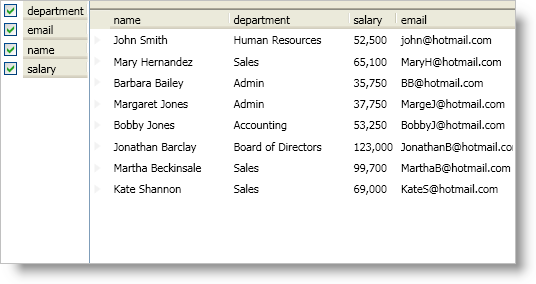

////

|metadata|
{
    "name": "xamdatapresenter-create-an-external-field-chooser",
    "controlName": ["xamDataPresenter"],
    "tags": ["Extending","Layouts","Tips and Tricks"],
    "guid": "{71CC5633-94BF-4F69-A018-5C630842E46C}",  
    "buildFlags": [],
    "createdOn": "2012-01-30T19:39:53.1179767Z"
}
|metadata|
////

= Create an External Field Chooser

You can add an instance of a link:{ApiPlatform}datapresenter{ApiVersion}~infragistics.windows.datapresenter.fieldchooser.html[FieldChooser] control to your window to create a field chooser area that is always visible to your end users. Simply add a FieldChooser control to your window like any other control and set its DataPresenter property to an instance of a DataPresenter control.

The following example code demonstrates how to create an external field chooser.

*In XAML:*

----
<Grid Name="layoutRoot">
    <Grid.ColumnDefinitions>
        <ColumnDefinition Width="Auto" />
        <ColumnDefinition />
    </Grid.ColumnDefinitions>
    <igDP:FieldChooser 
        Name="fieldChooser1" 
        DataPresenter="{Binding ElementName=xamDataPresenter1}" />
    <igDP:XamDataPresenter 
        Name="xamDataPresenter1" 
        Grid.Column="1" 
        BindToSampleData="True">
    </igDP:XamDataPresenter>
</Grid>
----

*In Visual Basic:*

----
Imports Infragistics.Windows.DataPresenter
...
Dim fieldChooser1 As New FieldChooser With {.DataPresenter = Me.xamDataPresenter1}
Me.layoutRoot.Children.Add(fieldChooser1)
----

*In C#:*

----
using Infragistics.Windows.DataPresenter;
...
FieldChooser fieldChooser1 = new FieldChooser
{
    DataPresenter = this.xamDataPresenter1
};
this.layoutRoot.Children.Add(fieldChooser1);
----

== Related Topics

link:xamdatapresenter-about-the-field-chooser.html[About the Field Chooser]

link:xamdatapresenter-display-the-field-chooser.html[Display the Field Chooser]

link:xamdatapresenter-about-field-chooser-settings.html[About Field Chooser Settings]

link:xamdatapresenter-prevent-fields-from-being-hidden.html[Prevent Fields from Being Hidden]

link:xamdatapresenter-change-the-display-order-of-fields-in-the-field-chooser.html[Change the Display Order of Fields in the Field Chooser]