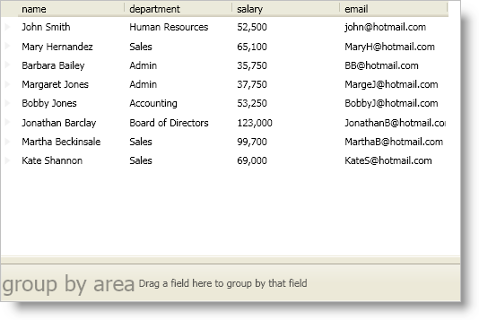

////

|metadata|
{
    "name": "xamdatapresenter-create-an-external-group-by-area",
    "controlName": ["xamDataPresenter"],
    "tags": ["Grouping","How Do I","Layouts"],
    "guid": "{4FC9C1B7-461B-42F5-A11F-486122B44CEB}",  
    "buildFlags": [],
    "createdOn": "2012-01-30T19:39:53.1199771Z"
}
|metadata|
////

= Create an External Group-By Area

Instead of using the group-by area attached to the top of a DataPresenter control, you can detach it from the DataPresenter control to create an external group-by area in your window. Simply add a link:{ApiPlatform}datapresenter.v{ProductVersion}~infragistics.windows.datapresenter.groupbyarea.html[GroupByArea] control or a link:{ApiPlatform}datapresenter.v{ProductVersion}~infragistics.windows.datapresenter.groupbyareamulti.html[GroupByAreaMulti] control to your window and set the DataPresenter control's link:{ApiPlatform}datapresenter.v{ProductVersion}~infragistics.windows.datapresenter.datapresenterbase~groupbyarea.html[GroupByArea] property or link:{ApiPlatform}datapresenter.v{ProductVersion}~infragistics.windows.datapresenter.datapresenterbase~groupbyareamulti.html[GroupByAreaMulti] property respectively.

The GroupByArea control only allows your end users to group records using fields in the default field layout. It represents each field header as a button that your end users can drag into the group-by area. Where-as, the GroupByAreaMulti control allows your end users to drag field headers from multiple field layouts into the group-by area.

.Note
[NOTE]
====
If you are setting the DataPresenter control's GroupByArea or GroupByAreaMulti property in XAML, you must place the XAML declaration for the group-by area control before the declaration for the DataPresenter control. However, this restriction does not apply if you are setting the DataPresenter control's GroupByArea or GroupByAreaMulti property in code.
====

When using this feature, you should be aware of the following restrictions:

* You cannot attach a single instance of a group-by area control to multiple DataPresenter controls or vice-versa.
* The DataPresenter control's link:{ApiPlatform}datapresenter.v{ProductVersion}~infragistics.windows.datapresenter.datapresenterbase~isgroupbyareaexpanded.html[IsGroupByAreaExpanded] property is synchronized with the group-by area control's IsExpanded property.
* If you do not display headers, your end users will not be able to use the GroupByAreaMulti control.

The following example code demonstrates how to create an external group-by area.

*In XAML:*

----
<DockPanel Name="dockPanel1">
    <igDP:GroupByAreaMulti Name="groupByAreaMulti1" DockPanel.Dock="Bottom" />
    <igDP:XamDataPresenter 
        Name="xamDataPresenter1" 
        BindToSampleData="True" 
        GroupByAreaMulti="{Binding ElementName=groupByAreaMulti1}">
    </igDP:XamDataPresenter>
    <!--
    Placing the group-by area control after the declaration for the DataPresenter control will not work unless you assign the DataPresenter control's GroupByArea or GroupByAreaMulti property in code.
    -->
</DockPanel>
----

*In Visual Basic:*

----
Imports Infragistics.Windows.DataPresenter
...
'You do not have to instantiate the GroupByAreaMulti control in code. 
'You can declare it in XAML and set the GroupByAreaMulti property in code to by-pass the XAML parser restriction.
'Dim groupByAreaMulti1 As New GroupByAreaMulti()
'Me.dockPanel1.Children.Add(groupByAreaMulti1)
'DockPanel.SetDock(groupByAreaMulti1, Dock.Bottom)
Me.xamDataPresenter1.GroupByAreaMulti = groupByAreaMulti1
...
----

*In C#:*

----
using Infragistics.Windows.DataPresenter;
...
//You do not have to instantiate the GroupByAreaMulti control in code. 
//You can declare it in XAML and set the GroupByAreaMulti property in code to by-pass the XAML parser restriction.
//GroupByAreaMulti groupByAreaMulti1 = new GroupByAreaMulti();
//this.dockPanel1.Children.Add(groupByAreaMulti1);
//DockPanel.SetDock(groupByAreaMulti1, Dock.Bottom);
this.xamDataPresenter1.GroupByAreaMulti = groupByAreaMulti1;
...
----

== Related Topics

link:xamdatapresenter-about-sorting.html[About Sorting]

link:xamdatapresenter-about-grouping.html[About Grouping]

link:xamdatapresenter-sorting-and-grouping-fields-programmatically.html[Sorting and Grouping Fields Programmatically]

link:xamdatapresenter-modify-the-group-by-area.html[Modify the Group-By Area]

link:xamdatapresenter-disable-groupby.html[Disable GroupBy]

link:xamdatapresenter-change-the-location-of-the-groupbyarea.html[Change the Location of the GroupByArea]