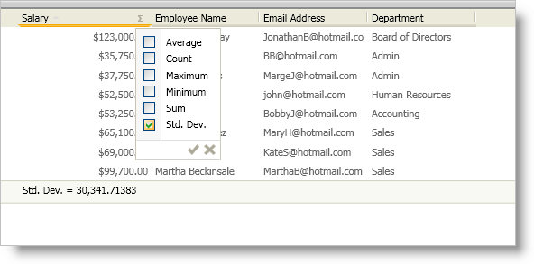

////
|metadata|
{
    "name": "xamdatapresenter-creating-a-custom-summary-calculator",
    "controlName": ["xamDataPresenter"],
    "tags": ["How Do I","Summaries","Tips and Tricks"],
    "guid": "{A1703FFE-F6D7-4544-8D66-3C33DD8872AD}",
    "buildFlags": [],
    "createdOn": "2012-01-30T19:39:53.1229777Z"
}
|metadata|
////

= Creating a Custom Summary Calculator

== Before You Begin

The xamDataPresenter™ control provides five commonly used summary functions to calculate summary values. If the built-in functions do not suit your needs, you can create and use a custom summary.

== What You Will Accomplish

You will create a custom summary calculator to calculate a standard deviation.

This topic doesn't cover the algorithm for calculating the standard deviation since it is an implementation detail that is beyond the scope of this topic. The algorithm is provided as a sample, it may not work in all application scenarios.

== Follow these Steps

[start=1]
. Add a new class to your project and name it StandardDeviation.

[start=2]
. Before you start writing any code, you should place using/Imports directives in your code-behind so you don't need to always type out a member's fully qualified name.
+
*In Visual Basic:*
+
[source,vb]
----
Imports Infragistics.Windows.DataPresenter
Imports Infragistics.Windows
...
----
+
*In C#:*
+
[source,csharp]
----
using Infragistics.Windows.DataPresenter;
using Infragistics.Windows;
using System.Windows.Media;
...
----

[start=3]
. Inherit from the abstract link:{ApiPlatform}datapresenter{ApiVersion}~infragistics.windows.datapresenter.summarycalculator.html[SummaryCalculator] class.
+
*In Visual Basic:*
+
[source,vb]
----
Public Class StandardDeviation
    Inherits SummaryCalculator
End Class
----
+
*In C#:*
+
[source,csharp]
----
public class StandardDeviation : SummaryCalculator
{
}
----

[start=4]
. Create class level variables to hold the results of intermediate calculations or any running totals you may need for the results.
+
*In Visual Basic:*
+
[source,vb]
----
...
Dim _count As Integer
Dim _sum As Double
Dim _squaredSum as Double
...
----
+
*In C#:*
+
[source,csharp]
----
...
int _count;
double _sum;
double _squaredSum;
...
----

[start=5]
. Implement the link:{ApiPlatform}datapresenter{ApiVersion}~infragistics.windows.datapresenter.summarycalculator~begincalculation.html[BeginCalculation] method.
+
The xamDataPresenter control calls the BeginCalculation method once at the beginning of a calculation. Use this method to initialize any variables required for the calculations.
+
*In Visual Basic:*
+
[source,vb]
----
...
Public Overrides Sub BeginCalculation(ByVal summaryResult As Infragistics.Windows.DataPresenter.SummaryResult)
    _count = 0
    _sum = 0
    _squaredSum = 0
End Sub
...
----
+
*In C#:*
+
[source,csharp]
----
...
public override void BeginCalculation(SummaryResult summaryResult)
{
    _count = 0;
    _sum = 0;
    _squaredSum = 0;
}
...
----

[start=6]
. Implement the link:{ApiPlatform}datapresenter{ApiVersion}~infragistics.windows.datapresenter.summarycalculator~canprocessdatatype.html[CanProcessDataType] method.
+
The xamDataPresenter control calls the CanProcessDataType method to determine whether the summary calculator should be added to the summary selection dialog box. After testing the data type that is passed in to this method, you can return a Boolean value to indicate if this calculator shows up in the summary selection dialog box.
+
*In Visual Basic:*
+
[source,vb]
----
...
Public Overrides Function CanProcessDataType(ByVal dataType As System.Type) As Boolean
    Return Utilities.IsNumericType(dataType)
End Function
...
----
+
*In C#:*
+
[source,csharp]
----
...
public override bool CanProcessDataType(Type dataType)
{
    return Utilities.IsNumericType(dataType);
}
...
----

[start=7]
. Implement the link:{ApiPlatform}datapresenter{ApiVersion}~infragistics.windows.datapresenter.summarycalculator~aggregate.html[Aggregate] method.
+
The xamDataPresenter control calls the Aggregate method once per field being calculated per row. Use this method to calculate any running totals or intermediate summaries that you need for the final result.
+
*In Visual Basic:*
+
[source,vb]
----
...
Public Overrides Sub Aggregate(ByVal dataValue As Object, ByVal summaryResult As Infragistics.Windows.DataPresenter.SummaryResult, ByVal record As Infragistics.Windows.DataPresenter.Record)
    Dim tempVal As Double = 0 
    If Not Convert.IsDBNull(dataValue) Then 
        tempVal = Convert.ToDouble(dataValue)
    End If 
    _count += 1 
    _sum += tempVal 
    _squaredSum += tempVal * tempVal 
End Sub
...
----
+
*In C#:*
+
[source,csharp]
----
...
public override void Aggregate(object dataValue, SummaryResult summaryResult, Record record)
{
    double tempVal = 0.0;
    if(!Convert.IsDBNull(dataValue))
        tempVal = Convert.ToDouble(dataValue);
    _count++;
    _sum += tempVal;
    _squaredSum += tempVal  * tempVal;
}
...
----

[start=8]
. Implement the link:{ApiPlatform}datapresenter{ApiVersion}~infragistics.windows.datapresenter.summarycalculator~endcalculation.html[EndCalculation] method.
+
The xamDataPresenter control calls the EndCalculation method at the end of a calculation. Use this method to return the results of the calculation. The xamDataPresenter control displays the return value of this method in the summary display area.
+
*In Visual Basic:*
+
[source,vb]
----
....
Public Overrides Function EndCalculation(ByVal summaryResult As Infragistics.Windows.DataPresenter.SummaryResult) As Object
    If _count < 2 OrElse _sum = 0 Then 
        Return 0 
    End If 
    Dim theAverage As Double = _sum / _count 
    Dim theDeviation As Double = (_squaredSum - _sum * theAverage) / (_count - 1) 
    Return Math.Sqrt(theDeviation)
End Function
...
----
+
*In C#:*
+
[source,csharp]
----
...
public override object EndCalculation(SummaryResult summaryResult)
{
    if (_count < 2 || _sum == 0)
        return 0;
    double theAverage = _sum / _count;
    double theDeviation = (_squaredSum - _sum * theAverage) / (_count - 1);
    return Math.Sqrt(theDeviation);
}
...
----

[start=9]
. Override the link:{ApiPlatform}datapresenter{ApiVersion}~infragistics.windows.datapresenter.summarycalculator~name.html[Name] property.
+
Each SummaryCalculator derived class must have a unique name. The Name property is a read-only property; therefore, you cannot set it at run time. You must override this property and return a name for your custom summary calculator. If you do not return a name, xamDataPresenter will throw an exception. If two summary calculators have the same name, only the one that was registered last will be used.
+
*In Visual Basic:*
+
[source,vb]
----
...
Public Overrides ReadOnly Property Name() As String
    Get
        Return "Std. Dev."
    End Get
End Property
...
----
+
*In C#:*
+
[source,csharp]
----
...
public override string Name
{
    get
    {
        return "Std. Dev.";
    }
}
...
----

[start=10]
. Override the link:{ApiPlatform}datapresenter{ApiVersion}~infragistics.windows.datapresenter.summarycalculator~description.html[Description] property.
+
Use the Description property to return a string that xamDataPresenter displays as a tool tip in the summary selection dialog box. Unlike the previous methods and properties, the Description property is not required for creating a custom summary calculator.
+
*In Visual Basic:*
+
[source,vb]
----
...
Public Overrides ReadOnly Property Description() As String
    Get
        Return "Standard Deviation"
    End Get
End Property
...
----
+
*In C#:*
+
[source,csharp]
----
...
public override string Description
{
    get
    {
        return "Standard Deviation";
    }
}
...
----

[start=11]
. Override the link:{ApiPlatform}datapresenter{ApiVersion}~infragistics.windows.datapresenter.summarycalculator~iscalculationaffectedbysort.html[IsCalculationAffectedBySort] property.
+
The IsCalculationAffectedBySort property determines whether the summary should be recalculated when you sort any field in xamDataPresenter. If you return True, xamDataPresenter will call BeginCalculation, Aggregate, and EndCalculation methods again. The SummaryCalculator base class returns a value of False for this property; therefore, it is not necessary to override this property unless you want to change the default value.
+
*In Visual Basic:*
+
[source,vb]
----
...
Public Overrides ReadOnly Property IsCalculationAffectedBySort() As Boolean
    Get
        Return False
        'Returning MyBase.IsCalculationAffectedBySort will have the same result as returning False.
    End Get
End Property
...
----
+
*In C#:*
+
[source,csharp]
----
...
public override bool IsCalculationAffectedBySort
{
    get
    {
        return false;
        //Returning MyBase.IsCalculationAffectedBySort will have the same result as returning False.
    }
}
...
----

[start=12]
. Override the link:{ApiPlatform}datapresenter{ApiVersion}~infragistics.windows.datapresenter.summarycalculator~image.html[Image] property.
+
The Image property is not required for the summary calculator to function properly. You can return an ImageSource object to display an image next to the summary calculator in the summary selection dialog box. You can also implement lazy loading for the image so you don't waste resources. To keep things simple, the sample code below does not use lazy loading.
+
*In Visual Basic:*
+
[source,vb]
----
...
Public Overrides ReadOnly Property Image() As System.Windows.Media.ImageSource 
    Get
        Dim converter As New ImageSourceConverter()
        Return TryCast(converter.ConvertFrom("Some_Image_Path.png"), ImageSource) 
    End Get 
End Property
...
----
+
*In C#:*
+
[source,csharp]
----
...
public override ImageSource Image
{
    get
    {
        ImageSourceConverter converter = new ImageSourceConverter();
        return converter.ConvertFrom("Some_Image_Path.jpg") as ImageSource;
    }
}
...
----

[start=13]
. Override the link:{ApiPlatform}datapresenter{ApiVersion}~infragistics.windows.datapresenter.summarycalculator~applydefaultformat.html[ApplyDefaultFormat] method.
+
The ApplyDefaultFormat method is not required for the summary calculator to function properly. In fact, if you set a field's SummaryStringFormats property to format this summary calculator, xamDataPresenter will not call the ApplyDefaultFormat method. You can return a formatted string representation of the calculated value in this method.
+
*In Visual Basic:*
+
[source,vb]
----
...
Public Overrides Function ApplyDefaultFormat(ByVal summaryResultValue As Object, ByVal context As SummaryResult) As String 
    Return String.Format("{1} = {0:n5}", summaryResultValue, Name) 
End Function 
...
----
+
*In C#:*
+
[source,csharp]
----
...
public override string ApplyDefaultFormat(object summaryResultValue, SummaryResult context)
{
    return string.Format("{1} = {0:n5}", summaryResultValue, Name);
}
...
----

[start=14]
. Register the custom summary calculator using the SummaryCalculator object's static link:{ApiPlatform}datapresenter{ApiVersion}~infragistics.windows.datapresenter.summarycalculator~register.html[Register] method.
+
You only need to register the summary calculator once. Once you register a summary calculator, all instances of xamDataPresenter within your project will automatically display the summary calculator in the summary selection dialog box. You can place the code to register the custom summary calculator in your main Window's Loaded event.
+
*In Visual Basic:*
+
[source,vb]
----
Imports Infragistics.Windows.DataPresenter
...
Private Sub Window_Loaded(ByVal sender As System.Object, ByVal e As System.Windows.RoutedEventArgs)
    SummaryCalculator.Register(New StandardDeviation())
End Sub
...
----
+
*In C#:*
+
[source,cshapr]
----
using Infragistics.Windows.DataPresenter;
...
private void Window1_Loaded(object sender, RoutedEventArgs e)
{
    SummaryCalculator.Register(new StandardDeviation());
}
...
----

[start=15]
. Build and run your application.
+
If you click the summary button in a numeric field's header, you should see a summary selection dialog box similar to the one in the screen shot below.
+

== Related Topics

link:xamdatapresenter-apply-default-summary-formats.html[Apply Default Summary Formats]

link:xamdatapresenter-enable-row-summaries.html[Enable Row Summaries]

link:xamdatapresenter-format-the-value-of-a-summary.html[Format the Value of a Summary]

link:xamdatapresenter-programmatically-add-summaries-to-a-field.html[Programmatically Add Summaries to a Field]

link:xamdatapresenter-retrieve-the-result-of-a-summary.html[Retrieve the Result of a Summary]